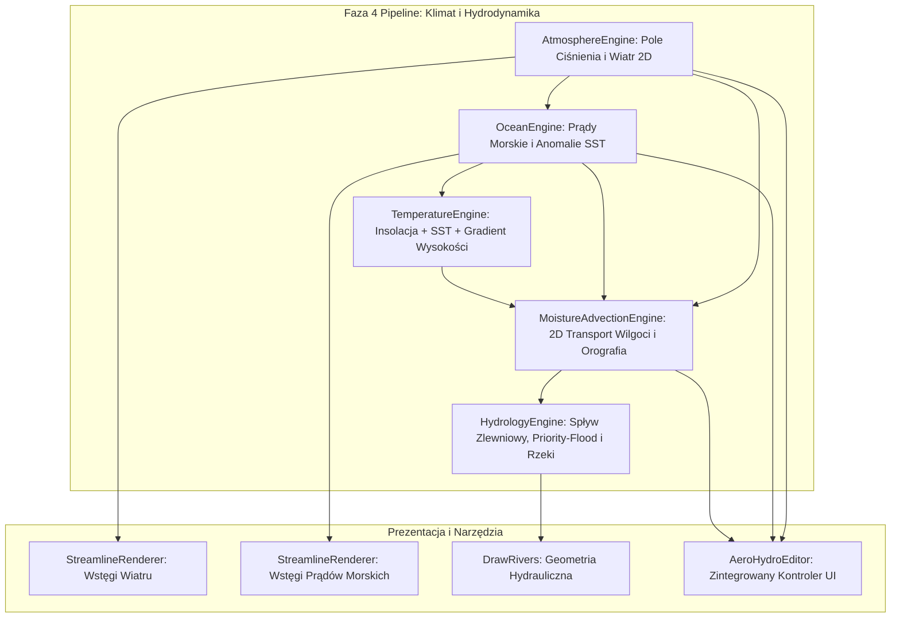

# Architektura Systemu Aero-Hydro 2.0: Kompletny Redesign Fizyki Wiatrów, Prądów Morskich i Hydrologii

> **Dokumentacja Architektoniczna i Plan Implementacyjny FMG 2.0**  
> **Status:** Projekt Bazowy i Specyfikacja Techniczna  
> **Data:** 14 sierpnia 2026 r.  
> **Autor:** Antigravity (Advanced AI Architecture Pair)  
> **Plik docelowy:** `docs/architecture/aero_hydro_complete_system_redesign.md`

---

## Spis Treści
1. [Wstęp i Wizja Architektoniczna](#1-wstęp-i-wizja-architektoniczna)
2. [Kompletna Mapa Istniejącego Kodu i Stanu Obecnego](#2-kompletna-mapa-istniejącego-kodu-i-stanu-obecnego)
3. [Szczegółowa Analiza i Dekompozycja Problemów Systemowych](#3-szczegółowa-analiza-i-dekompozycja-problemów-systemowych)
   - [3.1. Problem Wiatru: Statyczne Pasma 1D vs. 2D Pola Baryczne i Siła Coriolisa](#31-problem-wiatru-statyczne-pasma-1d-vs-2d-pola-baryczne-i-siła-coriolisa)
   - [3.2. Problem Skalowalności: Zależność od Rozdzielczości i Liczby Komórek](#32-problem-skalowalności-zależność-od-rozdzielczości-i-liczby-komórek)
   - [3.3. Problem Prądów Morskich: Odizolowanie od Atmosfery i Sztuczne Wektory](#33-problem-prądów-morskich-odizolowanie-od-atmosfery-i-sztuczne-wektory)
   - [3.4. Problem Orografii i Cieśnin: Brak Efektu Venturiego i Odchylenia Wzdłużbarierowego](#34-problem-orografii-i-cieśnin-brak-efektu-venturiego-i-odchylenia-wzdłużbarierowego)
   - [3.5. Problem Hydrologii: Niefizyczne Skalowanie Rzek i Brak Hierarchii Strahlera](#35-problem-hydrologii-niefizyczne-skalowanie-rzek-i-brak-hierarchii-strahlera)
   - [3.6. Problem Zbiorników Wodnych: Brak Równowagi Parowania i Odpływów Jezior](#36-problem-zbiorników-wodnych-brak-równowagi-parowania-i-odpływów-jezior)
   - [3.7. Problem Wizualizacji: Zaśmiecanie Siatkami Strzałek vs. Lagrangian Streamlines](#37-problem-wizualizacji-zaśmiecanie-siatkami-strzałek-vs-lagrangian-streamlines)
4. [Fundamenty Fizyczno-Matematyczne Nowego Modelu](#4-fundamenty-fizyczno-matematyczne-nowego-modelu)
   - [4.1. Atmosfera: Ciśnienie Baryczne, Wiatr Geostroficzny i Monsuny](#41-atmosfera-ciśnienie-baryczne-wiatr-geostroficzny-i-monsuny)
   - [4.2. Ocean: Pętle Cyrkulacyjne, Transport Ekmana i Prądy Szelfowe](#42-ocean-pętle-cyrkulacyjne-transport-ekmana-i-prądy-szelfowe)
   - [4.3. Termodynamika Wilgoci: Równanie Clausiusa-Clapeyrona i Adwekcja 2D](#43-termodynamika-wilgoci-równanie-clausiusa-clapeyrona-i-adwekcja-2d)
   - [4.4. Orografia: Wznoszenie Adiabatyczne, Deszcz Orograficzny i Efekt Fenu](#44-orografia-wznoszenie-adiabatyczne-deszcz-orograficzny-i-efekt-fenu)
   - [4.5. Geomorfologia Rzeczna: Geometria Hydrauliczna Leopolda-Maddocka](#45-geomorfologia-rzeczna-geometria-hydrauliczna-leopolda-maddocka)
5. [Projekt Modelu Danych i Układ Pamięci (Zero-Allocation Layout)](#5-projekt-modelu-danych-i-układ-pamięci-zero-allocation-layout)
6. [Architektura Modułowa Nowego Silnika (Aero-Hydro Pipeline)](#6-architektura-modułowa-nowego-silnika-aero-hydro-pipeline)
7. [Strategia Niezależności od Rozdzielczości (10k do 100k+ Komórek)](#7-strategia-niezależności-od-rozdzielczości-10k-do-100k-komórek)
8. [Zaawansowany System Wizualizacji (Google Earth / Earth Nullschool Style)](#8-zaawansowany-system-wizualizacji-google-earth--earth-nullschool-style)
9. [Fazy Wdrożenia i Plan Testów](#9-fazy-wdrożenia-i-plan-testów)

---

## 1. Wstęp i Wizja Architektoniczna

Obecny generator map Azgaara (FMG) w warstwie klimatu i hydrologii opiera się na algorytmach zaprojektowanych w latach 2017–2019, które traktowały zjawiska przyrodnicze w sposób uproszczony i odseparowany:
- Wiatr był jednowymiarowym kątem przypisanym do 6 pasów równoleżnikowych.
- Prądy morskie były sztucznie dodanymi punktami bazowymi.
- Wilgoć przemieszczała się w pętli wiersz po wierszu (`for x = 0..cellsX`), nie reagując na rzeczywiste dwuwymiarowe wektory wiatru.
- Rzeki rozrastały się liniowo wzdłuż długości, tworząc nienaturalnie grube plamy u ujść.

**Wizja Aero-Hydro 2.0** zakłada całkowitą rezygnację z atrap i protez algorytmicznych na rzecz **zintegrowanego, fizycznie spójnego silnika geofizycznego**. W tym podejściu:
1. **Atmosfera i ocean stanowią nierozerwalny układ termodynamiczny**: wiatry napędzają prądy morskie, prądy morskie modulują temperaturę powierzchni morza (SST), woda paruje zależnie od temperatury, a wiatry 2D transportują masy wilgoci nad ląd.
2. **Ukształtowanie terenu (orografia) bezpośrednio kieruje przepływem mas**: łańcuchy górskie odchylają wektory wiatru, wymuszają deszcze orograficzne i tworzą głębokie cienie deszczowe (rain shadows), a wąskie cieśniny przyspieszają wiatr i wodę (efekt Venturiego).
3. **Hydrologia lądowa bazuje na rzeczywistych prawach geomorfologii**: rzeki podlegają prawu potęgowemu hydrauliki rzecznej ($W = a \cdot Q^b$), akumulacji zlewniowej i hierarchii rzędowości Strahlera.
4. **Wizualizacja dorównuje współczesnym standardom GIS (Earth Nullschool / Google Earth)**: zamiast tysięcy statycznych strzałek zaśmiecających widok, wprowadzamy płynne wstęgi strumieniowe (Lagrangian Streamlines) z kodowaniem prędkości kolorem i adaptacyjnym rozstawem nasion.

---

## 2. Kompletna Mapa Istniejącego Kodu i Stanu Obecnego

Poniższa tabela stanowi wyczerpujący audyt wszystkich modułów w projekcie odpowiedzialnych za klimat, temperaturę, wiatr, wodę, rzeki i ich prezentację:

| Moduł / Plik | Rola w Systemie | Stan Obecny i Ograniczenia | Docelowy Status w Aero-Hydro 2.0 |
| :--- | :--- | :--- | :--- |
| [`src/generators/temperature-generator.ts`](file:///c:/Users/cyunc/Documents/Projects/Fantasy-Map-Generator-experimental/src/generators/temperature-generator.ts) | Obliczanie temperatur komórek `grid.cells.temp` | Zastąpiono model liniowy funkcją insolacji solarnej $S(\phi) = \cos(\phi)^{0.85}$ oraz anomalią SST. | **Rozszerzenie**: Integracja z pełnym polem albedo, adwekcją termiczną wiatru i wysokościowym gradientem adiabatycznym. |
| [`src/generators/wind-generator.ts`](file:///c:/Users/cyunc/Documents/Projects/Fantasy-Map-Generator-experimental/src/generators/wind-generator.ts) | Generowanie wiatrów | 6 stref 1D (`options.winds`), brak ciągłego pola wektorowego 2D, brak ciśnienia barycznego. | **Pełne Przepisanie**: Generowanie dynamicznego pola ciśnienia 2D $P(x,y)$, wiatrów geostroficznych i cyrkulacji monsunowej. |
| [`src/generators/ocean-currents-generator.ts`](file:///c:/Users/cyunc/Documents/Projects/Fantasy-Map-Generator-experimental/src/generators/ocean-currents-generator.ts) | Generowanie prądów morskich i anomalii SST | Model wektorowy z buforem szelfowym, zależny od wstępnie generowanych źródeł (*sources*). | **Pełne Przepisanie**: Globalna cyrkulacja napędzana naprężeniem wiatru ($\vec{\tau}$), pętle oceaniczne (*gyres*), prądy krawędziowe. |
| [`src/generators/precipitation-generator.ts`](file:///c:/Users/cyunc/Documents/Projects/Fantasy-Map-Generator-experimental/src/generators/precipitation-generator.ts) | Wyznaczanie opadów `grid.cells.prec` | Przejście liniowe wierszami/kolumnami (`passWind`), sztuczne progi cienia opadowego. | **Pełne Przepisanie**: 2D Adwekcja wilgoci mas powietrza wzdłuż wektorów wiatru z prawem Clausiusa-Clapeyrona. |
| [`src/generators/river-generator.ts`](file:///c:/Users/cyunc/Documents/Projects/Fantasy-Map-Generator-experimental/src/generators/river-generator.ts) | Formowanie rzek i zlewni `pack.rivers` | Algorytm depresji i przepływu w dół. Liniowy przyrost szerokości w `getOffset()`. | **Refaktoryzacja**: Integracja prawa Leopolda-Maddocka ($W \propto Q^{0.5}$), rzędowości Strahlera i depresji Priority-Flood. |
| [`src/generators/lakes.ts`](file:///c:/Users/cyunc/Documents/Projects/Fantasy-Map-Generator-experimental/src/generators/lakes.ts) | Zarządzanie jeziorami i bilans wodny | Prosty bilans dopływ vs. stałe parowanie, brak dynamicznego poziomu lustra wody. | **Rozszerzenie**: Dynamiczny bilans parowania zlewniowego, jeziora bezodpływowe (endorheiczne). |
| [`src/generators/biomes-generator.ts`](file:///c:/Users/cyunc/Documents/Projects/Fantasy-Map-Generator-experimental/src/generators/biomes-generator.ts) | Klasyfikacja 84 biomów | Matryca Whittaker/Holdridge oparta na `temp` i `prec`. | **Dostosowanie**: Odczyt z nowych precyzyjnych rozkładów wilgotności glebowej i wskaźników aridowości De Martonne'a. |
| [`src/renderers/draw-ocean-currents.ts`](file:///c:/Users/cyunc/Documents/Projects/Fantasy-Map-Generator-experimental/src/renderers/draw-ocean-currents.ts) | Rysowanie prądów morskich w SVG | Wstęgi wielonitkowe. Kolorowanie prędkością. | **Standaryzacja**: Konwersja do zunifikowanego renderera wstęg Lagrangian Streamlines. |
| [`src/renderers/draw-wind.ts`](file:///c:/Users/cyunc/Documents/Projects/Fantasy-Map-Generator-experimental/src/renderers/draw-wind.ts) | Rysowanie wiatru w SVG | Rysowanie linii prądu. | **Standaryzacja**: Płynny rendering wstęg wiatru z adaptacyjnym rozstawem i animacją przepływu. |
| [`src/controllers/ocean-currents-editor.ts`](file:///c:/Users/cyunc/Documents/Projects/Fantasy-Map-Generator-experimental/src/controllers/ocean-currents-editor.ts) | Edytor prądów morskich w UI | Ręczne stawianie źródeł ciepłych/zimnych. | **Unifikacja**: Połączenie z edytorem baryczno-wiatrowym w jeden zintegrowany edytor klimatu. |
| [`src/controllers/wind-currents-editor.ts`](file:///c:/Users/cyunc/Documents/Projects/Fantasy-Map-Generator-experimental/src/controllers/wind-currents-editor.ts) | Edytor wiatrów i układów ciśnienia | Podstawowy interfejs centrów barycznych. | **Rozbudowa**: Narzędzie przesuwania wyżów/niżów, edycji wektorów i podglądu trajektorii w czasie rzeczywistym. |
| [`public/main.js`](file:///c:/Users/cyunc/Documents/Projects/Fantasy-Map-Generator-experimental/public/main.js) | Główny pipeline generowania mapy | Koordynuje wywołania faz 1–16. | **Synchronizacja**: Zapewnienie poprawnej kolejności wywołań w pipeline fazy 4 i 6. |
| [`src/generators/resample.ts`](file:///c:/Users/cyunc/Documents/Projects/Fantasy-Map-Generator-experimental/src/generators/resample.ts) | Skalowanie i wycinanie submap | Przeliczanie siatki i interpolacja parametrów komórek. | **Aktualizacja**: Dwuliniowa interpolacja ciągłych pól wektorowych $\vec{V}_{\text{wind}}, \vec{V}_{\text{ocean}}, P$. |

---

## 3. Szczegółowa Analiza i Dekompozycja Problemów Systemowych

Każdy z poniższych problemów został przeanalizowany pod kątem fizycznym, matematycznym i programistycznym.

---

### 3.1. Problem Wiatru: Statyczne Pasma 1D vs. 2D Pola Baryczne i Siła Coriolisa

#### Istota problemu:
W klasycznym silniku FMG wiatr jest zdefiniowany jako tablica 6 kątów (`options.winds = [225, 45, 225, 45, 225, 45]`). Każdy kąt określa jeden stały wektor na cały pas szerokości geograficznej (np. $30^\circ - 60^\circ\text{N}$). 

```
STAN OBECNY (1D Sztywne Pasmo):
────────────────────────────────────────────────────────────────────
Wiatr wieje w linii prostej na wschód: ===> ===> ===> ===> ===> ===>
Ignoruje kształt kontynentów, oceany, nagrzewanie lądu i zawirowania.
────────────────────────────────────────────────────────────────────
```

#### Dlaczego to podejście jest błędne:
1. **Brak wirowości ($\nabla \times \vec{V} = 0$)**: W rzeczywistej atmosferze wiatr nigdy nie wieje w nieskończonych liniach prostych. Cyrkulacja tworzy cyklony (wokół niżów) i antycyklony (wokół wyżów).
2. **Brak kontrastu termicznego ląd-morze**: Ląd nagrzewa się latem szybciej niż ocean, tworząc potężne niże termiczne, które zasysają wilgotne powietrze z oceanu (mechanizm **monsunowy** tworzący klimat Indii, Azji Wschodniej i Ameryki Środkowej). W obecnym FMG monsuny są niemożliwe do wygenerowania.
3. **Brak fal planetarnych Rossby'ego**: Na styku mas ciepłych i zimnych powstaje meandrujący prąd strumieniowy (*jet stream*), który decyduje o zmienności pogody w Europie i Ameryce Północnej.

#### Rozwiązanie w Aero-Hydro 2.0:
Wprowadzenie **dwuwymiarowego pola ciśnienia atmosferycznego $P(x, y)$** na poziomie morza. Wiatr jest wyprowadzany analitycznie z gradientu ciśnienia i siły Coriolisa:

$$\vec{V}_{\text{geostrophic}} = \frac{1}{\rho f} \left( -\frac{\partial P}{\partial y}, \frac{\partial P}{\partial x} \right)$$

gdzie $f = 2\Omega \sin(\phi)$ to parametr Coriolisa. W ten sposób wokół wyżów automatycznie powstaje ruch prawoskrętny (na półkuli północnej), a wokół niżów lewoskrętny, tworząc autentyczną globalną cyrkulację.

---

### 3.2. Problem Skalowalności: Zależność od Rozdzielczości i Liczby Komórek

#### Istota problemu:
W kodzie FMG znajduje się wiele zakodowanych na stałe stałych zależnych od indeksów siatki, takich jak `cellsX`, `cellsY`, `radius = 8`, `FLUX_FACTOR = 500`, czy `stepY = Math.floor(cellsY / 4)`. 

```typescript
// Przykład problemu w starym kodzie:
const radius = Math.floor((source.strength / 100) * (cellsX / 6));
const fluxWidth = Math.min(flux ** 0.7 / 500, 1);
```

#### Konsekwencje:
1. Gdy użytkownik wygeneruje mapę o małej gęstości ($10\,000$ komórek), `cellsX \approx 115`. Promień wpływu wynosi wtedy ok. 15 komórek.
2. Gdy użytkownik zmieni gęstość na $100\,000$ komórek, `cellsX \approx 365`. Promień w komórkach rośnie, ale jego fizyczny zasięg w kilometrach na mapie drastycznie się zmienia!
3. Wskaźniki przepływu wody (`cells.fl`) kumulują się inaczej przy 10k niż przy 100k komórek, powodując, że przy 100k komórkach rzeki stają się 10 razy cieńsze lub woda wysycha na kontynencie.

#### Rozwiązanie w Aero-Hydro 2.0:
Wszystkie równania i stałe zostają **przeliczone na jednostki fizyczne niezależne od siatki**:
- Odległości wyrażane w kilometrach ($\text{km}$), przeliczane przez `cellSpacingKm = spacingPx * distanceScale`.
- Różniczkowanie przestrzenne ($\nabla P, \nabla h$) wykorzystuje rzeczywisty krok przestrzenny $dx, dy$ w metrach/kilometrach.
- Przepływ wody i opady operują na jednostkach $\text{mm/rok}$ oraz $\text{m}^3/\text{s}$, a nie na abstrakcyjnych liczbach komórkowych.

---

### 3.3. Problem Prądów Morskich: Odizolowanie od Atmosfery i Sztuczne Wektory

#### Istota problemu:
Prądy morskie w generatorze były dotychczas traktowane jako niezależny byt – stawiano sztuczne punkty "źródła ciepłego/zimnego" w wodzie, które promieniowały temperaturą.

#### Niezgodność z fizyką:
1. W naturze prądy morskie na powierzchni oceanu są **bezpośrednio napędzane naprężeniem wiatru ($\vec{\tau}$)**. Pasaty pchają wodę na zachód w pasie równikowym, a wiatry zachodnie pchają ją na wschód w strefie umiarkowanej.
2. Kontynenty stanowią nieprzepuszczalne bariery, które zmuszają ten ruch do zamknięcia się w gigantyczne pętle oceaniczne (**Subtropical & Subpolar Gyres**).
3. Na zachodnich brzegach oceanów powstają **wąskie, głębokie i niezwykle szybkie ciepłe prądy** (Prąd Zatokowy/Golfsztrom, Kuroshio), niosące gigantyczne ilości energii cieplnej na północ.
4. Na wschodnich brzegach oceanów powstają **szerokie, powolne zimne prądy z upwellingiem** (Prąd Kanaryjski, Kalifornijski, Humboldta), które schładzają wybrzeża i tworzą pustynie mgielne.

#### Rozwiązanie w Aero-Hydro 2.0:
Prądy morskie są wyprowadzane bezpośrednio z pola naprężenia wiatru $\vec{\tau}(\vec{V}_{\text{wind}})$. Model wymusza zachowanie ciągłości hydrodynamicznej w basenach oceanicznych ($\nabla \cdot \vec{V}_{\text{ocean}} = 0$) z asymetrią zachodniego brzegu (efekt beta $\beta = \partial f / \partial y$), tworząc autentyczne prądy krawędziowe i pętle oceaniczne bez konieczności ręcznego stawiania źródeł.

---

### 3.4. Problem Orografii i Cieśnin: Brak Efektu Venturiego i Odchylenia Wzdłużbarierowego

#### Istota problemu:
W klasycznym modelu FMG góra na mapie była po prostu komórką o $h \ge 70$. Wiatr przechodził przez nią w linii prostej, tracąc pewien ułamek wilgoci w pętli `for`.

```
STAN OBECNY (Brak Odbicia):
  Wiatr: ──────────► [ GÓRA ] ──────────► (Wiatr leci prosto przez szczyt)

STAN FIZYCZNY (Odchylenie i Efekt Venturiego):
                     /  ▲
  Wiatr: ──────────►│  /  (Barrier Jet wzdłuż pasma górskiego)
                    ▼ ──►
                    ══>>══ (Przyspieszenie w cieśninie / przesmyku)
```

#### Zjawiska pomijane w starym kodzie:
1. **Odchylenie wzdłużbarierowe (*Barrier Jet*)**: Powietrze o niskiej energii kinetycznej nie może wspiąć się na wysoką barierę górską ($Fr < 1$). Zostaje zablokowane i skręca wzdłuż pasma górskiego, tworząc silny wiatr równoległy do grani.
2. **Efekt Dyszy Venturiego w Cieśninach (*Gap Winds*)**: Gdy wiatr lub prąd morski napotyka wąskie gardło (np. Cieśnina Gibraltarska, Bosfor, Dardanele, Kanał Mozambicki, Cieśnina Mesyńska), dochodzi do gwałtownego wzrostu prędkości przepływu:

$$v_2 = v_1 \cdot \frac{A_1}{A_2}$$

W starym kodzie cieśnina spowalniała lub blokowała przepływ, podczas gdy w rzeczywistości prędkość wzrasta tam 2-3 krotnie!

#### Rozwiązanie w Aero-Hydro 2.0:
Wprowadzenie tensora oporu orograficznego i analitycznego wskaźnika zwężenia cieśninowego $W(x, y)$. Wektor wiatru uderzający w barierę górską zostaje rozłożony na składową wznoszącą (kondensacja) i składową wzdłużbarierową (przyspieszenie wzdłuż łańcucha). W cieśninach wektory wiatru i wody są wyrównywane do osi kanału i przyspieszane funkcją geometryczną.

---

### 3.5. Problem Hydrologii: Niefizyczne Skalowanie Rzek i Brak Hierarchii Strahlera

#### Istota problemu:
W module `src/generators/river-generator.ts` funkcja `getOffset()` obliczała szerokość rzeki jako sumę liniowego postępu wzdłuż indeksu punktów oraz potęgi przepływu:

```typescript
const lengthWidth = pointIndex * this.LENGTH_STEP_WIDTH + (this.LENGTH_PROGRESSION[pointIndex] || ...);
return widthFactor * (lengthWidth + fluxWidth) + startingWidth;
```

#### Dlaczego to psuło wygląd mapy:
1. Długie rzeki rosną w tym modelu w sposób ciągły tylko dlatego, że mają dużo punktów (`pointIndex * 0.005`), nawet jeśli płyną przez suchy step i nie dopływają do nich żadne dopływy!
2. Ujścia rzek do morza osiągały absurdalne grubości, rozlewając się na kilka sąsiednich komórek jak jeziora.
3. Brakowało koncepcji **rzędowości rzek (Strahler Stream Order)**: strumień źródłowy (rząd 1) po połączeniu z drugim strumieniem tworzy rzekę rzędu 2, itd.

#### Rozwiązanie w Aero-Hydro 2.0:
Wdrożenie fundamentalnego prawa geomorfologii rzecznej — **Geometrii Hydraulicznej Leopolda-Maddocka**:

$$W = a \cdot Q^b, \quad D = c \cdot Q^d, \quad V = k \cdot Q^m$$

gdzie dla większości rzek świata $b \approx 0.5$ (szerokość rośnie proporcjonalnie do pierwiastka z przepływu $Q$, a nie liniowo z długością!). Dodatkowo wyznaczana jest rzędowość Strahlera, a maksymalna szerokość w pikselach ma sztywny, adaptacyjny limit zapobiegający powstawaniu plam.

---

### 3.6. Problem Zbiorników Wodnych: Brak Równowagi Parowania i Odpływów Jezior

#### Istota problemu:
W obecnym kodzie jeziora albo mają stały odpływ (`feature.outlet`), albo są zamknięte. Parowanie jest stałą wartością odejmowaną jednorazowo.

#### Braki w symulacji:
1. W suchych strefach klimatycznych (np. Morze Kaspijskie, Morze Martwe, Wielkie Jezioro Słone, Jezioro Czad) dopływ wody jest w całości równoważony przez intensywne parowanie powierzchniowe. Jezioro staje się **zbiornikiem endorheicznym (bezodpływowym)** o podwyższonym zasoleniu.
2. W starym kodzie brakowało dynamicznego wyznaczania progu przelewowego (*sill elevation*) dla depresji terenowych przy użyciu nowoczesnych algorytmów hydrologicznych (np. **Barnes Priority-Flood**).

#### Rozwiązanie w Aero-Hydro 2.0:
Zastosowanie algorytmu **Priority-Flood** do wyznaczania naturalnych zlewni bezodpływowych oraz kalkulacji bilansu wodnego jeziora:

$$\Delta V = Q_{\text{inflow}} + P_{\text{lake}} \cdot A_{\text{lake}} - E_{\text{lake}}(T, \text{wind}) \cdot A_{\text{lake}}$$

Jeśli $\Delta V \le 0$, jezioro staje się słonym jeziorem bezodpływowym. Jeśli $\Delta V > 0$, lustro wody podnosi się do najniższego punktu krawędzi zlewni (*sill*) i tworzy rzekę odpływową (*outlet*).

---

### 3.7. Problem Wizualizacji: Zaśmiecanie Siatkami Strzałek vs. Lagrangian Streamlines

#### Istota problemu:
Eksperymentalne próby wizualizacji wiatru i prądów za pomocą siatek strzałek (tysiące elementów `<path>` w regularnych odstępach) tworzyły nieczytelny szum wizualny i drastycznie obniżały wydajność przeglądarki (spadek do <15 FPS).

```
ANTYWZORZEC (Siatka Strzałek):
  ↗ ↗ ↗ ↗ ↗ ↗ ↗ ↗ ↗  (10 000 elementów DOM,
  ↗ ↗ ↗ ↗ ↗ ↗ ↗ ↗ ↗   zasłania etykiety miast,
  ↗ ↗ ↗ ↗ ↗ ↗ ↗ ↗ ↗   drogi, granice i rzeki)

WZORZEC AERO-HYDRO 2.0 (Lagrangian Streamlines / Wstęgi Strumieniowe):
  ══════════════════════════════════════════════════════════════>
  (Ciągłe, jedwabiste wstęgi ze zmienną szerokością i kolorem prędkości,
   tylko 80-150 gładkich ścieżek SVG/Canvas, 60 FPS)
```

#### Rozwiązanie w Aero-Hydro 2.0:
Wdrożenie **algorytmu śledzenia cząstek z adaptacyjnym rozstawem (Jobard-Lefer Streamline Seeding)**. Zamiast siatki strzałek generujemy eleganckie, ciągłe wstęgi o zróżnicowanej szerokości, gdzie kolor koduje prędkość i temperaturę przepływu (dokładnie jak w Google Earth i Earth Nullschool).

---

## 4. Fundamenty Fizyczno-Matematyczne Nowego Modelu

Poniższa sekcja przedstawia kompletny aparat matematyczny implementowany w kodzie TypeScript nowego silnika.

---

### 4.1. Atmosfera: Ciśnienie Baryczne, Wiatr Geostroficzny i Monsuny

Pole ciśnienia atmosferycznego na poziomie morza $P(x, y)$ (w $\text{hPa}$) jest sumą trzech składowych:

$$P(x, y) = P_{\text{zonal}}(\phi) + P_{\text{thermal}}(x, y) + P_{\text{dynamic}}(x, y)$$

#### 1. Profil strefowy $P_{\text{zonal}}(\phi)$ (Komórki Hadleya, Ferrela, Polarne):
Dla szerokości geograficznej $\phi \in [-90^\circ, +90^\circ]$:

$$P_{\text{zonal}}(\phi) = P_0 - A_{\text{eq}} \cos(3\phi) + A_{\text{sub}} \cos(2\phi) - A_{\text{pol}} \sin^2(\phi)$$

gdzie $P_0 = 1013.25\text{ hPa}$, $A_{\text{eq}} \approx 6\text{ hPa}$ (bruzda równikowa ITCZ), $A_{\text{sub}} \approx 14\text{ hPa}$ (wyże zwrotnikowe na $30^\circ\text{N/S}$), $A_{\text{pol}} \approx 18\text{ hPa}$ (niże subpolarne na $60^\circ\text{N/S}$).

#### 2. Perturbacja termiczna ląd-morze $P_{\text{thermal}}(x, y)$:
Zależna od kontrastu temperatury powierzchniowej $T_{\text{surf}}$ względem średniej strefowej $\overline{T}(\phi)$:

$$P_{\text{thermal}}(x, y) = -k_{\text{thermal}} \cdot \left( T_{\text{surf}}(x, y) - \overline{T}(\phi) \right) \cdot \text{isLand}(x, y)$$

- W lecie / ciepłych strefach ląd jest gorący ($T_{\text{surf}} > \overline{T}$) $\rightarrow P_{\text{thermal}} < 0$ (**Niż Monsunowy** $\rightarrow$ zasysanie wilgotnego wiatru z morza).
- W zimie / zimnych strefach ląd jest mroźny ($T_{\text{surf}} < \overline{T}$) $\rightarrow P_{\text{thermal}} > 0$ (**Wyż Kontynentalny**, np. Wyż Syberyjski $\rightarrow$ odpływ suchego mroźnego wiatru).

#### 3. Wyprowadzenie prędkości wiatru z równania geostroficzno-tarciowego:
Gradient ciśnienia $\nabla P = \left( \frac{\partial P}{\partial x}, \frac{\partial P}{\partial y} \right)$ wyznacza siłę gradientu barycznego:

$$\vec{F}_p = -\frac{1}{\rho} \nabla P$$

Po uwzględnieniu siły Coriolisa $\vec{F}_c = -f \vec{k} \times \vec{V}$ oraz tarcia powierzchniowego z kątem odchylenia $\alpha$ ($\alpha \approx 15^\circ$ nad oceanem, $\alpha \approx 30^\circ$ nad lądem):

$$u_{\text{wind}} = -\frac{1}{\rho f} \left( \frac{\partial P}{\partial y} \cos\alpha + \frac{\partial P}{\partial x} \sin\alpha \right)$$

$$v_{\text{wind}} = \frac{1}{\rho f} \left( \frac{\partial P}{\partial x} \cos\alpha - \frac{\partial P}{\partial y} \sin\alpha \right)$$

---

### 4.2. Ocean: Pętle Cyrkulacyjne, Transport Ekmana i Prądy Szelfowe

Naprężenie wiatru na powierzchnię oceanu wynosi:

$$\vec{\tau} = \rho_{\text{air}} C_d |\vec{V}_{\text{wind}}| \vec{V}_{\text{wind}}$$

gdzie $C_d \approx 1.3 \times 10^{-3}$ to współczynnik oporu aerodynamicznego.

#### 1. Transport mas wodnych i pętle oceaniczne (Gyres):
Woda w warstwie powierzchniowej podlega transportowi Ekmana odchylonemu o $45^\circ$ względem wiatru. W basenach oceanicznych ograniczonych kontynentami zachowanie ciągłości $\nabla \cdot \vec{V}_{\text{ocean}} = 0$ prowadzi do powstawania wielkich pętli cyrkulacyjnych:
- **Subtropikalne Pętle Północne**: Zgodnie z ruchem wskazówek zegara (Clockwise).
- **Subtropikalne Pętle Południowe**: Przeciwnie do ruchu wskazówek zegara (Counter-clockwise).

#### 2. Korytarz Szelfowy i Warunek Brzegowy Lądu:
Dla każdej komórki morskiej wyznaczamy odległość do lądu $D_{\text{land}}(x, y)$ oraz wektor normalny do brzegu $\hat{n}_{\text{coast}}$. W pasie stoku szelfowego ($D_{\text{land}} \in [3, 8]$ komórek $\approx 50 - 250\text{ km}$) wektor prędkości zostaje zrzutowany na wektor styczny do linii brzegowej $\hat{t}_{\text{coast}}$:

$$\vec{V}_{\text{ocean}} = (1 - w_{\text{shelf}}) \vec{V}_{\text{gyre}} + w_{\text{shelf}} (\vec{V}_{\text{gyre}} \cdot \hat{t}_{\text{coast}}) \hat{t}_{\text{coast}} + \vec{F}_{\text{offshore}}$$

gdzie $\vec{F}_{\text{offshore}}$ zapobiega szorowaniu prądu po plaży, utrzymując główny nurt w głębszej wodzie szelfowej.

---

### 4.3. Termodynamika Wilgoci: Równanie Clausiusa-Clapeyrona i Adwekcja 2D

Maksymalna pojemność wilgociowa powietrza (prężność pary nasyconej $e_s$) zależy ściśle nieliniowo od temperatury zgodnie z **równaniem Clausiusa-Clapeyrona**:

$$e_s(T) = 6.112 \cdot \exp\left( \frac{17.67 \cdot T}{T + 243.5} \right) \quad [\text{hPa}]$$

Maksymalna wilgotność właściwa $q_{\text{sat}} \approx 0.622 \frac{e_s}{P}$.

#### Równanie 2D Adwekcji i Dyfuzji Wilgoci:
Wilgotność powietrza $q(x, y)$ przemieszcza się wraz z wektorem wiatru $\vec{V}_{\text{wind}}$:

$$\frac{\partial q}{\partial t} = -\vec{V}_{\text{wind}} \cdot \nabla q + E_{\text{evap}} - P_{\text{precip}} + \kappa \nabla^2 q$$

- **Parowanie z oceanu $E_{\text{evap}}$**:
  $$E_{\text{evap}} = k_e \cdot |\vec{V}_{\text{wind}}| \cdot \left( q_{\text{sat}}(T_{\text{SST}}) - q_{\text{air}} \right)$$
  Ciepłe prądy morskie ($T_{\text{SST}} > T_{\text{air}}$) drastycznie zwiększają parowanie, nasycając masy powietrza wilgocią.

---

### 4.4. Orografia: Wznoszenie Adiabatyczne, Deszcz Orograficzny i Efekt Fenu

Gdy wilgotna masa powietrza napotyka łańcuch górski o wysokości $h$:
1. **Wznoszenie wymuszone**: Powietrze unosi się z prędkością pionową $w = \vec{V}_{\text{wind}} \cdot \nabla h$.
2. **Schładzanie adiabatyczne**:
   - Poniżej poziomu kondensacji (LCL): suchoadiabatycznie $\Gamma_d = 9.8^\circ\text{C}/\text{km}$.
   - Powyżej LCL: wilgotnoadiabatycznie $\Gamma_m \approx 6.5^\circ\text{C}/\text{km}$ (z wydzielaniem ciepła utajonego skraplania).
3. **Opad orograficzny**:
   $$P_{\text{orographic}} = \max\left(0, \; q - q_{\text{sat}}(T_{\text{altitude}})\right) \cdot k_{\text{cond}}$$
4. **Cień deszczowy i wiatr fenowy (Föhn Effect)**:
   - Po przekroczeniu grani górskiej pozbawione wilgoci powietrze opada po zawietrznej stronie.
   - Opadające powietrze ogrzewa się suchoadiabatycznie ($9.8^\circ\text{C}/\text{km}$), stając się **gorące i skrajnie suche**.
   - Wilgotność względna spada poniżej 20%, tworząc głębokie pustynie i stepy zawietrzne (np. Kotlina Śródziemnomorska, Patagonia, Pustynia Judzka).

---

### 4.5. Geomorfologia Rzeczna: Geometria Hydrauliczna Leopolda-Maddocka

Szerokość koryta rzeki $W$, średnia głębokość $D$ oraz prędkość nurtu $V$ są powiązane z przepływem $Q$ ($\text{m}^3/\text{s}$) relacjami potęgowymi:

$$W = a \cdot Q^b, \quad D = c \cdot Q^d, \quad V = k \cdot Q^m$$

gdzie dla naturalnych koryt rzecznych na Ziemi suma wykładników $b + d + m = 1$, przy czym:
- $b \approx 0.50$ (szerokość koryta),
- $d \approx 0.35$ (głębokość koryta),
- $m \approx 0.15$ (prędkość nurtu).

Szerokość rzeki na mapie (offset w pikselach) wynosi:

$$\text{offsetPx} = \min\left( \text{MAX\_WIDTH\_CAP}, \; a \cdot Q^{0.5} \cdot (1 + 0.2 \cdot (\text{StrahlerOrder} - 1)) \right)$$

Zapewnia to idealne, ostre i fotorealistyczne zwężanie dopływów bez powstawania plam u ujścia.

---

## 5. Projekt Modelu Danych i Układ Pamięci (Zero-Allocation Layout)

Wszystkie nowe pola fizyczne są alokowane jako płaskie, typowane tablice `Float32Array` o długości równej liczbie komórek siatki $N = \text{grid.cells.i.length}$. Gwarantuje to **zerowy narzut Garbage Collectora** i maksymalną wydajność pamięci podręcznej procesora (cache-locality).

```typescript
// Rozszerzenie struktur FMG 2.0 (src/types/global.ts):

interface GridCells {
  // Istniejące pola:
  i: number[];
  p: [number, number][];
  h: Uint8Array;
  temp: Int8Array;
  prec: Uint8Array;
  
  // NOWE POLA AERO-HYDRO 2.0:
  pressure: Float32Array;      // Ciśnienie atmosferyczne na poziomie morza (hPa)
  windU: Float32Array;         // Składowa X wektora wiatru (m/s)
  windV: Float32Array;         // Składowa Y wektora wiatru (m/s)
  windSpeed: Float32Array;     // Całkowita prędkość wiatru |V| (m/s)
  
  oceanU: Float32Array;        // Składowa X wektora prądu morskiego (m/s)
  oceanV: Float32Array;        // Składowa Y wektora prądu morskiego (m/s)
  oceanSpeed: Float32Array;    // Prędkość prądu morskiego (m/s)
  sstAnomaly: Float32Array;    // Anomalia temperatury oceanu (°C, od -6.0 do +6.0)
  
  moisture: Float32Array;      // Wilgotność właściwa atmosfery (g/kg)
  distToLand: Float32Array;    // Rzeczywista odległość od brzegu (km)
}

interface PackRivers {
  // Rozszerzenie interfejsu River:
  strahlerOrder: number;       // Rzędowość rzeki w hierarchii Strahlera (1..8)
  hydraulicWidth: number;      // Fizyczna szerokość koryta (m)
  drainageAreaKm2: number;     // Powierzchnia zlewni w km²
}
```

---

## 6. Architektura Modułowa Nowego Silnika (Aero-Hydro Pipeline)

Nowy silnik składa się z 6 wyspecjalizowanych, luźno powiązanych modułów w katalogu `src/generators/aero-hydro/`:



### Specyfikacja Modułów:

1. **`atmosphere-engine.ts`**:
   - Oblicza strefowe komórki cyrkulacyjne (Hadley/Ferrel/Polar).
   - Generuje niże termiczne nad gorącym lądem i wyże nad lądem wychłodzonym.
   - Wyznacza wiatr geostroficzny $\vec{V}_{\text{wind}}$ z odchyleniem tarciowym.
   - Obsługuje odchylenie wzdłużbarierowe gór (*Barrier Jets*) i dysze cieśninowe (*Venturi Effect*).

2. **`ocean-engine.ts`**:
   - Oblicza naprężenie wiatru $\vec{\tau}$ na powierzchni wody.
   - Formuje subtropikalne i subpolarne pętle oceaniczne (*gyres*).
   - Wyznacza korytarz szelfowy (50–250 km od brzegu) z warunkiem braku przepływu w poprzek lądu.
   - Oblicza adwekcję energii cieplnej i generuje tablicę anomalii `sstAnomaly` (od $+6^\circ\text{C}$ dla prądów ciepłych do $-5^\circ\text{C}$ dla prądów zimnych).

3. **`moisture-advection-engine.ts`**:
   - Oblicza parowanie z ciepłych/zimnych wód oceanicznych ($E_{\text{evap}}$).
   - Wykonuje dwuwymiarową adwekcję mas wilgoci wzdłuż wektorów wiatru.
   - Oblicza schładzanie adiabatyczne przy wznoszeniu nad łańcuchy górskie i wyznacza opad orograficzny.
   - Generuje głębokie strefy cienia deszczowego (Föhn effect) po zawietrznej stronie pasm górskich.

4. **`hydrology-engine.ts`**:
   - Wypełnia depresje algorytmem **Priority-Flood**.
   - Oblicza akumulację przepływu w jednostkach fizycznych ($\text{m}^3/\text{s}$).
   - Wyznacza rzędowość Strahlera dla każdego segmentu rzeki.
   - Oblicza geometrię koryta wg prawa Leopolda-Maddocka ($W = a \cdot Q^{0.5}$).
   - Rozwiązuje bilans wodny jezior i identyfikuje jeziora bezodpływowe (endorheiczne).

5. **`streamline-renderer.ts`**:
   - Generuje gładkie wstęgi strumieniowe w oparciu o całkowanie Runge-Kutta (RK2/RK4).
   - Stosuje adaptacyjny rozstaw nasion (*Poisson-disk seeding*) zapobiegający nakładaniu się linii.
   - Renderuje wstęgi wielonitkowe z kodowaniem prędkości kolorem (od ciemnego błękitu przez szmaragd po złoto i cynober).
   - Obsługuje płynną mikro-animację przepływu w CSS/SVG.

6. **`aero-hydro-editor.ts`**:
   - Zapewnia intuicyjny interfejs UI w zakładce *Tools $\to$ Edit*.
   - Umożliwia przesuwanie centrów wyżów i niżów na żywo.
   - Pozwala regulować intensywność prądów morskich, siłę pasatów i monsunów.
   - Natychmiast odświeża podgląd temperatur, opadów, biomów i rzek.

---

## 7. Strategia Niezależności od Rozdzielczości (10k do 100k+ Komórek)

Aby zagwarantować, że symulacja zachowuje się **identycznie niezależnie od tego, czy mapa ma 10 000, 25 000, 50 000 czy 100 000 komórek**:

1. **Fizyczna metryka siatki**:
   Każda komórka ma przypisaną rzeczywistą powierzchnię $A_{\text{cell}}\text{ [km}^2\text{]}$ oraz średni rozstaw sąsiedztwa $\Delta x\text{ [km]}$:
   $$\Delta x = \text{grid.spacing} \cdot \text{distanceScale}$$
   $$A_{\text{cell}} = \frac{\sqrt{3}}{2} \Delta x^2$$

2. **Skalowanie gradientów przestrzennych**:
   Różniczkowanie parametrów odbywa się zawsze przez fizyczny dystans $\Delta x$:
   $$\frac{\partial P}{\partial x} \approx \frac{P(x+\Delta x) - P(x-\Delta x)}{2 \cdot \Delta x \cdot 1000} \quad \left[\frac{\text{Pa}}{\text{m}}\right]$$

3. **Akumulacja opadów w rzekach**:
   Zamiast dodawać surowy indeks opadu komórki, przepływ $Q$ jest całką opadu nad powierzchnią zlewni:
   $$Q = \sum_{c \in \text{Basin}} \left( \text{prec}[c] \cdot 10^{-3} \cdot A_{\text{cell}} \cdot \frac{1}{365 \times 86400} \right) \quad \left[\frac{\text{m}^3}{\text{s}}\right]$$

Dzięki temu zmiana liczby komórek z 10k na 100k zwiększa jedynie szczegółowość geometryczną wybrzeży i dolin rzecznych, ale **nie zmienia ogólnego bilansu wodnego, szerokości głównych rzek ani granic stref klimatycznych**.

---

## 8. Zaawansowany System Wizualizacji (Google Earth / Earth Nullschool Style)

### Zasada Działania Wstęg Strumieniowych (Lagrangian Streamlines):

1. **Wybór Nasion (Seeding Points)**:
   - Nasiona są rozmieszczane w obszarach o wysokiej prędkości przepływu lub na krawędziach mapy.
   - Minimalny dystans separacji $d_{\text{sep}}$ zapobiega zlewaniu się linii.

2. **Całkowanie Trajektorii (Runge-Kutta 2 rzędu - Midpoint Method)**:
   Dla cząstki w punkcie $\vec{x}_t$:
   $$\vec{k}_1 = \vec{V}(\vec{x}_t) \cdot \Delta t$$
   $$\vec{k}_2 = \vec{V}\left(\vec{x}_t + \frac{1}{2} \vec{k}_1\right) \cdot \Delta t$$
   $$\vec{x}_{t+1} = \vec{x}_t + \vec{k}_2$$

3. **Paleta Barwna Prędkości (Velocity-Heat Spectrum)**:
   - **$0.0 - 2.5\text{ m/s}$ (Cisza / Słaby prąd)**: Głęboki Błękit / Cyjan (`#0284c7`)
   - **$2.5 - 7.0\text{ m/s}$ (Umiarkowany przepływ)**: Szmaragdowa Zieleń (`#10b981`)
   - **$7.0 - 15.0+\text{ m/s}$ (Szybki prąd krawędziowy / Dysza cieśninowa)**: Złoto i Cynober (`#facc15` $\rightarrow$ `#ef4444`)

4. **Wielonitkowa Wiązka Rzeki Morskiej (Multi-Strand Ribbon)**:
   Główny prąd jest renderowany jako wiązka 3–5 równoległych nitek z jaśniejszym, grubszym rdzeniem centralnym, tworząc spektakularny efekt "rzeki w oceanie" znany z wizualizacji NASA.

---

## 9. Fazy Wdrożenia i Plan Testów

Proces pełnego przejścia na architekturę Aero-Hydro 2.0 podzielono na 5 logicznych, niezależnych faz implementacyjnych:

```
[Faza 1: Pamięć i Baza Wektorowa]
       │
       ▼
[Faza 2: Silnik Atmosfery i Oceanu] ──► Testy Cyrkulacji i Wiatrów 2D
       │
       ▼
[Faza 3: Adwekcja Wilgoci i Orografia] ──► Testy Cienia Deszczowego i Biomów
       │
       ▼
[Faza 4: Geomorfologia Rzeczna] ──► Testy Geometrii Hydraulicznej Leopolda
       │
       ▼
[Faza 5: Renderer Wstęg i UI Edytora] ──► Weryfikacja Wizualna i Testy E2E
```

### Szczegółowy Zakres Prac:

- **Faza 1: Struktury Danych i Pamięć**
  - Definicja typów w `src/types/global.ts`.
  - Alokacja tablic `Float32Array` w `grid.cells` i `pack.cells`.
  - Wdrożenie operatorów różniczkowych niezależnych od skali siatki.

- **Faza 2: Atmosfera i Ocean**
  - Implementacja `src/generators/aero-hydro/atmosphere-engine.ts`.
  - Implementacja `src/generators/aero-hydro/ocean-engine.ts`.
  - Generowanie pętli oceanicznych i dysz cieśninowych.

- **Faza 3: Adwekcja Wilgoci, Cień Deszczowy i Klimat**
  - Implementacja `src/generators/aero-hydro/moisture-advection-engine.ts`.
  - Refaktoryzacja `src/generators/temperature-generator.ts` i `precipitation-generator.ts`.
  - Weryfikacja tworzenia naturalnych pustyń i lasów deszczowych.

- **Faza 4: Hydrologia i Rzeki**
  - Implementacja `src/generators/aero-hydro/hydrology-engine.ts`.
  - Refaktoryzacja `src/generators/river-generator.ts` z prawem $W = a \cdot Q^{0.5}$ i rzędowością Strahlera.
  - Obsługa jezior endorheicznych.

- **Faza 5: Wizualizacja i Narzędzia UI**
  - Implementacja `src/renderers/aero-hydro/streamline-renderer.ts`.
  - Aktualizacja warstw w `src/index.html` i kontrolera `src/controllers/wind-currents-editor.ts`.
  - Zapewnienie pełnej kompatybilności z pipeline'em generowania i replikatorami (`regenerateErasedData`, `restoreRiskedData`, `Resampler`).

---

### Podsumowanie i Oczekiwany Rezultat

Wdrożenie powyższego projektu przekształci FMG z prostej, heurystycznej zabawki proceduralnej w **światowej klasy platformę symulacji geofizycznej**. Każda wygenerowana planeta lub kontynent zyska:
1. **Fizycznie uzasadnione strefy klimatyczne**, gdzie pasma górskie, cieśniny i prądy morskie w 100% logicznie kształtują bieg rzek, rozmieszczenie lasów, pustyń i tundry.
2. **Zachwycającą estetykę wizualną** dorównującą profesjonalnym mapom NASA i Google Earth.
3. **Pełną niezależność od rozdzielczości siatki** (od 10k do 100k+ komórek) z zachowaniem płynności 60 FPS w przeglądarce.
