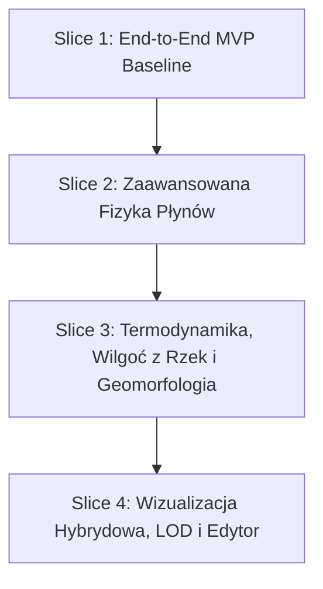

# Aero-Hydro 2.0: Kompletny Rejestr Discovery Q&A i Wzorzec Dokumentacji

> **Status dokumentu:** Zakończony rejestr ustaleń analityczno-projektowych (Discovery Complete ✅)  
> **Projekt:** Azgaar's Fantasy Map Generator (FMG 2.0)  
> **Powiązany dokument bazowy:** [`docs/architecture/aero_hydro_complete_system_redesign.md`](file:///home/mamac/projekty/Fantasy-Map-Generator-experimental/docs/architecture/aero_hydro_complete_system_redesign.md)  
> **Ostatnia aktualizacja:** 19 sierpnia 2026 r.

---

## 1. Wzorzec Optymalnej Dokumentacji Architektonicznej (Software Design Document / RFC)

Wszystkie dokumenty techniczne w ramach FMG 2.0 tworzone są w oparciu o poniższy, zunifikowany wzorzec:

1. **Wprowadzenie i Kontekst Domenowy** (*Problem Statement, stan As-Is vs To-Be, słownik pojęć*).
2. **Zakres i Mierzalne Wymagania** (*Goals, Non-Goals, budżet CPU: `< 80 ms` dla 10k, `< 400 ms` dla 100k komórek, 0 alokacji GC w pętli*).
3. **Architektura Systemu i Diagramy** (*Warstwy FMG 2.0: State $\to$ Generators $\to$ Editors $\to$ Renderers, przepływ danych, niezmienniki fizyczne*).
4. **Model Danych i Układ Pamięci** (*struktury TypeScript, typowane tablice `Float32Array`, metryka fizyczna $\Delta x$ w km, kontrakt zapisu `.map`*).
5. **Specyfikacja Matematyczno-Algorytmiczna** (*równania Green-Gaussa na Voronoi, liczba Froude'a $Fr$, adwekcja Upwind, Leopold-Maddock $W \propto Q^{0.5}$*).
6. **Ścisłe Mapowanie Plików** (*tabela `[NEW]`, `[MODIFY]`, `[DELETE]` ze wskazaniem dokładnych ról*).
7. **Plan Weryfikacji, Testy i Metryki Jakości** (*testy jednostkowe Vitest, testy integracyjne, testy LOD i renderera, benchmarki*).
8. **Ryzyka, Warunki Brzegowe i Mitygacje**.

---

## 2. Podsumowanie Decyzji Projektowych (Pełny Rejestr Q&A)

### Runda 1: Strategia, Wydajność i Architektura Ogólna ✅
- **1.1. Model Wdrożenia:** **Vertical Slices (Pionowe Plasterki):** Budowa najpierw działającego pełnego łańcucha MVP, a następnie iteracyjne podnoszenie realizmu fizycznego.
- **1.2. Budżet Wydajnościowy:** `< 80 ms` dla 10k komórek oraz `< 400 ms` dla 100k komórek na pojedynczym wątku, 0 alokacji GC w pętli symulacji.
- **1.3. Realizm vs Fantastyka:** Symulacja fizyczna planety kulistej z zachowaniem intuicyjnych kontrolek w UI (dostosowanie kąta, odwrócona rotacja, customowe presety).
- **1.4. Technologia Wizualizacji:** **Hybryda SVG + Canvas 2D:** Wektorowe wstęgi SVG do eksportu mapy/druku + opcjonalna animacja cząstek na żywo w Canvas z efektem smug (streak trails).
- **1.5. Wsteczna Kompatybilność:** Stare mapy (v1.x) ładują się bez uszkadzania rzek i biomów; nowe wektory generują się w locie, z opcją pełnego upgrade'u na życzenie.

### Runda 2: Pamięć, Siatka Voronoi i Atmosfera ✅
- **2.1. Podział `grid` vs `pack`:** Makroklimat (ciśnienie, wiatr, ocean) liczony na `grid`, a szczegółowa hydrologia i rzeki na `pack`. Wiatry i prądy generowane w jednym cyklu i prezentowane na powiązanej warstwie.
- **2.2. Matematyka Różniczkowa:** **Metoda Greena-Gaussa (FVM)** zatwierdzona dla $\nabla P, \nabla \cdot \vec{V}, \nabla^2$ w `src/utils/grid-math.ts`.
- **2.3. Warunki Brzegowe:** Cylindryczne zawijanie wschód-zachód dla map $360^\circ$ oraz otwarte warunki z deterministycznym szumem proceduralnym (Simplex/Perlin) dla map regionalnych.
- **2.4. Konfiguracja Świata vs Edytory:** `world-configurator` zachowuje intuicyjne róże wiatrów z presetami. Fizyka monsunów działa automatycznie w silniku, a pełna ręczna manipulacja odbywa się w dedykowanym edytorze klimatu.
- **2.5. Orografia (Barrier Jets):** Dynamiczne rozszczepienie wiatru na bazie **Liczby Froude'a $Fr = \frac{|\vec{V}|}{N \cdot h_{\text{mtn}}}$** i kąta uderzenia (brak arbitralnych stałych).

### Runda 3: Oceanografia, Wilgoć, Rzeki i Wilgotność Glebowa ✅
- **3.1. Prądy Morskie i Szelfy:** Pętle oceaniczne (*gyres*) napędzane wiatrem, rzutowanie brzegowe w strefie szelfu, ciepłe prądy ku biegunom, zimne ku równikowi.
- **3.2. 2D Adwekcja Wilgoci:** Szybka, bezalokacyjna **metoda Upwind na Voronoi** (3–5 iteracji relaksacji, czas $< 15\text{ ms}$).
- **3.3. Ewapotranspiracja:** W wersji bazowej (MVP) parowanie zachodzi nad wodą (ocean + jeziora).
- **3.4. Hydrologia Rzeczna:** Prawo Leopolda-Maddocka ($W = a \cdot Q^{0.5}$) i rzędowość Strahlera jako model domyślny z suwakiem w edytorze rzek do precyzyjnego dostrajania lub porównania ze starym trybem.
- **3.5. Jeziora Endorheiczne:** Automatyczna klasyfikacja suchych zbiorników jako słonych jezior bezodpływowych (zamykających zlewnię).
- **3.6. Wilgoć z Rzek (Decyzja Nowa):**  
  - **Lokalna Wilgotność Glebowa (`soilMoisture`):** Rzeki płynące przez pustynie tworzą zielone doliny, lasy łęgowe i oazy (`soilMoisture = prec + k * sqrt(flux)`).
  - **Wtórne Parowanie:** Wielkie rzeki i delty (Strahler $\ge 4$) oddają porcję pary z powrotem do atmosfery, zasilając opady w głębi lądu.

### Runda 4: UI Edytora, Animacja Canvas i Serializacja ✅
- **4.1. UX Edytora Klimatu:** Interaktywne przesuwanie żetonów wyżów i niżów myszką z podglądem na żywo + podwójne kliknięcie otwierające inspektor właściwości (`token-modal`) + rysowanie referencyjnych linii prądów/wiatrów.
- **4.2. Warstwa Canvas w DOM:** Płótno animacji umieszczone nad terenem i oceanem, ale **pod etykietami miast, granicami państw i drogami**.
- **4.3. Wydajność i LOD (Level of Detail):** Animacja cząstek w Canvas aktywowana przy przybliżeniu (zoom), wstrzymywana przy wyłączonej warstwie lub szybkim panningu.
- **4.4. Serializacja `.map` v2.0:** Kompaktowy, deterministyczny zapis wektorowy (centra baryczne, konfiguracja i linie referencyjne w nagłówku; przeliczenie po wczytaniu w ~25 ms bez powiększania pliku mapy).

---

## 3. Plan Wdrożenia (Vertical Slices):

1. **Slice 1 (MVP Baseline Pipeline):**
   - Alokacja `Float32Array` w `grid.cells` (`pressure`, `windU/V`, `oceanU/V`, `moisture`).
   - Operatory różniczkowe Green-Gaussa w `src/utils/grid-math.ts`.
   - Bazowe generowanie ciśnienia $P(x,y)$, wiatru Coriolisa i uproszczonych pętli oceanicznych.
   - 2D transport wilgoci Upwind i opady `grid.cells.prec`.
   - Rzutowanie na `pack.cells` i formowanie rzek.
   - Wstępne rysowanie połączonej warstwy wiatru i prądów w SVG.

2. **Slice 2 (Zaawansowana Dynamika Płynów):**
   - Rozszczepienie orograficzne Froude'a (*Barrier Jets*).
   - Efekt Venturiego w cieśninach morskich i lądowych.
   - Korytarze szelfowe i transport Ekmana w oceanie.
   - Perturbacje termiczne monsunów (ląd-morze).

3. **Slice 3 (Termodynamika, Wilgoć z Rzek i Geomorfologia):**
   - Równanie Clausiusa-Clapeyrona, schładzanie adiabatyczne i wiatr fenowy.
   - Priority-Flood i jeziora endorheiczne.
   - Geometria Leopolda-Maddocka ($W \propto Q^{0.5}$) i rzędowość Strahlera.
   - Sprzężenie wilgotności rzek: `soilMoisture` dla dolin rzecznych i oaz w biomach + wtórne parowanie z delt.

4. **Slice 4 (Wizualizacja Hybrydowa, LOD i Edytor):**
   - Płynny renderer cząstek w HTML5 Canvas z systemem LOD (Level of Detail).
   - Zintegrowany kontroler UI `AeroHydroEditor` z interaktywnymi żetonami wyżów/niżów (drag&drop + double-click) i liniami referencyjnymi.
   - Kompaktowa serializacja `.map` w `src/services/io/save.ts` i `load.ts`.
