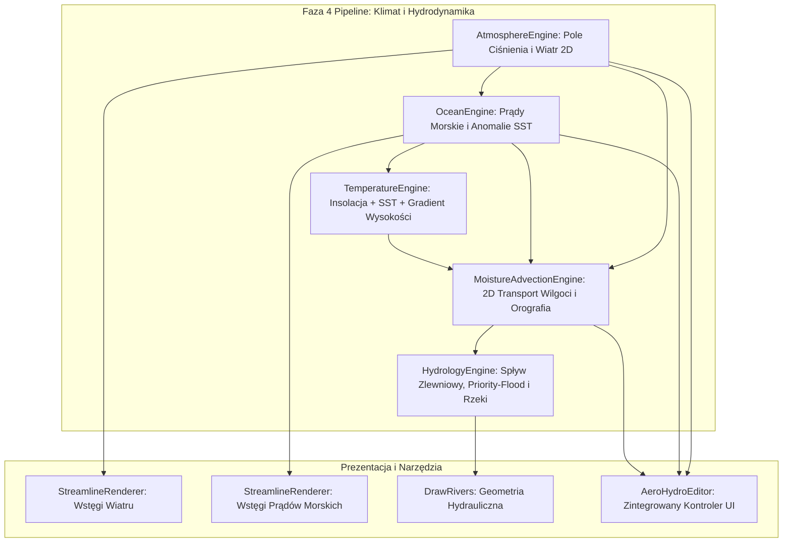

# Plan Realizacji: Zaawansowany Silnik Wiatrów i Prądów Morskich (Aero-Hydro 2.0)

> **Dla Agenta Realizującego:** WYMAGANA SUB-UMIEJĘTNOŚĆ: Użyj `superpowers:executing-plans` lub `subagent-driven-development`, aby wdrażać ten plan zadanie po zadaniu w rygorze TDD.

**Cel:** Stworzenie fizycznie wiarygodnego, zintegrowanego modelu wiatrów 2D i powierzchniowych prądów morskich, oddziałującego na orografię, cieśniny, temperaturę, opady i biomy, wraz z ultra-wydajną wizualizacją wstęg strumieniowych (Lagrangian Streamlines).

**Architektura:** Dwuwymiarowe pole ciśnienia barycznego $P(x,y)$ z siłą Coriolisa i kontrastem ląd-morze $\rightarrow$ wektory wiatru $\vec{V}_{\text{wind}}$ modyfikowane orograficznie (odchylenie wzdłuż łańcuchów górskich i przyspieszenie Venturiego w cieśninach) $\rightarrow$ naprężenie wiatru napędzające pętle oceaniczne (*gyres*) $\vec{V}_{\text{ocean}}$ $\rightarrow$ anomalie SST i parowania $\rightarrow$ adwekcja wilgoci 2D $\rightarrow$ deszcz orograficzny, cień opadowy i biomy. Wizualizacja: wstęgi całkowe oparte na śledzeniu cząstek (*Lagrangian Streamlines*), bez zaśmiecania mapy tysiącami strzałek.

**Stos Technologiczny:** TypeScript, Vitest (TDD), SVG (DOM/Path interpolation), Float32Array (SIMD-friendly typed arrays), D3-geo / Bezier smoothing.

---

## Mapa Zadań (Task Breakdown)

```
[Task 1: Typy i Pola Grid] ──► [Task 2: Generator Ciśnienia i Wiatru 2D] ──► [Task 3: Orografia i Cieśniny Venturiego]
                                                                                     │
[Task 5: Sprzężenie z Klimatem i Opadami 2D] ◄── [Task 4: Sprzężenie z Prądami Morskimi i SST]
         │
         ├──► [Task 6: Renderer Wstęg Wiatru]
         ├──► [Task 7: Renderer Wstęg Prądów Morskich]
         └──► [Task 8: Integracja z Pipeline FMG] ──► [Task 9: Kontroler i Edytor UI] ──► [Task 10: Weryfikacja i Testy]
```

---

### Zadanie 1: Model Danych i Typy dla Wiatrów i Ciśnienia

**Pliki do modyfikacji:**
- Modyfikacja: `src/types/global.ts`
- Modyfikacja: `src/generators/ocean-currents-generator.ts`

**Krok 1: Definicja struktur danych**
Rozszerz interfejs `Grid` w `src/types/global.ts` o pola wektorowe i skalarne:
* `pressure`: `Float32Array` (ciśnienie atmosferyczne w hPa)
* `windU`: `Float32Array` (składowa X wektora wiatru)
* `windV`: `Float32Array` (składowa Y wektora wiatru)
* `windSpeed`: `Float32Array` (prędkość wiatru w m/s)
* `oceanU`: `Float32Array` (składowa X prądu morskiego)
* `oceanV`: `Float32Array` (składowa Y prądu morskiego)
* `sstAnomaly`: `Float32Array` (anomalia temperatury oceanu w °C)
* `evapBoost`: `Float32Array` (mnożnik parowania z oceanu)

**Krok 2: Weryfikacja typowania**
Uruchom: `npm run lint`  
Oczekiwany rezultat: Brak błędów typowania.

---

### Zadanie 2: Generator Pola Ciśnienia i Wiatrów 2D (TDD)

**Pliki:**
- Tworzenie: `src/generators/wind-generator.test.ts`
- Tworzenie: `src/generators/wind-generator.ts`

**Krok 1: Napisanie testu jednostkowego (Red)**
```typescript
// src/generators/wind-generator.test.ts
import { beforeEach, describe, expect, it } from "vitest";

describe("WindGenerator", () => {
  let windGenerator: any;

  beforeEach(async () => {
    globalThis.TIME = false;
    globalThis.mapCoordinates = { latN: 60, latS: 0, latT: 60, lonW: -30, lonE: 30, lonT: 60 } as any;
    globalThis.options = { winds: [225, 45, 225, 315, 135, 315] } as any;

    const n = 100; // 10x10 grid
    globalThis.grid = {
      cellsX: 10,
      cellsY: 10,
      spacing: 10,
      cells: {
        i: Array.from({ length: n }, (_, i) => i),
        h: new Uint8Array(n).fill(10), // water
        temp: new Int8Array(n).fill(15)
      }
    } as any;

    const { WindGenerator } = await import("./wind-generator");
    windGenerator = WindGenerator;
  });

  it("generates 2D pressure and continuous wind vector field", () => {
    windGenerator.generate();
    expect(globalThis.grid.pressure).toBeDefined();
    expect(globalThis.grid.windU).toBeDefined();
    expect(globalThis.grid.windV).toBeDefined();
    expect(globalThis.grid.windSpeed).toBeDefined();
    expect(globalThis.grid.pressure.length).toBe(100);
    // Westerlies should have eastward (positive U) component in mid latitudes
    expect(globalThis.grid.windU.some((u: number) => Math.abs(u) > 0)).toBe(true);
  });
});
```

**Krok 2: Uruchomienie testu i weryfikacja niepowodzenia**
Uruchom: `npm test src/generators/wind-generator.test.ts`  
Oczekiwany rezultat: FAIL (moduł nie istnieje).

**Krok 3: Implementacja minimalnego kodu (Green)**
W `src/generators/wind-generator.ts`:
* Obliczanie strefowego profilu ciśnienia $P_{\text{zonal}}(\phi)$ na podstawie szerokości geograficznej (Hadley/Ferrel/Polar).
* Wyznaczanie gradientu ciśnienia 2D: $\nabla P = (\partial P/\partial x, \partial P/\partial y)$.
* Obliczenie wektorów wiatru geostroficznego $U = -\frac{1}{\rho f}\frac{\partial P}{\partial y}, V = \frac{1}{\rho f}\frac{\partial P}{\partial x}$ z kątem odchylenia tarciowego.

**Krok 4: Uruchomienie testu i weryfikacja powodzenia**
Uruchom: `npm test src/generators/wind-generator.test.ts`  
Oczekiwany rezultat: PASS.

---

### Zadanie 3: Interakcja Wiatru z Orografią i Efekt Cieśnin Venturiego (TDD)

**Pliki:**
- Modyfikacja: `src/generators/wind-generator.test.ts`
- Modyfikacja: `src/generators/wind-generator.ts`

**Krok 1: Napisanie testu jednostkowego dla cieśnin i pasm górskich**
```typescript
it("accelerates wind in narrow straits (Venturi effect) and deflects along mountains", () => {
  // Setup a narrow strait between two landmasses
  const h = new Uint8Array(100).fill(10); // water
  // Left and right barriers leaving row 5 as a narrow channel
  for (let y = 0; y < 10; y++) {
    if (y !== 4 && y !== 5) {
      h[y * 10 + 4] = 60; // Mountain on left
      h[y * 10 + 6] = 60; // Mountain on right
    }
  }
  globalThis.grid.cells.h = h;

  windGenerator.generate();

  const straitCell = 5 * 10 + 5;
  const openOceanCell = 0 * 10 + 0;

  // Strait wind speed should be amplified by Venturi factor
  expect(globalThis.grid.windSpeed[straitCell]).toBeGreaterThan(globalThis.grid.windSpeed[openOceanCell] * 0.9);
});
```

**Krok 2: Implementacja algorytmów orograficznych w `wind-generator.ts`**
* Obliczanie wektora normalnego do terenu i rozkład prędkości na składową styczną i prostopadłą do pasma górskiego.
* Detekcja szerokości przesmyków (*gap width*) i mnożnik Venturiego $k_{\text{venturi}} = 1.0 + 1.8 \cdot (1.0 - W/W_{\max})^2$.

**Krok 3: Uruchomienie testów**
Uruchom: `npm test src/generators/wind-generator.test.ts`  
Oczekiwany rezultat: PASS.

---

### Zadanie 4: Sprzężenie z Prądami Morskimi i Anomaliami SST (TDD)

**Pliki:**
- Modyfikacja: `src/generators/ocean-currents-generator.test.ts`
- Modyfikacja: `src/generators/ocean-currents-generator.ts`

**Krok 1: Napisanie testu jednostkowego**
```typescript
it("generates wind-driven ocean gyres with positive SST anomaly for poleward currents", () => {
  oceanCurrentsGenerator.generate();
  expect(globalThis.grid.oceanU).toBeDefined();
  expect(globalThis.grid.oceanV).toBeDefined();
  expect(globalThis.grid.sstAnomaly).toBeDefined();
  expect(globalThis.grid.evapBoost).toBeDefined();
  // Warm poleward currents have positive SST anomaly
  expect(globalThis.grid.sstAnomaly.some((t: number) => t > 0)).toBe(true);
});
```

**Krok 2: Refaktoryzacja `OceanCurrentsModule`**
* Przekształcenie naprężenia wiatru $\vec{\tau}$ w prąd powierzchniowy w komórkach wody ($h < 20$).
* Rzutowanie wektorów na wektory styczne do wybrzeża $\vec{T}_{\text{coast}}$ (prądy wzdłużbrzeżne).
* Wyznaczanie transportu termicznego: woda płynąca z równika ku biegunom niesie anomalię $\Delta T \in [+1.5, +5.5]^\circ\text{C}$ (ciepły prąd), a woda spływająca z biegunów niesie $\Delta T \in [-1.5, -4.5]^\circ\text{C}$ (zimny prąd).
* Obliczenie wskaźnika stymulacji parowania `evapBoost`.

**Krok 3: Uruchomienie testów**
Uruchom: `npm test src/generators/ocean-currents-generator.test.ts`  
Oczekiwany rezultat: PASS.

---

### Zadanie 5: Sprzężenie z Temperaturą i Opadami 2D (TDD)

**Pliki:**
- Modyfikacja: `src/generators/temperature-generator.ts`
- Modyfikacja: `src/generators/precipitation-generator.ts`
- Modyfikacja: `src/generators/precipitation-generator.test.ts`

**Krok 1: Integracja temperatury SST z `temperature-generator.ts`**
* Odczyt `grid.sstAnomaly[cellId]` i dodanie go do temperatury poziomu morza.

**Krok 2: Adwekcja wilgoci 2D w `precipitation-generator.ts`**
* Zastąpienie 1D liniowych pętli równoleżnikowych wielokrokową adwekcją wilgoci wzdłuż wektorów `(windU, windV)`.
* Obliczenie zrzutu deszczu orograficznego przy wznoszeniu ($\vec{V} \cdot \nabla h > 0$) oraz cienia opadowego za szczytami ($h \ge 70$).
* Uwzględnienie wzmocnienia parowania z ciepłych prądów morskich (`grid.evapBoost`).

**Krok 3: Uruchomienie testów**
Uruchom: `npm test src/generators/precipitation-generator.test.ts`  
Oczekiwany rezultat: PASS.

---

### Zadanie 6: Nowoczesny Renderer Wstęg Wiatru (Lagrangian Streamlines)

**Pliki:**
- Tworzenie: `src/renderers/draw-wind.ts`
- Modyfikacja: `src/renderers/index.ts`

**Krok 1: Implementacja algorytmu wstęg prądu (Streamlines)**
* Algorytm nasion cząstek (*Streamline Seeding*) z kontrolą minimalnego odstępu $d_{\text{sep}}$.
* Całkowanie Runge-Kutta 2 rzędu (RK2) wzdłuż wektorów `windU, windV`.
* Wygładzanie krzywymi Beziera/Catmull-Rom.
* Kodowanie kolorystyczne:
  * Wilgotne masy morskie: lodowy błękit / cyjan (`#38bdf8` - `#0284c7`).
  * Suche masy lądowe i feny: ciepłe złoto / bursztyn (`#f59e0b` - `#d97706`).
* Opcjonalna subtelna animacja `stroke-dasharray` w CSS.

---

### Zadanie 7: Nowoczesny Renderer Wstęg Prądów Morskich

**Pliki:**
- Modyfikacja: `src/renderers/draw-ocean-currents.ts`

**Krok 1: Wdrożenie wielopasmowych wstęg (Ribbon Bundles)**
* Tracing wstęg wzdłuż wektorów prądów morskich `oceanU, oceanV`.
* Meandrowanie w głębokim oceanie i zwężenie w cieśninach (Gibraltar, Gallipoli).
* Paleta barwna:
  * Ciepłe prądy: Szkarłat / Złoto / Szmaragd (`#ef4444`, `#f59e0b`, `#10b981`).
  * Zimne prądy: Lodowy Cyjan / Indygo / Granat (`#38bdf8`, `#1e3a8a`, `#0f172a`).

---

### Zadanie 8: Integracja z Pipeline FMG 2.0 i Warstwami

**Pliki:**
- Modyfikacja: `public/main.js` (Faza 4 w `generate()`)
- Modyfikacja: `src/controllers/heightmap-editor.ts` (`regenerateErasedData` & `restoreRiskedData`)
- Modyfikacja: `src/generators/resample.ts` (`Resampler.process`)
- Modyfikacja: `src/renderers/viewport/viewport-renderer.ts` (obsługa warstw `toggleWind`, `toggleOceanCurrents`)

**Krok 1: Wpięcie wywołania generatorów**
* Kolejność wywołań w Fazie 4:
  1. `WindGenerator.generate()`
  2. `OceanCurrentsGenerator.generate()`
  3. `TemperatureGenerator.generate()`
  4. `PrecipitationGenerator.generate()`

---

### Zadanie 9: Kontroler i Edytor Wiatrów i Prądów

**Pliki:**
- Tworzenie: `src/controllers/wind-currents-editor.ts`
- Modyfikacja: `src/controllers/index.ts`
- Modyfikacja: `src/controllers/ocean-currents-editor.ts`

**Krok 1: Interfejs dialogowy**
* Suwaki intensywności komórek ciśnienia (Hadley/Ferrel, monsuny).
* Przełącznik podglądu warstwy wiatru i prądów.
* Interaktywne dodawanie i przesuwanie punktów wyżów/niżów na mapie.
* Przycisk natychmiastowej rekalkulacji klimatu i biomów.

---

### Zadanie 10: Weryfikacja Końcowa, Testy i Optymalizacja

**Krok 1: Uruchomienie pełnego zestawu testów**
Uruchom: `npm test`  
Oczekiwany rezultat: Wszystkie testy przechodzą pomyślnie.

**Krok 2: Linting i weryfikacja standardów kodu**
Uruchom: `npm run lint`  
Oczekiwany rezultat: Brak błędów lintera Biome.

**Krok 3: Profilowanie wydajnościowe**
Sprawdzenie w konsoli czasu `generateWind` + `generateOceanCurrents` ($< 25\text{ ms}$).
# Architektura Systemu Aero-Hydro 2.0: Kompletny Redesign Fizyki Wiatrów, Prądów Morskich i Hydrologii

> **Dokumentacja Architektoniczna i Plan Implementacyjny FMG 2.0**  
> **Status:** Projekt Bazowy i Specyfikacja Techniczna  
> **Data:** 14 sierpnia 2026 r.  
> **Autor:** Antigravity (Advanced AI Architecture Pair)  
> **Plik docelowy:** `docs/architecture/aero_hydro_complete_system_redesign.md`

---

## Spis Treści
1. [Wstęp i Wizja Architektoniczna](#1-wstęp-i-wizja-architektoniczna)
2. [Kompletna Mapa Istniejącego Kodu i Stanu Obecnego](#2-kompletna-mapa-istniejącego-kodu-i-stanu-obecnego)
3. [Szczegółowa Analiza i Dekompozycja Problemów Systemowych](#3-szczegółowa-analiza-i-dekompozycja-problemów-systemowych)
   - [3.1. Problem Wiatru: Statyczne Pasma 1D vs. 2D Pola Baryczne i Siła Coriolisa](#31-problem-wiatru-statyczne-pasma-1d-vs-2d-pola-baryczne-i-siła-coriolisa)
   - [3.2. Problem Skalowalności: Zależność od Rozdzielczości i Liczby Komórek](#32-problem-skalowalności-zależność-od-rozdzielczości-i-liczby-komórek)
   - [3.3. Problem Prądów Morskich: Odizolowanie od Atmosfery i Sztuczne Wektory](#33-problem-prądów-morskich-odizolowanie-od-atmosfery-i-sztuczne-wektory)
   - [3.4. Problem Orografii i Cieśnin: Brak Efektu Venturiego i Odchylenia Wzdłużbarierowego](#34-problem-orografii-i-cieśnin-brak-efektu-venturiego-i-odchylenia-wzdłużbarierowego)
   - [3.5. Problem Hydrologii: Niefizyczne Skalowanie Rzek i Brak Hierarchii Strahlera](#35-problem-hydrologii-niefizyczne-skalowanie-rzek-i-brak-hierarchii-strahlera)
   - [3.6. Problem Zbiorników Wodnych: Brak Równowagi Parowania i Odpływów Jezior](#36-problem-zbiorników-wodnych-brak-równowagi-parowania-i-odpływów-jezior)
   - [3.7. Problem Wizualizacji: Zaśmiecanie Siatkami Strzałek vs. Lagrangian Streamlines](#37-problem-wizualizacji-zaśmiecanie-siatkami-strzałek-vs-lagrangian-streamlines)
4. [Fundamenty Fizyczno-Matematyczne Nowego Modelu](#4-fundamenty-fizyczno-matematyczne-nowego-modelu)
   - [4.1. Atmosfera: Ciśnienie Baryczne, Wiatr Geostroficzny i Monsuny](#41-atmosfera-ciśnienie-baryczne-wiatr-geostroficzny-i-monsuny)
   - [4.2. Ocean: Pętle Cyrkulacyjne, Transport Ekmana i Prądy Szelfowe](#42-ocean-pętle-cyrkulacyjne-transport-ekmana-i-prądy-szelfowe)
   - [4.3. Termodynamika Wilgoci: Równanie Clausiusa-Clapeyrona i Adwekcja 2D](#43-termodynamika-wilgoci-równanie-clausiusa-clapeyrona-i-adwekcja-2d)
   - [4.4. Orografia: Wznoszenie Adiabatyczne, Deszcz Orograficzny i Efekt Fenu](#44-orografia-wznoszenie-adiabatyczne-deszcz-orograficzny-i-efekt-fenu)
   - [4.5. Geomorfologia Rzeczna: Geometria Hydrauliczna Leopolda-Maddocka](#45-geomorfologia-rzeczna-geometria-hydrauliczna-leopolda-maddocka)
5. [Projekt Modelu Danych i Układ Pamięci (Zero-Allocation Layout)](#5-projekt-modelu-danych-i-układ-pamięci-zero-allocation-layout)
6. [Architektura Modułowa Nowego Silnika (Aero-Hydro Pipeline)](#6-architektura-modułowa-nowego-silnika-aero-hydro-pipeline)
7. [Strategia Niezależności od Rozdzielczości (10k do 100k+ Komórek)](#7-strategia-niezależności-od-rozdzielczości-10k-do-100k-komórek)
8. [Zaawansowany System Wizualizacji (Google Earth / Earth Nullschool Style)](#8-zaawansowany-system-wizualizacji-google-earth--earth-nullschool-style)
9. [Fazy Wdrożenia i Plan Testów](#9-fazy-wdrożenia-i-plan-testów)

---

## 1. Wstęp i Wizja Architektoniczna

Obecny generator map Azgaara (FMG) w warstwie klimatu i hydrologii opiera się na algorytmach zaprojektowanych w latach 2017–2019, które traktowały zjawiska przyrodnicze w sposób uproszczony i odseparowany:
- Wiatr był jednowymiarowym kątem przypisanym do 6 pasów równoleżnikowych.
- Prądy morskie były sztucznie dodanymi punktami bazowymi.
- Wilgoć przemieszczała się w pętli wiersz po wierszu (`for x = 0..cellsX`), nie reagując na rzeczywiste dwuwymiarowe wektory wiatru.
- Rzeki rozrastały się liniowo wzdłuż długości, tworząc nienaturalnie grube plamy u ujść.

**Wizja Aero-Hydro 2.0** zakłada całkowitą rezygnację z atrap i protez algorytmicznych na rzecz **zintegrowanego, fizycznie spójnego silnika geofizycznego**. W tym podejściu:
1. **Atmosfera i ocean stanowią nierozerwalny układ termodynamiczny**: wiatry napędzają prądy morskie, prądy morskie modulują temperaturę powierzchni morza (SST), woda paruje zależnie od temperatury, a wiatry 2D transportują masy wilgoci nad ląd.
2. **Ukształtowanie terenu (orografia) bezpośrednio kieruje przepływem mas**: łańcuchy górskie odchylają wektory wiatru, wymuszają deszcze orograficzne i tworzą głębokie cienie deszczowe (rain shadows), a wąskie cieśniny przyspieszają wiatr i wodę (efekt Venturiego).
3. **Hydrologia lądowa bazuje na rzeczywistych prawach geomorfologii**: rzeki podlegają prawu potęgowemu hydrauliki rzecznej ($W = a \cdot Q^b$), akumulacji zlewniowej i hierarchii rzędowości Strahlera.
4. **Wizualizacja dorównuje współczesnym standardom GIS (Earth Nullschool / Google Earth)**: zamiast tysięcy statycznych strzałek zaśmiecających widok, wprowadzamy płynne wstęgi strumieniowe (Lagrangian Streamlines) z kodowaniem prędkości kolorem i adaptacyjnym rozstawem nasion.

---

## 2. Kompletna Mapa Istniejącego Kodu i Stanu Obecnego

Poniższa tabela stanowi wyczerpujący audyt wszystkich modułów w projekcie odpowiedzialnych za klimat, temperaturę, wiatr, wodę, rzeki i ich prezentację:

| Moduł / Plik | Rola w Systemie | Stan Obecny i Ograniczenia | Docelowy Status w Aero-Hydro 2.0 |
| :--- | :--- | :--- | :--- |
| [`src/generators/temperature-generator.ts`](file:///c:/Users/cyunc/Documents/Projects/Fantasy-Map-Generator-experimental/src/generators/temperature-generator.ts) | Obliczanie temperatur komórek `grid.cells.temp` | Zastąpiono model liniowy funkcją insolacji solarnej $S(\phi) = \cos(\phi)^{0.85}$ oraz anomalią SST. | **Rozszerzenie**: Integracja z pełnym polem albedo, adwekcją termiczną wiatru i wysokościowym gradientem adiabatycznym. |
| [`src/generators/wind-generator.ts`](file:///c:/Users/cyunc/Documents/Projects/Fantasy-Map-Generator-experimental/src/generators/wind-generator.ts) | Generowanie wiatrów | 6 stref 1D (`options.winds`), brak ciągłego pola wektorowego 2D, brak ciśnienia barycznego. | **Pełne Przepisanie**: Generowanie dynamicznego pola ciśnienia 2D $P(x,y)$, wiatrów geostroficznych i cyrkulacji monsunowej. |
| [`src/generators/ocean-currents-generator.ts`](file:///c:/Users/cyunc/Documents/Projects/Fantasy-Map-Generator-experimental/src/generators/ocean-currents-generator.ts) | Generowanie prądów morskich i anomalii SST | Model wektorowy z buforem szelfowym, zależny od wstępnie generowanych źródeł (*sources*). | **Pełne Przepisanie**: Globalna cyrkulacja napędzana naprężeniem wiatru ($\vec{\tau}$), pętle oceaniczne (*gyres*), prądy krawędziowe. |
| [`src/generators/precipitation-generator.ts`](file:///c:/Users/cyunc/Documents/Projects/Fantasy-Map-Generator-experimental/src/generators/precipitation-generator.ts) | Wyznaczanie opadów `grid.cells.prec` | Przejście liniowe wierszami/kolumnami (`passWind`), sztuczne progi cienia opadowego. | **Pełne Przepisanie**: 2D Adwekcja wilgoci mas powietrza wzdłuż wektorów wiatru z prawem Clausiusa-Clapeyrona. |
| [`src/generators/river-generator.ts`](file:///c:/Users/cyunc/Documents/Projects/Fantasy-Map-Generator-experimental/src/generators/river-generator.ts) | Formowanie rzek i zlewni `pack.rivers` | Algorytm depresji i przepływu w dół. Liniowy przyrost szerokości w `getOffset()`. | **Refaktoryzacja**: Integracja prawa Leopolda-Maddocka ($W \propto Q^{0.5}$), rzędowości Strahlera i depresji Priority-Flood. |
| [`src/generators/lakes.ts`](file:///c:/Users/cyunc/Documents/Projects/Fantasy-Map-Generator-experimental/src/generators/lakes.ts) | Zarządzanie jeziorami i bilans wodny | Prosty bilans dopływ vs. stałe parowanie, brak dynamicznego poziomu lustra wody. | **Rozszerzenie**: Dynamiczny bilans parowania zlewniowego, jeziora bezodpływowe (endorheiczne). |
| [`src/generators/biomes-generator.ts`](file:///c:/Users/cyunc/Documents/Projects/Fantasy-Map-Generator-experimental/src/generators/biomes-generator.ts) | Klasyfikacja 84 biomów | Matryca Whittaker/Holdridge oparta na `temp` i `prec`. | **Dostosowanie**: Odczyt z nowych precyzyjnych rozkładów wilgotności glebowej i wskaźników aridowości De Martonne'a. |
| [`src/renderers/draw-ocean-currents.ts`](file:///c:/Users/cyunc/Documents/Projects/Fantasy-Map-Generator-experimental/src/renderers/draw-ocean-currents.ts) | Rysowanie prądów morskich w SVG | Wstęgi wielonitkowe. Kolorowanie prędkością. | **Standaryzacja**: Konwersja do zunifikowanego renderera wstęg Lagrangian Streamlines. |
| [`src/renderers/draw-wind.ts`](file:///c:/Users/cyunc/Documents/Projects/Fantasy-Map-Generator-experimental/src/renderers/draw-wind.ts) | Rysowanie wiatru w SVG | Rysowanie linii prądu. | **Standaryzacja**: Płynny rendering wstęg wiatru z adaptacyjnym rozstawem i animacją przepływu. |
| [`src/controllers/ocean-currents-editor.ts`](file:///c:/Users/cyunc/Documents/Projects/Fantasy-Map-Generator-experimental/src/controllers/ocean-currents-editor.ts) | Edytor prądów morskich w UI | Ręczne stawianie źródeł ciepłych/zimnych. | **Unifikacja**: Połączenie z edytorem baryczno-wiatrowym w jeden zintegrowany edytor klimatu. |
| [`src/controllers/wind-currents-editor.ts`](file:///c:/Users/cyunc/Documents/Projects/Fantasy-Map-Generator-experimental/src/controllers/wind-currents-editor.ts) | Edytor wiatrów i układów ciśnienia | Podstawowy interfejs centrów barycznych. | **Rozbudowa**: Narzędzie przesuwania wyżów/niżów, edycji wektorów i podglądu trajektorii w czasie rzeczywistym. |
| [`public/main.js`](file:///c:/Users/cyunc/Documents/Projects/Fantasy-Map-Generator-experimental/public/main.js) | Główny pipeline generowania mapy | Koordynuje wywołania faz 1–16. | **Synchronizacja**: Zapewnienie poprawnej kolejności wywołań w pipeline fazy 4 i 6. |
| [`src/generators/resample.ts`](file:///c:/Users/cyunc/Documents/Projects/Fantasy-Map-Generator-experimental/src/generators/resample.ts) | Skalowanie i wycinanie submap | Przeliczanie siatki i interpolacja parametrów komórek. | **Aktualizacja**: Dwuliniowa interpolacja ciągłych pól wektorowych $\vec{V}_{\text{wind}}, \vec{V}_{\text{ocean}}, P$. |

---

## 3. Szczegółowa Analiza i Dekompozycja Problemów Systemowych

Każdy z poniższych problemów został przeanalizowany pod kątem fizycznym, matematycznym i programistycznym.

---

### 3.1. Problem Wiatru: Statyczne Pasma 1D vs. 2D Pola Baryczne i Siła Coriolisa

#### Istota problemu:
W klasycznym silniku FMG wiatr jest zdefiniowany jako tablica 6 kątów (`options.winds = [225, 45, 225, 45, 225, 45]`). Każdy kąt określa jeden stały wektor na cały pas szerokości geograficznej (np. $30^\circ - 60^\circ\text{N}$). 

```
STAN OBECNY (1D Sztywne Pasmo):
────────────────────────────────────────────────────────────────────
Wiatr wieje w linii prostej na wschód: ===> ===> ===> ===> ===> ===>
Ignoruje kształt kontynentów, oceany, nagrzewanie lądu i zawirowania.
────────────────────────────────────────────────────────────────────
```

#### Dlaczego to podejście jest błędne:
1. **Brak wirowości ($\nabla \times \vec{V} = 0$)**: W rzeczywistej atmosferze wiatr nigdy nie wieje w nieskończonych liniach prostych. Cyrkulacja tworzy cyklony (wokół niżów) i antycyklony (wokół wyżów).
2. **Brak kontrastu termicznego ląd-morze**: Ląd nagrzewa się latem szybciej niż ocean, tworząc potężne niże termiczne, które zasysają wilgotne powietrze z oceanu (mechanizm **monsunowy** tworzący klimat Indii, Azji Wschodniej i Ameryki Środkowej). W obecnym FMG monsuny są niemożliwe do wygenerowania.
3. **Brak fal planetarnych Rossby'ego**: Na styku mas ciepłych i zimnych powstaje meandrujący prąd strumieniowy (*jet stream*), który decyduje o zmienności pogody w Europie i Ameryce Północnej.

#### Rozwiązanie w Aero-Hydro 2.0:
Wprowadzenie **dwuwymiarowego pola ciśnienia atmosferycznego $P(x, y)$** na poziomie morza. Wiatr jest wyprowadzany analitycznie z gradientu ciśnienia i siły Coriolisa:

$$\vec{V}_{\text{geostrophic}} = \frac{1}{\rho f} \left( -\frac{\partial P}{\partial y}, \frac{\partial P}{\partial x} \right)$$

gdzie $f = 2\Omega \sin(\phi)$ to parametr Coriolisa. W ten sposób wokół wyżów automatycznie powstaje ruch prawoskrętny (na półkuli północnej), a wokół niżów lewoskrętny, tworząc autentyczną globalną cyrkulację.

---

### 3.2. Problem Skalowalności: Zależność od Rozdzielczości i Liczby Komórek

#### Istota problemu:
W kodzie FMG znajduje się wiele zakodowanych na stałe stałych zależnych od indeksów siatki, takich jak `cellsX`, `cellsY`, `radius = 8`, `FLUX_FACTOR = 500`, czy `stepY = Math.floor(cellsY / 4)`. 

```typescript
// Przykład problemu w starym kodzie:
const radius = Math.floor((source.strength / 100) * (cellsX / 6));
const fluxWidth = Math.min(flux ** 0.7 / 500, 1);
```

#### Konsekwencje:
1. Gdy użytkownik wygeneruje mapę o małej gęstości ($10\,000$ komórek), `cellsX \approx 115`. Promień wpływu wynosi wtedy ok. 15 komórek.
2. Gdy użytkownik zmieni gęstość na $100\,000$ komórek, `cellsX \approx 365`. Promień w komórkach rośnie, ale jego fizyczny zasięg w kilometrach na mapie drastycznie się zmienia!
3. Wskaźniki przepływu wody (`cells.fl`) kumulują się inaczej przy 10k niż przy 100k komórek, powodując, że przy 100k komórkach rzeki stają się 10 razy cieńsze lub woda wysycha na kontynencie.

#### Rozwiązanie w Aero-Hydro 2.0:
Wszystkie równania i stałe zostają **przeliczone na jednostki fizyczne niezależne od siatki**:
- Odległości wyrażane w kilometrach ($\text{km}$), przeliczane przez `cellSpacingKm = spacingPx * distanceScale`.
- Różniczkowanie przestrzenne ($\nabla P, \nabla h$) wykorzystuje rzeczywisty krok przestrzenny $dx, dy$ w metrach/kilometrach.
- Przepływ wody i opady operują na jednostkach $\text{mm/rok}$ oraz $\text{m}^3/\text{s}$, a nie na abstrakcyjnych liczbach komórkowych.

---

### 3.3. Problem Prądów Morskich: Odizolowanie od Atmosfery i Sztuczne Wektory

#### Istota problemu:
Prądy morskie w generatorze były dotychczas traktowane jako niezależny byt – stawiano sztuczne punkty "źródła ciepłego/zimnego" w wodzie, które promieniowały temperaturą.

#### Niezgodność z fizyką:
1. W naturze prądy morskie na powierzchni oceanu są **bezpośrednio napędzane naprężeniem wiatru ($\vec{\tau}$)**. Pasaty pchają wodę na zachód w pasie równikowym, a wiatry zachodnie pchają ją na wschód w strefie umiarkowanej.
2. Kontynenty stanowią nieprzepuszczalne bariery, które zmuszają ten ruch do zamknięcia się w gigantyczne pętle oceaniczne (**Subtropical & Subpolar Gyres**).
3. Na zachodnich brzegach oceanów powstają **wąskie, głębokie i niezwykle szybkie ciepłe prądy** (Prąd Zatokowy/Golfsztrom, Kuroshio), niosące gigantyczne ilości energii cieplnej na północ.
4. Na wschodnich brzegach oceanów powstają **szerokie, powolne zimne prądy z upwellingiem** (Prąd Kanaryjski, Kalifornijski, Humboldta), które schładzają wybrzeża i tworzą pustynie mgielne.

#### Rozwiązanie w Aero-Hydro 2.0:
Prądy morskie są wyprowadzane bezpośrednio z pola naprężenia wiatru $\vec{\tau}(\vec{V}_{\text{wind}})$. Model wymusza zachowanie ciągłości hydrodynamicznej w basenach oceanicznych ($\nabla \cdot \vec{V}_{\text{ocean}} = 0$) z asymetrią zachodniego brzegu (efekt beta $\beta = \partial f / \partial y$), tworząc autentyczne prądy krawędziowe i pętle oceaniczne bez konieczności ręcznego stawiania źródeł.

---

### 3.4. Problem Orografii i Cieśnin: Brak Efektu Venturiego i Odchylenia Wzdłużbarierowego

#### Istota problemu:
W klasycznym modelu FMG góra na mapie była po prostu komórką o $h \ge 70$. Wiatr przechodził przez nią w linii prostej, tracąc pewien ułamek wilgoci w pętli `for`.

```
STAN OBECNY (Brak Odbicia):
  Wiatr: ──────────► [ GÓRA ] ──────────► (Wiatr leci prosto przez szczyt)

STAN FIZYCZNY (Odchylenie i Efekt Venturiego):
                     /  ▲
  Wiatr: ──────────►│  /  (Barrier Jet wzdłuż pasma górskiego)
                    ▼ ──►
                    ══>>══ (Przyspieszenie w cieśninie / przesmyku)
```

#### Zjawiska pomijane w starym kodzie:
1. **Odchylenie wzdłużbarierowe (*Barrier Jet*)**: Powietrze o niskiej energii kinetycznej nie może wspiąć się na wysoką barierę górską ($Fr < 1$). Zostaje zablokowane i skręca wzdłuż pasma górskiego, tworząc silny wiatr równoległy do grani.
2. **Efekt Dyszy Venturiego w Cieśninach (*Gap Winds*)**: Gdy wiatr lub prąd morski napotyka wąskie gardło (np. Cieśnina Gibraltarska, Bosfor, Dardanele, Kanał Mozambicki, Cieśnina Mesyńska), dochodzi do gwałtownego wzrostu prędkości przepływu:

$$v_2 = v_1 \cdot \frac{A_1}{A_2}$$

W starym kodzie cieśnina spowalniała lub blokowała przepływ, podczas gdy w rzeczywistości prędkość wzrasta tam 2-3 krotnie!

#### Rozwiązanie w Aero-Hydro 2.0:
Wprowadzenie tensora oporu orograficznego i analitycznego wskaźnika zwężenia cieśninowego $W(x, y)$. Wektor wiatru uderzający w barierę górską zostaje rozłożony na składową wznoszącą (kondensacja) i składową wzdłużbarierową (przyspieszenie wzdłuż łańcucha). W cieśninach wektory wiatru i wody są wyrównywane do osi kanału i przyspieszane funkcją geometryczną.

---

### 3.5. Problem Hydrologii: Niefizyczne Skalowanie Rzek i Brak Hierarchii Strahlera

#### Istota problemu:
W module `src/generators/river-generator.ts` funkcja `getOffset()` obliczała szerokość rzeki jako sumę liniowego postępu wzdłuż indeksu punktów oraz potęgi przepływu:

```typescript
const lengthWidth = pointIndex * this.LENGTH_STEP_WIDTH + (this.LENGTH_PROGRESSION[pointIndex] || ...);
return widthFactor * (lengthWidth + fluxWidth) + startingWidth;
```

#### Dlaczego to psuło wygląd mapy:
1. Długie rzeki rosną w tym modelu w sposób ciągły tylko dlatego, że mają dużo punktów (`pointIndex * 0.005`), nawet jeśli płyną przez suchy step i nie dopływają do nich żadne dopływy!
2. Ujścia rzek do morza osiągały absurdalne grubości, rozlewając się na kilka sąsiednich komórek jak jeziora.
3. Brakowało koncepcji **rzędowości rzek (Strahler Stream Order)**: strumień źródłowy (rząd 1) po połączeniu z drugim strumieniem tworzy rzekę rzędu 2, itd.

#### Rozwiązanie w Aero-Hydro 2.0:
Wdrożenie fundamentalnego prawa geomorfologii rzecznej — **Geometrii Hydraulicznej Leopolda-Maddocka**:

$$W = a \cdot Q^b, \quad D = c \cdot Q^d, \quad V = k \cdot Q^m$$

gdzie dla większości rzek świata $b \approx 0.5$ (szerokość rośnie proporcjonalnie do pierwiastka z przepływu $Q$, a nie liniowo z długością!). Dodatkowo wyznaczana jest rzędowość Strahlera, a maksymalna szerokość w pikselach ma sztywny, adaptacyjny limit zapobiegający powstawaniu plam.

---

### 3.6. Problem Zbiorników Wodnych: Brak Równowagi Parowania i Odpływów Jezior

#### Istota problemu:
W obecnym kodzie jeziora albo mają stały odpływ (`feature.outlet`), albo są zamknięte. Parowanie jest stałą wartością odejmowaną jednorazowo.

#### Braki w symulacji:
1. W suchych strefach klimatycznych (np. Morze Kaspijskie, Morze Martwe, Wielkie Jezioro Słone, Jezioro Czad) dopływ wody jest w całości równoważony przez intensywne parowanie powierzchniowe. Jezioro staje się **zbiornikiem endorheicznym (bezodpływowym)** o podwyższonym zasoleniu.
2. W starym kodzie brakowało dynamicznego wyznaczania progu przelewowego (*sill elevation*) dla depresji terenowych przy użyciu nowoczesnych algorytmów hydrologicznych (np. **Barnes Priority-Flood**).

#### Rozwiązanie w Aero-Hydro 2.0:
Zastosowanie algorytmu **Priority-Flood** do wyznaczania naturalnych zlewni bezodpływowych oraz kalkulacji bilansu wodnego jeziora:

$$\Delta V = Q_{\text{inflow}} + P_{\text{lake}} \cdot A_{\text{lake}} - E_{\text{lake}}(T, \text{wind}) \cdot A_{\text{lake}}$$

Jeśli $\Delta V \le 0$, jezioro staje się słonym jeziorem bezodpływowym. Jeśli $\Delta V > 0$, lustro wody podnosi się do najniższego punktu krawędzi zlewni (*sill*) i tworzy rzekę odpływową (*outlet*).

---

### 3.7. Problem Wizualizacji: Zaśmiecanie Siatkami Strzałek vs. Lagrangian Streamlines

#### Istota problemu:
Eksperymentalne próby wizualizacji wiatru i prądów za pomocą siatek strzałek (tysiące elementów `<path>` w regularnych odstępach) tworzyły nieczytelny szum wizualny i drastycznie obniżały wydajność przeglądarki (spadek do <15 FPS).

```
ANTYWZORZEC (Siatka Strzałek):
  ↗ ↗ ↗ ↗ ↗ ↗ ↗ ↗ ↗  (10 000 elementów DOM,
  ↗ ↗ ↗ ↗ ↗ ↗ ↗ ↗ ↗   zasłania etykiety miast,
  ↗ ↗ ↗ ↗ ↗ ↗ ↗ ↗ ↗   drogi, granice i rzeki)

WZORZEC AERO-HYDRO 2.0 (Lagrangian Streamlines / Wstęgi Strumieniowe):
  ══════════════════════════════════════════════════════════════>
  (Ciągłe, jedwabiste wstęgi ze zmienną szerokością i kolorem prędkości,
   tylko 80-150 gładkich ścieżek SVG/Canvas, 60 FPS)
```

#### Rozwiązanie w Aero-Hydro 2.0:
Wdrożenie **algorytmu śledzenia cząstek z adaptacyjnym rozstawem (Jobard-Lefer Streamline Seeding)**. Zamiast siatki strzałek generujemy eleganckie, ciągłe wstęgi o zróżnicowanej szerokości, gdzie kolor koduje prędkość i temperaturę przepływu (dokładnie jak w Google Earth i Earth Nullschool).

---

## 4. Fundamenty Fizyczno-Matematyczne Nowego Modelu

Poniższa sekcja przedstawia kompletny aparat matematyczny implementowany w kodzie TypeScript nowego silnika.

---

### 4.1. Atmosfera: Ciśnienie Baryczne, Wiatr Geostroficzny i Monsuny

Pole ciśnienia atmosferycznego na poziomie morza $P(x, y)$ (w $\text{hPa}$) jest sumą trzech składowych:

$$P(x, y) = P_{\text{zonal}}(\phi) + P_{\text{thermal}}(x, y) + P_{\text{dynamic}}(x, y)$$

#### 1. Profil strefowy $P_{\text{zonal}}(\phi)$ (Komórki Hadleya, Ferrela, Polarne):
Dla szerokości geograficznej $\phi \in [-90^\circ, +90^\circ]$:

$$P_{\text{zonal}}(\phi) = P_0 - A_{\text{eq}} \cos(3\phi) + A_{\text{sub}} \cos(2\phi) - A_{\text{pol}} \sin^2(\phi)$$

gdzie $P_0 = 1013.25\text{ hPa}$, $A_{\text{eq}} \approx 6\text{ hPa}$ (bruzda równikowa ITCZ), $A_{\text{sub}} \approx 14\text{ hPa}$ (wyże zwrotnikowe na $30^\circ\text{N/S}$), $A_{\text{pol}} \approx 18\text{ hPa}$ (niże subpolarne na $60^\circ\text{N/S}$).

#### 2. Perturbacja termiczna ląd-morze $P_{\text{thermal}}(x, y)$:
Zależna od kontrastu temperatury powierzchniowej $T_{\text{surf}}$ względem średniej strefowej $\overline{T}(\phi)$:

$$P_{\text{thermal}}(x, y) = -k_{\text{thermal}} \cdot \left( T_{\text{surf}}(x, y) - \overline{T}(\phi) \right) \cdot \text{isLand}(x, y)$$

- W lecie / ciepłych strefach ląd jest gorący ($T_{\text{surf}} > \overline{T}$) $\rightarrow P_{\text{thermal}} < 0$ (**Niż Monsunowy** $\rightarrow$ zasysanie wilgotnego wiatru z morza).
- W zimie / zimnych strefach ląd jest mroźny ($T_{\text{surf}} < \overline{T}$) $\rightarrow P_{\text{thermal}} > 0$ (**Wyż Kontynentalny**, np. Wyż Syberyjski $\rightarrow$ odpływ suchego mroźnego wiatru).

#### 3. Wyprowadzenie prędkości wiatru z równania geostroficzno-tarciowego:
Gradient ciśnienia $\nabla P = \left( \frac{\partial P}{\partial x}, \frac{\partial P}{\partial y} \right)$ wyznacza siłę gradientu barycznego:

$$\vec{F}_p = -\frac{1}{\rho} \nabla P$$

Po uwzględnieniu siły Coriolisa $\vec{F}_c = -f \vec{k} \times \vec{V}$ oraz tarcia powierzchniowego z kątem odchylenia $\alpha$ ($\alpha \approx 15^\circ$ nad oceanem, $\alpha \approx 30^\circ$ nad lądem):

$$u_{\text{wind}} = -\frac{1}{\rho f} \left( \frac{\partial P}{\partial y} \cos\alpha + \frac{\partial P}{\partial x} \sin\alpha \right)$$

$$v_{\text{wind}} = \frac{1}{\rho f} \left( \frac{\partial P}{\partial x} \cos\alpha - \frac{\partial P}{\partial y} \sin\alpha \right)$$

---

### 4.2. Ocean: Pętle Cyrkulacyjne, Transport Ekmana i Prądy Szelfowe

Naprężenie wiatru na powierzchnię oceanu wynosi:

$$\vec{\tau} = \rho_{\text{air}} C_d |\vec{V}_{\text{wind}}| \vec{V}_{\text{wind}}$$

gdzie $C_d \approx 1.3 \times 10^{-3}$ to współczynnik oporu aerodynamicznego.

#### 1. Transport mas wodnych i pętle oceaniczne (Gyres):
Woda w warstwie powierzchniowej podlega transportowi Ekmana odchylonemu o $45^\circ$ względem wiatru. W basenach oceanicznych ograniczonych kontynentami zachowanie ciągłości $\nabla \cdot \vec{V}_{\text{ocean}} = 0$ prowadzi do powstawania wielkich pętli cyrkulacyjnych:
- **Subtropikalne Pętle Północne**: Zgodnie z ruchem wskazówek zegara (Clockwise).
- **Subtropikalne Pętle Południowe**: Przeciwnie do ruchu wskazówek zegara (Counter-clockwise).

#### 2. Korytarz Szelfowy i Warunek Brzegowy Lądu:
Dla każdej komórki morskiej wyznaczamy odległość do lądu $D_{\text{land}}(x, y)$ oraz wektor normalny do brzegu $\hat{n}_{\text{coast}}$. W pasie stoku szelfowego ($D_{\text{land}} \in [3, 8]$ komórek $\approx 50 - 250\text{ km}$) wektor prędkości zostaje zrzutowany na wektor styczny do linii brzegowej $\hat{t}_{\text{coast}}$:

$$\vec{V}_{\text{ocean}} = (1 - w_{\text{shelf}}) \vec{V}_{\text{gyre}} + w_{\text{shelf}} (\vec{V}_{\text{gyre}} \cdot \hat{t}_{\text{coast}}) \hat{t}_{\text{coast}} + \vec{F}_{\text{offshore}}$$

gdzie $\vec{F}_{\text{offshore}}$ zapobiega szorowaniu prądu po plaży, utrzymując główny nurt w głębszej wodzie szelfowej.

---

### 4.3. Termodynamika Wilgoci: Równanie Clausiusa-Clapeyrona i Adwekcja 2D

Maksymalna pojemność wilgociowa powietrza (prężność pary nasyconej $e_s$) zależy ściśle nieliniowo od temperatury zgodnie z **równaniem Clausiusa-Clapeyrona**:

$$e_s(T) = 6.112 \cdot \exp\left( \frac{17.67 \cdot T}{T + 243.5} \right) \quad [\text{hPa}]$$

Maksymalna wilgotność właściwa $q_{\text{sat}} \approx 0.622 \frac{e_s}{P}$.

#### Równanie 2D Adwekcji i Dyfuzji Wilgoci:
Wilgotność powietrza $q(x, y)$ przemieszcza się wraz z wektorem wiatru $\vec{V}_{\text{wind}}$:

$$\frac{\partial q}{\partial t} = -\vec{V}_{\text{wind}} \cdot \nabla q + E_{\text{evap}} - P_{\text{precip}} + \kappa \nabla^2 q$$

- **Parowanie z oceanu $E_{\text{evap}}$**:
  $$E_{\text{evap}} = k_e \cdot |\vec{V}_{\text{wind}}| \cdot \left( q_{\text{sat}}(T_{\text{SST}}) - q_{\text{air}} \right)$$
  Ciepłe prądy morskie ($T_{\text{SST}} > T_{\text{air}}$) drastycznie zwiększają parowanie, nasycając masy powietrza wilgocią.

---

### 4.4. Orografia: Wznoszenie Adiabatyczne, Deszcz Orograficzny i Efekt Fenu

Gdy wilgotna masa powietrza napotyka łańcuch górski o wysokości $h$:
1. **Wznoszenie wymuszone**: Powietrze unosi się z prędkością pionową $w = \vec{V}_{\text{wind}} \cdot \nabla h$.
2. **Schładzanie adiabatyczne**:
   - Poniżej poziomu kondensacji (LCL): suchoadiabatycznie $\Gamma_d = 9.8^\circ\text{C}/\text{km}$.
   - Powyżej LCL: wilgotnoadiabatycznie $\Gamma_m \approx 6.5^\circ\text{C}/\text{km}$ (z wydzielaniem ciepła utajonego skraplania).
3. **Opad orograficzny**:
   $$P_{\text{orographic}} = \max\left(0, \; q - q_{\text{sat}}(T_{\text{altitude}})\right) \cdot k_{\text{cond}}$$
4. **Cień deszczowy i wiatr fenowy (Föhn Effect)**:
   - Po przekroczeniu grani górskiej pozbawione wilgoci powietrze opada po zawietrznej stronie.
   - Opadające powietrze ogrzewa się suchoadiabatycznie ($9.8^\circ\text{C}/\text{km}$), stając się **gorące i skrajnie suche**.
   - Wilgotność względna spada poniżej 20%, tworząc głębokie pustynie i stepy zawietrzne (np. Kotlina Śródziemnomorska, Patagonia, Pustynia Judzka).

---

### 4.5. Geomorfologia Rzeczna: Geometria Hydrauliczna Leopolda-Maddocka

Szerokość koryta rzeki $W$, średnia głębokość $D$ oraz prędkość nurtu $V$ są powiązane z przepływem $Q$ ($\text{m}^3/\text{s}$) relacjami potęgowymi:

$$W = a \cdot Q^b, \quad D = c \cdot Q^d, \quad V = k \cdot Q^m$$

gdzie dla naturalnych koryt rzecznych na Ziemi suma wykładników $b + d + m = 1$, przy czym:
- $b \approx 0.50$ (szerokość koryta),
- $d \approx 0.35$ (głębokość koryta),
- $m \approx 0.15$ (prędkość nurtu).

Szerokość rzeki na mapie (offset w pikselach) wynosi:

$$\text{offsetPx} = \min\left( \text{MAX\_WIDTH\_CAP}, \; a \cdot Q^{0.5} \cdot (1 + 0.2 \cdot (\text{StrahlerOrder} - 1)) \right)$$

Zapewnia to idealne, ostre i fotorealistyczne zwężanie dopływów bez powstawania plam u ujścia.

---

## 5. Projekt Modelu Danych i Układ Pamięci (Zero-Allocation Layout)

Wszystkie nowe pola fizyczne są alokowane jako płaskie, typowane tablice `Float32Array` o długości równej liczbie komórek siatki $N = \text{grid.cells.i.length}$. Gwarantuje to **zerowy narzut Garbage Collectora** i maksymalną wydajność pamięci podręcznej procesora (cache-locality).

```typescript
// Rozszerzenie struktur FMG 2.0 (src/types/global.ts):

interface GridCells {
  // Istniejące pola:
  i: number[];
  p: [number, number][];
  h: Uint8Array;
  temp: Int8Array;
  prec: Uint8Array;
  
  // NOWE POLA AERO-HYDRO 2.0:
  pressure: Float32Array;      // Ciśnienie atmosferyczne na poziomie morza (hPa)
  windU: Float32Array;         // Składowa X wektora wiatru (m/s)
  windV: Float32Array;         // Składowa Y wektora wiatru (m/s)
  windSpeed: Float32Array;     // Całkowita prędkość wiatru |V| (m/s)
  
  oceanU: Float32Array;        // Składowa X wektora prądu morskiego (m/s)
  oceanV: Float32Array;        // Składowa Y wektora prądu morskiego (m/s)
  oceanSpeed: Float32Array;    // Prędkość prądu morskiego (m/s)
  sstAnomaly: Float32Array;    // Anomalia temperatury oceanu (°C, od -6.0 do +6.0)
  
  moisture: Float32Array;      // Wilgotność właściwa atmosfery (g/kg)
  distToLand: Float32Array;    // Rzeczywista odległość od brzegu (km)
}

interface PackRivers {
  // Rozszerzenie interfejsu River:
  strahlerOrder: number;       // Rzędowość rzeki w hierarchii Strahlera (1..8)
  hydraulicWidth: number;      // Fizyczna szerokość koryta (m)
  drainageAreaKm2: number;     // Powierzchnia zlewni w km²
}
```

---

## 6. Architektura Modułowa Nowego Silnika (Aero-Hydro Pipeline)

Nowy silnik składa się z 6 wyspecjalizowanych, luźno powiązanych modułów w katalogu `src/generators/aero-hydro/`:



### Specyfikacja Modułów:

1. **`atmosphere-engine.ts`**:
   - Oblicza strefowe komórki cyrkulacyjne (Hadley/Ferrel/Polar).
   - Generuje niże termiczne nad gorącym lądem i wyże nad lądem wychłodzonym.
   - Wyznacza wiatr geostroficzny $\vec{V}_{\text{wind}}$ z odchyleniem tarciowym.
   - Obsługuje odchylenie wzdłużbarierowe gór (*Barrier Jets*) i dysze cieśninowe (*Venturi Effect*).

2. **`ocean-engine.ts`**:
   - Oblicza naprężenie wiatru $\vec{\tau}$ na powierzchni wody.
   - Formuje subtropikalne i subpolarne pętle oceaniczne (*gyres*).
   - Wyznacza korytarz szelfowy (50–250 km od brzegu) z warunkiem braku przepływu w poprzek lądu.
   - Oblicza adwekcję energii cieplnej i generuje tablicę anomalii `sstAnomaly` (od $+6^\circ\text{C}$ dla prądów ciepłych do $-5^\circ\text{C}$ dla prądów zimnych).

3. **`moisture-advection-engine.ts`**:
   - Oblicza parowanie z ciepłych/zimnych wód oceanicznych ($E_{\text{evap}}$).
   - Wykonuje dwuwymiarową adwekcję mas wilgoci wzdłuż wektorów wiatru.
   - Oblicza schładzanie adiabatyczne przy wznoszeniu nad łańcuchy górskie i wyznacza opad orograficzny.
   - Generuje głębokie strefy cienia deszczowego (Föhn effect) po zawietrznej stronie pasm górskich.

4. **`hydrology-engine.ts`**:
   - Wypełnia depresje algorytmem **Priority-Flood**.
   - Oblicza akumulację przepływu w jednostkach fizycznych ($\text{m}^3/\text{s}$).
   - Wyznacza rzędowość Strahlera dla każdego segmentu rzeki.
   - Oblicza geometrię koryta wg prawa Leopolda-Maddocka ($W = a \cdot Q^{0.5}$).
   - Rozwiązuje bilans wodny jezior i identyfikuje jeziora bezodpływowe (endorheiczne).

5. **`streamline-renderer.ts`**:
   - Generuje gładkie wstęgi strumieniowe w oparciu o całkowanie Runge-Kutta (RK2/RK4).
   - Stosuje adaptacyjny rozstaw nasion (*Poisson-disk seeding*) zapobiegający nakładaniu się linii.
   - Renderuje wstęgi wielonitkowe z kodowaniem prędkości kolorem (od ciemnego błękitu przez szmaragd po złoto i cynober).
   - Obsługuje płynną mikro-animację przepływu w CSS/SVG.

6. **`aero-hydro-editor.ts`**:
   - Zapewnia intuicyjny interfejs UI w zakładce *Tools $\to$ Edit*.
   - Umożliwia przesuwanie centrów wyżów i niżów na żywo.
   - Pozwala regulować intensywność prądów morskich, siłę pasatów i monsunów.
   - Natychmiast odświeża podgląd temperatur, opadów, biomów i rzek.

---

## 7. Strategia Niezależności od Rozdzielczości (10k do 100k+ Komórek)

Aby zagwarantować, że symulacja zachowuje się **identycznie niezależnie od tego, czy mapa ma 10 000, 25 000, 50 000 czy 100 000 komórek**:

1. **Fizyczna metryka siatki**:
   Każda komórka ma przypisaną rzeczywistą powierzchnię $A_{\text{cell}}\text{ [km}^2\text{]}$ oraz średni rozstaw sąsiedztwa $\Delta x\text{ [km]}$:
   $$\Delta x = \text{grid.spacing} \cdot \text{distanceScale}$$
   $$A_{\text{cell}} = \frac{\sqrt{3}}{2} \Delta x^2$$

2. **Skalowanie gradientów przestrzennych**:
   Różniczkowanie parametrów odbywa się zawsze przez fizyczny dystans $\Delta x$:
   $$\frac{\partial P}{\partial x} \approx \frac{P(x+\Delta x) - P(x-\Delta x)}{2 \cdot \Delta x \cdot 1000} \quad \left[\frac{\text{Pa}}{\text{m}}\right]$$

3. **Akumulacja opadów w rzekach**:
   Zamiast dodawać surowy indeks opadu komórki, przepływ $Q$ jest całką opadu nad powierzchnią zlewni:
   $$Q = \sum_{c \in \text{Basin}} \left( \text{prec}[c] \cdot 10^{-3} \cdot A_{\text{cell}} \cdot \frac{1}{365 \times 86400} \right) \quad \left[\frac{\text{m}^3}{\text{s}}\right]$$

Dzięki temu zmiana liczby komórek z 10k na 100k zwiększa jedynie szczegółowość geometryczną wybrzeży i dolin rzecznych, ale **nie zmienia ogólnego bilansu wodnego, szerokości głównych rzek ani granic stref klimatycznych**.

---

## 8. Zaawansowany System Wizualizacji (Google Earth / Earth Nullschool Style)

### Zasada Działania Wstęg Strumieniowych (Lagrangian Streamlines):

1. **Wybór Nasion (Seeding Points)**:
   - Nasiona są rozmieszczane w obszarach o wysokiej prędkości przepływu lub na krawędziach mapy.
   - Minimalny dystans separacji $d_{\text{sep}}$ zapobiega zlewaniu się linii.

2. **Całkowanie Trajektorii (Runge-Kutta 2 rzędu - Midpoint Method)**:
   Dla cząstki w punkcie $\vec{x}_t$:
   $$\vec{k}_1 = \vec{V}(\vec{x}_t) \cdot \Delta t$$
   $$\vec{k}_2 = \vec{V}\left(\vec{x}_t + \frac{1}{2} \vec{k}_1\right) \cdot \Delta t$$
   $$\vec{x}_{t+1} = \vec{x}_t + \vec{k}_2$$

3. **Paleta Barwna Prędkości (Velocity-Heat Spectrum)**:
   - **$0.0 - 2.5\text{ m/s}$ (Cisza / Słaby prąd)**: Głęboki Błękit / Cyjan (`#0284c7`)
   - **$2.5 - 7.0\text{ m/s}$ (Umiarkowany przepływ)**: Szmaragdowa Zieleń (`#10b981`)
   - **$7.0 - 15.0+\text{ m/s}$ (Szybki prąd krawędziowy / Dysza cieśninowa)**: Złoto i Cynober (`#facc15` $\rightarrow$ `#ef4444`)

4. **Wielonitkowa Wiązka Rzeki Morskiej (Multi-Strand Ribbon)**:
   Główny prąd jest renderowany jako wiązka 3–5 równoległych nitek z jaśniejszym, grubszym rdzeniem centralnym, tworząc spektakularny efekt "rzeki w oceanie" znany z wizualizacji NASA.

---

## 9. Fazy Wdrożenia i Plan Testów

Proces pełnego przejścia na architekturę Aero-Hydro 2.0 podzielono na 5 logicznych, niezależnych faz implementacyjnych:

```
[Faza 1: Pamięć i Baza Wektorowa]
       │
       ▼
[Faza 2: Silnik Atmosfery i Oceanu] ──► Testy Cyrkulacji i Wiatrów 2D
       │
       ▼
[Faza 3: Adwekcja Wilgoci i Orografia] ──► Testy Cienia Deszczowego i Biomów
       │
       ▼
[Faza 4: Geomorfologia Rzeczna] ──► Testy Geometrii Hydraulicznej Leopolda
       │
       ▼
[Faza 5: Renderer Wstęg i UI Edytora] ──► Weryfikacja Wizualna i Testy E2E
```

### Szczegółowy Zakres Prac:

- **Faza 1: Struktury Danych i Pamięć**
  - Definicja typów w `src/types/global.ts`.
  - Alokacja tablic `Float32Array` w `grid.cells` i `pack.cells`.
  - Wdrożenie operatorów różniczkowych niezależnych od skali siatki.

- **Faza 2: Atmosfera i Ocean**
  - Implementacja `src/generators/aero-hydro/atmosphere-engine.ts`.
  - Implementacja `src/generators/aero-hydro/ocean-engine.ts`.
  - Generowanie pętli oceanicznych i dysz cieśninowych.

- **Faza 3: Adwekcja Wilgoci, Cień Deszczowy i Klimat**
  - Implementacja `src/generators/aero-hydro/moisture-advection-engine.ts`.
  - Refaktoryzacja `src/generators/temperature-generator.ts` i `precipitation-generator.ts`.
  - Weryfikacja tworzenia naturalnych pustyń i lasów deszczowych.

- **Faza 4: Hydrologia i Rzeki**
  - Implementacja `src/generators/aero-hydro/hydrology-engine.ts`.
  - Refaktoryzacja `src/generators/river-generator.ts` z prawem $W = a \cdot Q^{0.5}$ i rzędowością Strahlera.
  - Obsługa jezior endorheicznych.

- **Faza 5: Wizualizacja i Narzędzia UI**
  - Implementacja `src/renderers/aero-hydro/streamline-renderer.ts`.
  - Aktualizacja warstw w `src/index.html` i kontrolera `src/controllers/wind-currents-editor.ts`.
  - Zapewnienie pełnej kompatybilności z pipeline'em generowania i replikatorami (`regenerateErasedData`, `restoreRiskedData`, `Resampler`).

---

### Podsumowanie i Oczekiwany Rezultat

Wdrożenie powyższego projektu przekształci FMG z prostej, heurystycznej zabawki proceduralnej w **światowej klasy platformę symulacji geofizycznej**. Każda wygenerowana planeta lub kontynent zyska:
1. **Fizycznie uzasadnione strefy klimatyczne**, gdzie pasma górskie, cieśniny i prądy morskie w 100% logicznie kształtują bieg rzek, rozmieszczenie lasów, pustyń i tundry.
2. **Zachwycającą estetykę wizualną** dorównującą profesjonalnym mapom NASA i Google Earth.
3. **Pełną niezależność od rozdzielczości siatki** (od 10k do 100k+ komórek) z zachowaniem płynności 60 FPS w przeglądarce.
This document outlines the future architecture of the Fantasy Map Generator. It is intended to guide the development of a new, more consistent and maintainable codebase. The current architecture is a mix of different patterns and styles, which makes it difficult to understand and maintain. The future architecture will be based on clear separation of concerns, modularity and type safety.

## Goals

The proposed FMG 2.0 architecture aims to gradually transform the project from a large, tightly-coupled vanilla JavaScript application into a modular, maintainable, and testable system.

Main goals:

- Stay fast and responsive in the browser, even on large maps (100k cells)
- Keep memory bounded — build UI on demand and release it on close, so a long session does not grow without limit
- Separate procedural generation from rendering and UI logic
- Make world data independent from SVG / DOM manipulation
- Reduce hidden global state and implicit side effects
- Enable easier contribution and onboarding
- Support gradual migration from JavaScript to TypeScript
- Improve long-term maintainability without breaking existing `.map` files
- Allow alternative renderers in the future (e.g. WebGL)

---

# Core Architectural Vision

The overall desired architecture model is as below:

````
                 settings
                    │
                    ▼
                GENERATORS
                    │
                    ▼
                  WORLD
           (state: data + style)
                    │
      ┌─────────────┴─────────────┐
      ▼                           ▼
   EDITORS                    RENDERERS
      │                           │
      ▼                           ▼
data mutations            SVG or WebGL Canvas

The architecture is conceptually divided into four major layers:

Or more formally:

```text
world data + styles (state)
        ↑↓
generators (model)
        ↑↓
editors (controllers)
        ↓
renderers (view)
````

All the map-related state should be represented by a single gigantic `map` object. When the `.map` file is saved, the object is transformed into a single json file.

---

# Layer Responsibilities

## 1. World Data Layer (State)

The world data layer is intended to become the central source of truth.

Responsibilities:

- Store all generated world information
- Store rendering style configuration
- Keep normalized data structures
- Provide serialization compatibility with `.map` files
- Remain renderer-agnostic

Important constraints:

- No rendering code (even included style config says what to render, not how to render)
- No DOM elements
- No SVG
- Minimal or no business logic
- Pure data containers

Example stored entities:

- Cells
- Burgs
- States
- Cultures
- Religions
- Rivers
- Biomes
- Routes
- Military
- Zones
- Labels (addedLabels)
- Style configuration

The intent is for generators and editors to mutate this state in controlled ways.

---

## 2. Generators Layer (Model)

Generators are responsible for procedural simulation and content creation.

Responsibilities:

- Terrain generation
- Climate simulation
- River generation
- State expansion
- Culture placement
- Burg generation
- Route generation
- Economy simulation
- Military calculations

Key design ideas:

- Generators operate on pure world data
- Inputs and outputs should be deterministic (seeded)
- Generators must not directly manipulate SVG or UI
- Systems should be independently runnable (ideally)
- Pipeline stages should be a composable as possible

Long-term vision:

```text
seed → terrain → climate → hydrology → cultures → states → burgs → routes → economy
```

This creates a clearer simulation pipeline and enables partial regeneration.

---

## 3. Editors Layer (Controllers)

Editors are treated as interactive generators.

Responsibilities:

- User-driven mutations
- Validation and constraints
- Editing workflows
- Tool interactions
- Controlled state updates

Examples:

- River editor
- States editor
- Burg editor
- Religion editor
- Province editor
- Heightmap editor

Important concept: editors should not directly own rendering.

Instead:

```text
User action
    ↓
Editor mutates world state
    ↓
Renderer reacts to updated state
```

This reduces coupling between UI tools and rendering implementation.

---

## 4. Renderer Layer (View)

The renderer becomes a pure visualization step.

Responsibilities:

- Convert world data into SVG / WebGL / canvas output
- Draw labels and geometry into the layer group it is given (ordering and visibility are owned by the layers registry)
- Apply visual styling from serialized style state
- Visual optimizations

Important restrictions:

- Renderer must not modify world state
- Renderer should be idempotent
- Rendering should ideally be stateless

The same world state could theoretically support:

- SVG renderer
- WebGL renderer
- 3D renderer
- External engine export
- Server-side rendering

---

# Map Styling

Map styling is map state. The desired model is one plain, JSON-compatible `style`
object that contains everything needed to reproduce the map appearance. SVG attributes
and other rendered output are projections of that object, never the source of truth.

Layer visibility, layer presets, and stacking order are separate concerns and are not part of the style model described here — they belong to the layers registry.

## Problems with the current approach

The current style preset files are close to the desired serializable form, but their
structure mirrors the rendered SVG:

- Most style values live as attributes on SVG elements and are read back from the DOM.
- Presets are keyed by selectors such as `#stateBorders` and `#labels > #states`.
- SVG attributes, custom `data-*` attributes, and application options are mixed together.
- The global `style` object covers only selected subsystems: Label Groups, Burg icon
  groups, and anchor groups. Other styles remain attached to SVG nodes.
- The Style UI changes the rendered SVG directly and calls drawing functions when an
  attribute affects geometry.

This makes the DOM part state container and part renderer output. It also couples preset
files, saving, loading, and migration to the current SVG structure. Renaming or nesting an
SVG group can become a data-format change even when the visible feature did not change.

## Desired style object

The `style` object is organized by map feature rather than by DOM selector. Related
parts are nested, while repeated user-defined styles are stored in keyed `groups`
objects. The following is illustrative schema:

```ts
const style = {
  borders: {
    state: { opacity: 0.8, stroke: "#56566d", "stroke-width": 1, "line-cap": "butt", filter: null },
    province: { opacity: 0.8, stroke: "#56566d", "stroke-width": 0.5, "line-cap": "round", filter: null }
  }
};
```

Existing selector fragments become
nested parts, for example:

- `#statesBody` and `#statesHalo` become `style.states.body` and `style.states.halo`.
- `#freshwater`, `#salt`, and the other lake types become entries in `style.lakes.groups`.
- `#rural` and `#urban` become `style.population.rural` and `style.population.urban`.
- `#stateEmblems`, `#provinceEmblems`, and `#burgEmblems` become nested emblem styles.
- `#goodsCells`, `#goodsIcons`, and `#goodsBurgs` become nested parts of `style.goods`.
- `#legendBox`, `#scaleBarBack`, and the compass rose become nested parts of their owning feature.

The grouping is organizational only. It does not introduce a generic style framework,
CSS cascade, or inheritance system. Each renderer owns the small typed style shape for
its feature.

## Naming and values

- Use html snake case attributes names such as `stroke-width`, `font-size`, `data-dx`.
- Preserve every styling capability users have today, including colors, opacity,
  strokes, typography, filters, masks, textures, patterns, sizes, offsets, and
  feature-specific rendering options.

## Ownership and data flow

The Style controller edits the serialized object and then asks the affected renderer to
redraw:

```text
User changes a style
        ↓
Style controller mutates style.<feature>
        ↓
Feature renderer reads world data + style.<feature>
        ↓
SVG / WebGL / canvas output
```

The renderer translates the feature style into its output format. It may write SVG
attributes, but it must not read those attributes back as current style. Re-rendering
from the same world data and style must produce the same result.

Reusable styles belong in the global `style` object. Existing entity-specific visual
overrides, such as one label's size or offset, may remain with that entity's data. They
are exceptions to a reusable group style, not another global styling system.

## Presets and persistence

Built-in presets, custom presets, and the style stored in a `.map` file use the same
complete object schema.

- Applying a preset replaces the current `style` object and redraws affected features.
- Saving stores the resolved object, not only a preset name, so the map looks the same
  when opened without access to the original preset.
- Custom preset storage may remain an app preference, but its contents use the same
  schema as map style state.
- Selector-based preset files are migrated by mapping each selector and attribute to a
  semantic object path and field.

## Incremental migration

Move one feature at a time:

1. Define its typed style subtree and defaults.
2. Map the corresponding bundled preset values into that subtree.
3. Make its Style controller edit the object rather than SVG attributes.
4. Make its renderer accept the subtree and write the resulting output.
5. Read legacy SVG attributes only in map compatibility code, then store the converted
   values in the style object.

During migration the object can contain both modern feature subtrees and the existing
group-style entries. Once a feature is migrated, its normal editor, renderer, save, and
load paths must not reconstruct its style from the DOM. Existing maps and presets should
retain their appearance throughout the conversion.

---

# Project Structure

The four-layer model above (state → generators → editors → renderers) is the _conceptual_
core, but a real application also needs code that is none of those: persistence,
app-shell lifecycle, static content, and shared helpers.

| Folder             | Layer       | Holds                                                |
| ------------------ | ----------- | ---------------------------------------------------- |
| `src/generators/`  | Model       | procedural generators & domain logic                 |
| `src/renderers/`   | View        | code that draws SVG / WebGL layers                   |
| `src/controllers/` | Controller  | transient editors, tools, dialogs, panels, overviews |
| `src/components/`  | Application | application state and reusable UI                    |
| `src/data/`        | —           | static content / reference data                      |
| `src/services/`    | —           | app-shell & platform infra                           |
| `src/utils/`       | —           | pure helpers: no ambient state, min 2 consumers      |
| `src/types/`       | Shape       | shared TypeScript interfaces / domain models         |

## What a "controller" is

`src/controllers/` is the **UI / interaction layer** broader than the
textbook MVC "controller." It holds three kinds of UI:

- **Editors** — user-driven mutations of world data (`coastline-editor`,
  `cultures-editor`, `states-editor`). These are the "C" of the conceptual model.
- **Tools** — interactive map tools and workflows.
- **Overviews / visualizations** — read-only views that _present_ map state without
  mutating it (`market-overview`, `charts-overview`, `production-chains`,
  `elevation-profile`).

The unifying rule: _UI that is **opened and closed**, and that **mutates or presents map
state**._ A controller does **not** hold pure static data, services, or serialization
— those have their own folders.

## What a "component" is

`src/components/` holds Application state and UI that is **not owned by one editor**. Four kinds:

- **Application state** — statefull application-level modules, active layers and their order,
  viewport zoom and position.
- **Web components** — reusable custom elements with no map knowledge (`fill-box`,
  `slider-input`).
- **App-level UI** — dialogs and widgets that are opened over the map but say nothing about it:
  the About dialog (`app-info`). They have a controller's lifecycle but not a controller's
  subject, so they live here and load with the shell.

Widgets like `hierarchy-tree` and `minimap` may move to `components/` if they generalize.

## Cross-layer subsystems

Most folders are flat. A tightly-coupled subsystem that genuinely spans layers appears as
a **same-named subfolder inside each layer it touches**, rather than one mixed folder.
Heraldry is the current example:

- `src/generators/emblems/` — emblem generation + heraldry data (registers `window.COA`)
- `src/renderers/emblems/` — SVG drawing of emblems (registers `window.COArenderer`)

This keeps each half under the correct layer (generation vs view) while the shared
`emblems/` name signals they form one feature.

## Why no `core/`

Folders are named by **role**, never by vague importance. A generic `core/` becomes a
junk drawer — everything feels "core," so unrelated code accretes there and the name
stops meaning anything. If a genuinely foundational bucket is ever needed, prefer a
meaningful name like `src/state/` (the `pack`/`grid` container and the serialization
contract) over `core/`.

## Libraries

New bundled code imports third-party dependencies from **npm**; Vite tree-shakes them
into the graph (e.g. d3 v7 via `import { select } from "d3"`). There is **no vendored
`libs/` under `src/`**.

`public/libs/*.min.js` (d3 v5, jQuery, three, …) is loaded via `<script>` tags **only**
for classic `public/**/*.js` that still depend on runtime globals. It is legacy-only and
shrinks as modules migrate: when a feature ports to `src/`, its dependency flips from a
vendored global script to an npm import, and the vendored script is dropped once nothing
classic needs it.

## Where does my file go?

- Mutates world state from user input → **editor** in `controllers/`
- Presents map state read-only in a dialog the user opens and closes → **overview** in `controllers/`
- Presents map state but is _always_ on screen → **chrome** in `components/`
- A dialog or widget that knows nothing about the map and loads with the shell (About) → `components/`
- Transient UI loaded only when opened (for example, the color picker) → `controllers/`
- Draws an SVG / WebGL layer (incl. stateful animation engines like `trade-animation`) → `renderers/`
  — and the layer itself is declared in the registry in `components/layers.ts`
- Draws transient feedback that removes itself (highlight, brush circle, fog) → `renderers/overlays/`
- Generates or simulates world data → `generators/`
- Serializes, saves, loads, or exports state → `services/io/`
- Manages browser/app lifecycle, a platform asset, or app preferences → `services/`
- A constant list or template, no behavior → `data/`
- A helper that reads no ambient state and has ≥2 consumers → `utils/`
- A shared type / interface → `types/`

## Imports point down, never up

Bundled code **imports what it calls** — a migrated module must not reach a migrated function
through its `window.*` global. The globals exist for classic `public/**/*.js`, not for `src/`.

But an import is also a dependency, and dependencies only run **downhill**:

```text
components / controllers / services      ← may import anything below
              ↑
          renderers                       ← utils, types, data, generators
              ↑
          generators                      ← utils, types, data
              ↑
        utils / types / data              ← only each other
```

So `states-editor` imports `tip` from `components/tooltips`, but a **generator or a
renderer that wants to show a tooltip may not** — that import would point up the stack. Those
few call sites keep the `window` bridge with a comment saying why; the real fix is to move the
message to the controller that owns the interaction, not to import across the layer boundary.
`utils/registry.ts` is the standing example: it shows a loading tip through `window.tip`
because utils must never depend on the UI.

---

# Module Design

The four layers say _where_ responsibility lives. This section says what _shape_ a good module of each type should take.

- **Simple and concise.** The shortest code that reads clearly. Fewer moving parts beat a clever framework.
- **Expressive.** Names and structure state intent; a reader should not have to run the code in their head.
- **Unsophisticated abstractions.** Introduce an abstraction to remove real duplication or to name a real concept.
- **Clean.** Side effects pushed to the edges, a single clear responsibility per module, explicit inputs and outputs.

## Generators (Model)

A generator turns inputs into world data.

- **Explicit in, explicit out.** Take the state to read plus a seed/options; produce the
  data to write. The fewer hidden inputs (ambient globals) it reads, the easier it is to
  reason about and to test. New generators ship with unit tests (`*-generator.test.ts`) —
  design for that from line one.
- **Deterministic.** The same seed reproduces the same world. Seed the RNG once, up front;
  never depend on wall-clock time or unspecified iteration order.
- **No view, no UI.** A generator never reads the DOM, builds SVG, or opens a dialog. If it
  needs to _show_ something, that is a renderer's or controller's job.
- **Keep the data out.** Lookup tables, recipes, and tuning constants are _data_, not
  algorithm. Fixed properties of the domain stay co-located reference data
  ([Configurations and data](#configurations-and-data)); any parameter a user might want to
  change belongs in the map config rather than as a magic number — see
  [Generation is configuration-driven](#generation-is-configuration-driven).

## Renderers (View)

A renderer is a pure projection of state into visuals.

- **Idempotent and stateless.** Drawing the same state twice yields the same output;
  re-running never accumulates. Build the layer from the current state, replace it, done.
- **Read-only.** A renderer never mutates world data. If drawing needs a value that is not
  in the state, that value belongs _in_ the state — compute it in a generator, not the view.
- **No business logic.** Geometry, layout, and styling only. A renderer that decides what is
  _true_ about the world is doing a generator's job.
- **Isolate the rare stateful case.** An animation engine that owns frames or caches is the
  exception: encapsulate its runtime state and give it an explicit reset, so the rest of the
  renderer stays a plain function of state.
- **Overlays are the other exception, and they live in `renderers/overlays/`.** A highlight
  pulse, the brush circle, fogging — these are drawn from what the user is _doing_, not from
  world state, so they are neither idempotent nor derivable. They are still view code (they
  write SVG and return nothing), so they belong under `renderers/`, but quarantined in their
  own folder and required to **clean themselves up**: an overlay ends by removing its own nodes.
  A visual that is a projection of world state is a layer, not an overlay.
- **Framework-free, direct injection.** Rendering is plain markup written straight into the
  DOM — assemble an HTML/SVG string and inject it in one write. No virtual DOM, no component
  runtime, no diffing layer: the renderer keeps full, granular control over exactly what is
  emitted.
- **Vanilla JS first.** d3.js carries a real memory cost and is
  easy to over-reach for. Reserve it for what it is genuinely good at — geometry, paths,
  scales, projections, quadtrees — and use plain strings / `createElement` for node creation,
  attributes, and event wiring. Rerouting simple DOM work through d3 selections is a common,
  avoidable source of bloat.

## Controllers (Editors)

A controller is the thin seam between a user action and the state.

- **Thin.** Translate intent into one explicit state mutation, then ask the renderer to
  redraw. Validation and constraints live here; simulation and drawing do not.
- **Editors mutate, overviews don't.** An editor changes world data and triggers a redraw;
  an overview presents state read-only. Keep the two honest.
- **Safe to re-enter.** Opening a panel twice must be harmless: wire one-time handlers once
  and keep per-session state minimal and local.
- **One object, lazily reached.** A controller exports a single named object —
  `export const StatesEditor = { open }` — and is reached through the `Controllers` registry
  (`Controllers.StatesEditor.open()`), never imported eagerly. See [Lazy module registry](#lazy-module-registry).

## Configurations and data

Static content: lookup tables, templates, tuning constants, reference lists.

- **Data, not behaviour.** Export plain values; no logic, no side effects. This is
  data-driven design: a small generic algorithm reads the data, and the data describes the
  world.
- **Co-locate, then extract.** A table serving one generator can live as a `const` at the
  top of that file. Split it into its own module only once it grows large enough to obscure
  the logic, or once it is shared.

## IO (serialization)

- **The serialized shape is a contract.** A saved `.map` must reload identically, so every
  field written must be a field read back. Keep (de)serialization explicit and symmetric — a
  silently dropped field corrupts saves.
- **Pure functions.** Serialization reads state and returns bytes; it owns no state of its
  own.

## Services

- **No world state.** Services handle app-shell and platform concerns (install, fonts,
  lifecycle) and must never read or write `pack`/`grid`. A service that touches world data is
  mis-filed — it is really a generator, editor, io module, or (if it merely _presents_ state and
  is always on screen) **chrome**.
- **App preferences are a service.** The `localStorage` scope from
  [Two scopes of configuration](#two-scopes-of-configuration) — UI prefs, locked generation
  options, "don't ask again" flags — lives in `services/preferences.ts`. It is per-browser
  platform state, never part of the `.map`. Map config is not a service; it is state.
- **IO is a service.** Save/load/export live in `src/services/io/`. Like controllers, each
  service/io module exports a single named object (`Save`, `Load`, `ExportMap`, …) reached
  through the `Services` registry (`Services.Save.saveMap(...)`).

## Lazy module registry

Controllers and services are never imported eagerly by their callers; they are reached through
two typed registries — `Controllers` (built in `src/controllers/index.ts`) and `Services` (in
`src/services/index.ts`) — backed by one factory in `src/utils/registry.ts`.

- **One export per module (the convention).** Each registered module exports a single named
  object whose properties are its public methods — `export const StatesEditor = { open }`,
  `export const Save = { saveMap, prepareMapData, saveToStorage }`. The registry key matches
  that export name. A module exposing data or a nested object wraps it in a method facade (e.g.
  `CloudStorage` flattens `Cloud.providers.dropbox`) so it fits the dispatch contract.
- **Lazy by default, async at the call site.** `Controllers.X.method(...)` dynamically imports
  the module on first use (its own code-split chunk, evaluated once) and then dispatches — so
  every call returns a Promise. The factory infers each module's real signatures, so callers
  get precise, type-checked contracts rather than `any`.
- **Same handle everywhere.** Migrated TS imports `{ Controllers }` / `{ Services }`; legacy
  `public/**/*.js` and inline handlers use the `window.Controllers` / `window.Services` globals.

Generators, renderers, and components are different: they are **eager** and self-register their
own globals (`window.Markets`, `window.drawRoutes`, `window.tip`) because classic code calls them
directly and, in chrome's case, because there is no moment at which they would be "opened". See
[lazy_loading.md](./lazy_loading.md) for the full pattern and how to add a module.

---

# Map Layers

A map layer is one slot in the map's z-order: an SVG group, the code that draws it, and whether it
is currently on. Layers are the unit the user toggles, reorders and saves, so they are **application
state**, not style and not world data. They live in one registry — `src/components/layers.ts` —
which is the single source of truth for layer identity, order and visibility.

Each layer is declared exactly once, as a value in one ordered list. **Registration order is the
z-order, the init order and the draw order**, so the SVG, the Layers tab and the draw sequence
cannot drift apart. A declaration names the layer's id, the SVG group and its parent root, any
permanent child elements and static attributes, and the `draw` / `erase` functions.

The active set and the layer order are serialized with the map (`data[50]`) and re-applied with
`Layers.restore` on load, which adopts the state without redrawing content the loaded SVG already
carries. `restore` tolerates version skew in both directions: unknown ids are ignored, and layers
the file predates slot in after their registration-order predecessor.

---

# Performance & Resource Discipline

The whole tool runs in the browser — no server does the heavy lifting — on maps of
hundreds of thousands of cells. Speed and a low memory footprint are therefore
**architectural constraints, not a polish step**. Each layer earns its keep by doing the
least work and holding the least state; the rule of thumb is _touch fewer things_ — fewer
objects, fewer DOM nodes, fewer redraws, fewer listeners.

## State & memory

- **Structure-of-arrays with typed arrays.** Per-cell data lives in parallel typed arrays
  (`pack.cells.h`, `cells.biome`, …), not an array of cell objects.
- **Canonical data only; derived data is disposable.** Store the source of truth; rebuild
  lookups on demand instead of holding and serializing them. Smaller saves, no stale duplicates.
- **Don't copy the world.** Mutate in place through the owning generator; reserve
  `structuredClone`/spread of large arrays for genuine snapshots (e.g. restoring defaults).

## Generators (compute)

- **Work once, at the right granularity.** Full `generate()` for the first build; targeted
  re-runs (`regeneratePlacement(id)`) for an edit — never regenerate the world to change one
  thing.
- **Right structure for the query.** Spatial lookups use a quadtree; cheapest-path growth
  uses a priority queue (`FlatQueue`). An O(n²) scan over cells is a bug at map scale.
- **Iterate arrays, don't materialize objects.** Loop `cells.i` and index the parallel
  arrays; avoid building throwaway object arrays just to walk them.
- **Keep heavy bakes off the interaction path** so a long computation never freezes input.

## Renderers (DOM / SVG — the usual bottleneck)

Every SVG node is a live DOM element; thousands of them slow styling, hit-testing, and
reflow. **Minimising element count is the single biggest rendering lever.**

- **Build once, attach once.** Assemble a layer as one string and write it with a single
  injection, rather than appending nodes in a loop — one parse, one reflow.
- **Don't build DOM with d3.** One cached selection doing a single `.html(str)` write is fine;
  per-node `selectAll().data().enter().append()` chains retain data joins and closures at a
  real per-element cost. Create nodes from strings / `createElement` and reserve d3 for
  geometry, scales, and projections.
- **Fewer, bigger paths.** Merge adjacent same-valued cells into a few region polygons /
  isolines instead of one path per cell.
- **Reuse, don't duplicate.** Define a glyph once in `<defs>` and stamp it with
  `<use href>`; share gradients, filters, and clip-paths by id. The DOM keeps one
  definition, not N copies.
- **Off costs nothing.** A hidden layer is hidden with `display: none` on its group and its content
  is dropped, not kept as thousands of hidden nodes — the registry does both. Only content that is
  expensive to rebuild or holds user edits opts out (`keepContent`). Re-render only the layers a
  change actually touches, through `Layers.draw(...)`.
- **Round coordinates** (`rn`) in path data — shorter strings parse and paint faster and
  shrink saved SVG.

## Controllers (listeners & cleanup)

The biggest leak risk in a long-lived single-page session is handlers and detached nodes
that are never released.

- **Wire handlers once.** Gate one-time `.on(...)` setup behind an init flag, so reopening a
  panel never stacks duplicate listeners (each duplicate also re-does the work).
- **Clean up on close.** A dialog's `close` handler clears the `innerHTML` it generated and
  tears down what it started — timers, animation loops, listeners — so no large
  detached subtree stays referenced.
- **Delegate for many similar targets.** One listener on a parent that reads
  `event.target`/`dataset` beats one listener per row or cell: fewer retained closures, less
  to remove.
- **Cancel async on teardown.** An in-flight animation or timer checks a generation token
  (or is cleared) so it stops touching the DOM after the user has moved on.

## Load time

Split rarely-used features into on-demand chunks so the initial bundle stays small — see
[lazy_loading.md](./lazy_loading.md).

## Measure, don't guess

Guard hot paths with `TIME && console.time(…)` / `console.timeEnd(…)` and keep the guards.
Profile real maps at large cell counts and optimise the measured bottleneck.

---

# Settings, Options & UI Lifecycle

Settings, options, and style panels are a large share of the app's surface — and a
large share of its memory cost. The configuration _data_
is **State**, and the panels that edit it are **Controllers** (a settings subtype beside
editors and overviews).

## Configuration is state, not the DOM

- **Every option is a field in an explicit, typed config object** held in state. The panel is
  a _view/editor_ over that object; reading or writing a setting never requires the panel to
  be open.
- **The DOM is not the source of truth, any panel can be destroyed on close** without
  losing a value.

## Two scopes of configuration

| Scope              | Source of truth              | Persisted to                 | Examples                                                     |
| ------------------ | ---------------------------- | ---------------------------- | ------------------------------------------------------------ |
| **Map config**     | the serialized map state     | the `.map` file              | generation parameters, units, resolved map style, biome data |
| **App preference** | an app/session config object | `localStorage` (per browser) | UI prefs, panel positions, theme, "don't ask again" flags    |

- **Map config travels with the map** and must round-trip through [IO](#io-serialization); a
  map opened on another machine must look identical.
- **App preferences never enter the `.map`** — they are this browser's choices, not the
  map's. Keep the two apart so one user's UI tweaks don't ride along inside a shared map.

## Generation is configuration-driven

A generator reads its tunable parameters from the **map config object**, not from magic
numbers buried in the algorithm. The goal is that every significant lever of generation —
counts, rates, thresholds, spacing, weights — can be changed by the end user **without
editing code**. Many advanced users treat the tool as a sandbox, so configurability is a
feature in its own right, not just a developer convenience.

- **Promote meaningful constants to config.** The test is _would a user plausibly want to
  change this?_ If yes, it becomes a named field on the config object. If it is a fixed
  property of the domain (the number of biome rings, a recipe ratio), it stays a
  [reference constant](#configurations-and-data).
- **One unified config — no basic/advanced split.** All generation settings live in a single
  flat namespace. "Advanced" is at most a presentation hint for the editor, never a separate
  data structure: splitting the schema fragments serialization and forces arbitrary calls
  about where each value lives.
- **Built for a generic editor.** Because every parameter is a named, plainly-typed field on
  one object, a single planned controller can let users edit _any_ value — basic and advanced
  alike — with no bespoke UI per setting. Keep fields self-describing so that editor stays
  simple.
- **Defaults are part of the schema.** A new map starts from the config defaults; a loaded
  `.map` restores its saved config, so a value the user changed reproduces exactly on reload.

## The editing UI are controllers

Options, Style, Units, and the per-entity editors are all **controllers**. A style/options
panel follows the same data flow as any editor: **mutate config state, then ask the affected
renderer to re-render** — a style change redraws the affected visual feature; a generator-parameter change
re-runs that generator. The panel never paints the map itself.

## Transient UI: build on open, destroy on close

This is the memory design, and it applies to **every** controller — settings panels most of
all, because they are large and numerous. The legacy monolith bakes every dialog, panel, and
list into `index.html` and merely shows/hides them; with big per-entity lists (a row per
state, culture, burg…) that retained DOM — with its listeners and closures — is the main
reason a session can climb toward gigabytes. The target:

- **Minimal static DOM.** `index.html` holds only the always-present shell — map, toolbars,
  layer buttons. Panels are not pre-baked into it.
- **Build on open.** A controller constructs its DOM when opened, wires its listeners, and
  mounts it.
- **Destroy on close — always.** `close()` removes the generated subtree (`element.remove()`),
  drops its listeners, cancels timers/observers/animation loops, and releases references.
  **Hiding is not closing**: a hidden panel still costs its full DOM, listeners, and retained
  closures.
- **Symmetric ownership.** Every `build` has a matching `teardown` in the same controller. If
  `open` created it, `close` destroys it — no orphaned subtrees, no half-freed state.
- **Bound large lists.** A panel over N entities must not materialize N rows when N is large:
  render only the visible window (windowing — not a virtual DOM) or page, and rebuild on scroll.
- **Wire on build, not "once forever."** Listeners are born with the DOM and die
  with it; re-wiring on each open is cheap and leak-free, whereas keeping the DOM alive just to
  avoid re-wiring _is_ the bug.

The net effect: at rest the app holds the map plus a thin shell; the only heavy UI in memory
is what is **currently on screen**, and closing a panel returns its memory. Footprint tracks
what the user is looking at now — not everything they have opened this session.

---

# Migration Strategy

The refactor is explicitly incremental and is already in progress. The project is too large for a full rewrite, so the architecture aims for:

- Progressive extraction
- Compatibility bridges
- Mixed JS/TS operation
- Gradual module isolation
- Step-by-step modernization

Key strategy: old code continues working, while new subsystems adopt cleaner architecture.

---

# TypeScript Adoption

A major direction of the modernization is gradual TypeScript migration.

Goals:

- Strong typing
- Better editor tooling
- Safer refactors
- Explicit contracts between systems
- Better discoverability for contributors

For the concrete `src/` layout the code actually uses — and a guide to where each new
file belongs — see [Project Structure](#project-structure) below. The transition is
designed to coexist with legacy JavaScript.
**FMG data model** is poorly defined, inconsistent and not well-documented. This page is an attempt to document it. Once everything is documented, it can be used for building a new consistent model. Please note the current document reflect the object model **as is**, so with all its quirks. The model we want to get is covered in the [future_data_model.md](future_data_model.md) page.

FMG exposes most of its data into the global namespace.

# Basic objects

FMG has two meta-objects storing most of the map data:

- `grid` contains map data before _repacking_
- `pack` contains map data after _repacking_

Repacking is a process of amending an initial [voronoi diagram](https://en.wikipedia.org/wiki/Voronoi_diagram), that is based on a jittered square grid of points, into a voronoi diagram optimized for the current landmass (see [my old blog post](https://azgaar.wordpress.com/2017/10/05/templates) for the details). So the `pack` object is used for most of the data, but data optimized for square grid is available only via the `grid` object.

## Voronoi data

Both `grid` and `pack` objects include data representing voronoi diagrams and their inner connections. Both initial and repacked voronoi can be build from the initial set of points, so this data is stored in memory only. It does not included into the .map file and getting calculated on map load.

### Grid object

- `grid.cellsDesired`: `number` - initial count of cells/points requested for map creation. Used to define `spacing` and place points on a jittered square grid, hence the object name. Actual number of cells is defined by the number points able to place on a square grid. Default `cellsDesired` is 10 000, maximum - 100 000, minimal - 1 000
- `grid.spacing`: `number` - spacing between points before jittering
- `grid.cellsY`: `number` - number of cells in column
- `grid.cellsX`: `number` - number of cells in row
- `grid.points`: `number[][]` - coordinates `[x, y]` based on jittered square grid. Numbers rounded to 2 decimals
- `grid.boundary`: `number[][]` - off-canvas points coordinates used to cut the diagram approximately by canvas edges. Integers
- `grid.cells`: `{}` - cells data object, including voronoi data:
- - `grid.cells.i`: `number[]` - cell indexes `Uint16Array` or `Uint32Array` (depending on cells number)
- - `grid.cells.c`: `number[][]` - indexes of cells adjacent to each cell (neighboring cells)
- - `grid.cells.v`: `number[][]` - indexes of vertices of each cell
- - `grid.cells.b`: `number[]` - indicates if cell borders map edge, 1 if `true`, 0 if `false`. Integers, not Boolean

- `grid.vertices`: `{}` - vertices data object, contains only voronoi data:
- - `grid.vertices.p`: `number[][]` - vertices coordinates `[x, y]`, integers
- - `grid.vertices.c`: `number[][]` - indexes of cells adjacent to each vertex, each vertex has 3 adjacent cells
- - `grid.vertices.v`: `number[][]` - indexes of vertices adjacent to each vertex. Most vertices have 3 neighboring vertices, bordering vertices has only 2, while the third is still added to the data as `-1`

### Pack object

- `pack.cells`: `{}` - cells data object, including voronoi data:
- - `pack.cells.i`: `number[]` - cell indexes `Uint16Array` or `Uint32Array` (depending on cells number)
- - `pack.cells.p`: `number[][]` - cells coordinates `[x, y]` after repacking. Numbers rounded to 2 decimals
- - `pack.cells.c`: `number[][]` - indexes of cells adjacent to each cell (neighboring cells)
- - `pack.cells.v`: `number[][]` - indexes of vertices of each cell
- - `pack.cells.b`: `number[]` - indicator whether the cell borders the map edge, 1 if `true`, 0 if `false`. Integers, not Boolean
- - `pack.cells.g`: `number[]` - indexes of a source cell in `grid`. `Uint16Array` or `Uint32Array`. The only way to find correct `grid` cell parent for `pack` cells

- `pack.vertices`: `{}` - vertices data object, contains only voronoi data:
- - `pack.vertices.p`: `number[][]` - vertices coordinates `[x, y]`, integers
- - `pack.vertices.c`: `number[][]` - indexes of cells adjacent to each vertex, each vertex has 3 adjacent cells
- - `pack.vertices.v`: `number[][]` - indexes of vertices adjacent to each vertex. Most vertices have 3 neighboring vertices, bordering vertices has only 2, while the third is still added to the data as `-1`

## Features data

Features represent separate locked areas like islands, lakes and oceans.

### Grid object

- `grid.features`: `object[]` - array containing objects for all enclosed entities of original graph: islands, lakes and oceans. Feature object structure:
- - `i`: `number` - feature id starting from `1`
- - `land`: `boolean` - `true` if feature is land (height >= `20`)
- - `border`: `boolean` - `true` if feature touches map border (used to separate lakes from oceans)
- - `type`: `string` - feature type, can be `ocean`, `island` or `lake

### Pack object

- `pack.features`: `object[]` - array containing objects for all enclosed entities of repacked graph: islands, lakes and oceans. Note: element 0 has no data. Stored in .map file. Feature object structure:
- - `i`: `number` - feature id starting from `1`
- - `land`: `boolean` - `true` if feature is land (height >= `20`)
- - `border`: `boolean` - `true` if feature touches map border (used to separate lakes from oceans)
- - `type`: `string` - feature type, can be `ocean`, `island` or `lake`
- - `group`: `string`: feature subtype, depends on type. Subtype for ocean is `ocean`; for land it is `continent`, `island`, `isle` or `lake_island`; for lake it is `freshwater`, `salt`, `dry`, `sinkhole` or `lava`
- - `cells`: `number` - number of cells in feature
- - `firstCell`: `number` - index of the first (top left) cell in feature
- - `vertices`: `number[]` - indexes of vertices around the feature (perimetric vertices)
    \*\* `name`: `string` - name, available for `lake` type only

## Specific cells data

World data is mainly stored in typed arrays within `cells` object in both `grid` and `pack`.

### Grid object

- `grid.cells.h`: `number[]` - cells elevation in `[0, 100]` range, where `20` is the minimal land elevation. `Uint8Array`
- `grid.cells.f`: `number[]` - indexes of feature. `Uint16Array` or `Uint32Array` (depending on cells number)
- `grid.cells.t`: `number[]` - [distance field](https://prideout.net/blog/distance_fields/) from water level. `1, 2, ...` - land cells, `-1, -2, ...` - water cells, `0` - unmarked cell. `Uint8Array`
- `grid.cells.temp`: `number[]` - cells temperature in Celsius. `Uint8Array`
- `grid.cells.prec`: `number[]` - cells precipitation in unspecified scale. `Uint8Array`

### Pack object

- `pack.cells.h`: `number[]` - cells elevation in `[0, 100]` range, where `20` is the minimal land elevation. `Uint8Array`
- `pack.cells.f`: `number[]` - indexes of feature. `Uint16Array` or `Uint32Array` (depending on cells number)
- `pack.cells.t`: `number[]` - distance field. `1, 2, ...` - land cells, `-1, -2, ...` - water cells, `0` - unmarked cell. `Uint8Array`
- `pack.cells.s`: `number[]` - cells score. Scoring is used to define best cells to place a burg. `Uint16Array`
- `pack.cells.biome`: `number[]` - cells biome index. `Uint8Array`
- `pack.cells.burg`: `number[]` - cells burg index. `Uint16Array`
- `pack.cells.culture`: `number[]` - cells culture index. `Uint16Array`
- `pack.cells.state`: `number[]` - cells state index. `Uint16Array`
- `pack.cells.province`: `number[]` - cells province index. `Uint16Array`
- `pack.cells.religion`: `number[]` - cells religion index. `Uint16Array`
- `pack.cells.good`: `number[]` - cells bonus resource good id (`0` if none). Marks the special good extracted on the cell. `Uint16Array`
- `pack.cells.market`: `number[]` - cells market index (`0` if unassigned). Filled by the market territory flood-fill. `Uint16Array`
- `pack.cells.area`: `number[]` - cells area in pixels. `Uint16Array`
- `pack.cells.pop`: `number[]` - cells population in population points (1 point = 1000 people by default). `Float32Array`, not rounded to not lose population of high population rate
- `pack.cells.r`: `number[]` - cells river index. `Uint16Array`
- `pack.cells.fl`: `number[]` - cells flux amount. Defines how much water flow through the cell. Use to get rivers data and score cells. `Uint16Array`
- `pack.cells.conf`: `number[]` - cells flux amount in confluences. Confluences are cells where rivers meet each other. `Uint16Array`
- `pack.cells.harbor`: `number[]` - cells harbor score. Shows how many water cells are adjacent to the cell. Used for scoring. `Uint8Array`
- `pack.cells.haven`: `number[]` - cells haven cells index. Each coastal cell has haven cells defined for correct routes building. `Uint16Array` or `Uint32Array` (depending on cells number)
- `pack.cells.routes`: `object` - cells connections via routes. E.g. `pack.cells.routes[8] = {9: 306, 10: 306}` shows that cell `8` has two route connections - with cell `9` via route `306` and with cell `10` by route `306`

# Secondary data

Secondary data available as a part of the `pack` object.

## Cultures

Cultures (races, language zones) data is stored as an array of objects with strict element order. Element 0 is reserved by the _wildlands_ culture. If culture is removed, the element is not getting removed, but instead a `removed` attribute is added. Object structure:

- `i`: `number` - culture id, always equal to the array index
- `base`: `number` - _nameBase_ id, name base is used for names generation
- `name`: `string` - culture name
- `origins`: `number[]` - ids of origin cultures. Used to render cultures tree to show cultures evolution. The first array member is main link, other - supporting out-of-tree links
- `shield`: `string` - shield type. Used for emblems rendering
- `center`: `number` - cell id of culture center (initial cell)
- `code`: `string` - culture name abbreviation. Used to render cultures tree
- `color`: `string` - culture color in hex (e.g. `#45ff12`) or link to hatching pattern (e.g. `url(#hatch7)`)
- `expansionism`: `number` - culture growth multiplier. Used mainly during cultures generation to spread cultures not uniformly
- `type`: `string` - culture type, see [culture types](https://github.com/Azgaar/Fantasy-Map-Generator/wiki/Culture-types)
- `area`: `number` - culture area in pixels
- `cells`: `number` - number of cells assigned to culture
- `rural`: `number` - rural (non-burg) population of cells assigned to culture. In population points
- `urban`: `number` - urban (burg) population of cells assigned to culture. In population points
- `lock`: `boolean` - `true` if culture is locked (not affected by regeneration)
- `removed`: `boolean` - `true` if culture is removed

## Burgs

Burgs (settlements) data is stored as an array of objects with strict element order. Element 0 is an empty object. If burg is removed, the element is not getting removed, but instead a `removed` attribute is added. Object structure:

- `i`: `number` - burg id, always equal to the array index
- `name`: `string` - burg name
- `cell`: `number` - burg cell id. One cell can have only one burg
- `x`: `number` - x axis coordinate, rounded to two decimals
- `y`: `number` - y axis coordinate, rounded to two decimals
- `culture`: `number` - burg culture id
- `state`: `number` - burg state id
- `feature`: `number` - burg feature id (id of a landmass)
- `population`: `number` - burg population in population points
- `type`: `string` - burg type, see [culture types](https://github.com/Azgaar/Fantasy-Map-Generator/wiki/Culture_types)
- `group`: `string` - Burg classification and rendering group. It is also the default Label Group for the Burg label
- `label`: `Label` - optional Burg-label overrides. Burg labels use the Burg name, coordinates, and `burg.group` by default; `label.group` can override only the label group
- `coa`: `object` - emblem object, data model is the same as in [Armoria](https://github.com/Azgaar/Armoria) and covered in [API documentation](https://github.com/Azgaar/armoria-api#readme). The only additional fields are optional `size`: `number`, `x`: `number` and `y`: `number` that controls the emblem position on the map (if it's not default). If emblem is loaded by user, then the value is `{ custom: true }` and cannot be displayed in Armoria
- `MFCG`: `number` - burg seed in [Medieval Fantasy City Generator](https://watabou.github.io/city-generator) (MFCG). If not provided, seed is combined from map seed and burg id
- `link`: `string` - custom link to burg in MFCG. `MFCG` seed is not used if link is provided
- `capital`: `number` - `1` if burg is a capital, `0` if not (each state has only 1 capital)
- `port`: `number` - if burg is not a port, then `0`, otherwise feature id of the water body the burg trades by. For coastal burgs this is the adjacent sea/lake; for burgs on a navigable river it is the water body the river ultimately drains into (the ocean, or a closed lake for endorheic basins), so river burgs join that body's sea-route network
- `market`: `number` - id of the market this burg belongs to (`0` if none). Derived from `cells.market[burg.cell]` during market territory expansion
- `production`: `object[]` - per-burg production/trade records from the last production run. Each record is one of: a local-bonus record `{good, units}`, a manufacture record `{good, units, recipe, cultureModifier?}`, or a deal reference `{dealId}` pointing into `pack.deals`. Used by the Production Overview and Production Chains UI
- `product`: `number` - net product (gross sell revenue minus ingredient costs) from the last production run
- `treasury`: `number` - accumulated cash balance, updated by ingredient purchases, post-tax sale revenue, and demand-fill purchases
- `citadel`: `number` - `1` if burg has a castle, `0` if not. Used for MFCG
- `plaza`: `number` - `1` if burg has a marketplace, `0` if not. Used for MFCG
- `shanty`: `number` - `1` if burg has a shanty town, `0` if not. Used for MFCG
- `temple`: `number` - `1` if burg has a temple, `0` if not. Used for MFCG
- `walls`: `number` - `1` if burg has walls, `0` if not. Used for MFCG
- `lock`: `boolean` - `true` if burg is locked (not affected by regeneration)
- `removed`: `boolean` - `true` if burg is removed

## States

States (countries) data is stored as an array of objects with strict element order. Element 0 is reserved for `neutrals`. If state is removed, the element is not getting removed, but instead a `removed` attribute is added. Object structure:

- `i`: `number` - state id, always equal to the array index
- `name`: `string` - short (proper) form of the state name
- `form`: `string` - state form type. Available types are `Monarchy`, `Republic`, `Theocracy`, `Union`, and `Anarchy`
- `formName`: `string` - string form name, used to get state `fullName`
- `fullName`: `string` - full state name. Combination of the proper name and state `formName`
- `color`: `string` - state color in hex (e.g. `#45ff12`) or link to hatching pattern (e.g. `url(#hatch7)`)
- `center`: `number` - cell id of state center (initial cell)
- `pole`: `number[]` - state pole of inaccessibility (visual center) coordinates, see [the concept description](https://blog.mapbox.com/a-new-algorithm-for-finding-a-visual-center-of-a-polygon-7c77e6492fbc?gi=6bd4fcb9ecc1)
- `culture`: `number` - state culture id (equals to initial cell culture)
- `type`: `string` - state type, see [culture types](https://github.com/Azgaar/Fantasy-Map-Generator/wiki/Culture types)
- `expansionism`: `number` - state growth multiplier. Used mainly during state generation to spread states not uniformly
- `area`: `number` - state area in pixels
- `burgs`: `number` - number of burgs within the state
- `cells`: `number` - number of cells within the state
- `rural`: `number` - rural (non-burg) population of state cells. In population points
- `urban`: `number` - urban (burg) population of state cells. In population points
- `neighbors`: `number[]` - ids of neighboring (bordering by land) states
- `provinces`: `number[]` - ids of state provinces
- `diplomacy`: `string[]` - diplomatic relations status for all states. 'x' for self and neutrals. Element 0 (neutrals) `diplomacy` is used differently and contains wars story as `string[][]`
- `campaigns`: `object[]` - wars the state participated in. The was is defined as `start`: `number` (year), `end`: `number` (year), `name`: `string`
- `alert`: `number` - state war alert, see [military forces page](https://github.com/Azgaar/Fantasy-Map-Generator/wiki/Military-Forces)
- `military`: `Regiment[]` - list of state regiments, see [military forces page](https://github.com/Azgaar/Fantasy-Map-Generator/wiki/Military-Forces)
- `label`: `Label` - optional state-label data. If absent, the renderer derives the text, path, and relative size from the State data and label mode
- `coa`: `object` - emblem object, data model is the same as in [Armoria](https://github.com/Azgaar/Armoria) and covered in [API documentation](https://github.com/Azgaar/armoria-api#readme). The only additional fields are optional `size`: `number`, `x`: `number` and `y`: `number` that controls the emblem position on the map (if it's not default). If emblem is loaded by user, then the value is `{ custom: true }` and cannot be displayed in Armoria
- `salesTax`: `number` - sales tax rate `0..1` charged on deals where this state is the seller. Generated from `form` (Monarchy 0.15, Theocracy 0.25, Union 0.07, Republic 0.05, Anarchy 0), jittered per state. Always `0` for neutrals
- `pollTax`: `number` - flat poll tax per population point (rural + urban), credited to the treasury once per cycle. Generated from `form` (Monarchy 0.20, Theocracy 0.10, Union 0.13, Republic 0.15, Anarchy 0), jittered per state. Always `0` for neutrals
- `treasury`: `number` - accumulated state currency balance. Reset and refilled by `States.collectTaxes()` from `deal.tax` (sales tax) plus `pollTax × (rural + urban)`. Always `0` for neutrals
- `lock`: `boolean` - `true` if state is locked (not affected by regeneration)
- `removed`: `boolean` - `true` if state is removed

### Regiment

- `i`: `number` - regiment id, equals to the array index of regiment in the `state[x].military` array. Not unique, as unique string `regimentStateId-regimentId` is used
- `x`: `number` - regiment x coordinate
- `y`: `number` - regiment y coordinate
- `bx`: `number` - regiment base x coordinate
- `by`: `number` - regiment base y coordinate
- `angle`: `number` - regiment rotation angle degree
- `icon`: `number` - Unicode character to serve as an icon
- `cell`: `number` - original regiment cell id
- `state`: `number` - regiment state id
- `name`: `string` - regiment name
- `n`: `number` - `1` if regiment is a separate unit (like naval units), `0` is not
- `u`: `Record<unitName, number>` - regiment content object

## Provinces

Provinces data is stored as an array of objects with strict element order. Element 0 is not used. If religion is removed, the element is not getting removed, but instead a `removed` attribute is added. Object structure:

- `i`: `number` - province id, always equal to the array index
- `name`: `string` - short (proper) form of the province name
- `formName`: `string` - string form name, used to get province `fullName`
- `fullName`: `string` - full state name. Combination of the proper name and province `formName`
- `color`: `string` - province color in hex (e.g. `#45ff12`) or link to hatching pattern (e.g. `url(#hatch7)`)
- `center`: `number` - cell id of province center (initial cell)
- `pole`: `number[]` - province pole of inaccessibility (visual center) coordinates, see [the concept description](https://blog.mapbox.com/a-new-algorithm-for-finding-a-visual-center-of-a-polygon-7c77e6492fbc?gi=6bd4fcb9ecc1)
- `area`: `number` - province area in pixels
- `burg`: `number` - id of province capital burg if any
- `burgs`: `number[]` - id of burgs within the province. Optional (added when Province editor is opened)
- `cells`: `number` - number of cells within the province
- `rural`: `number` - rural (non-burg) population of province cells. In population points
- `urban`: `number` - urban (burg) population of state province. In population points
- `coa`: `object` - emblem object, data model is the same as in [Armoria](https://github.com/Azgaar/Armoria) and covered in [API documentation](https://github.com/Azgaar/armoria-api#readme). The only additional fields are optional `size`: `number`, `x`: `number` and `y`: `number` that controls the emblem position on the map (if it's not default). If emblem is loaded by user, then the value is `{ custom: true }` and cannot be displayed in Armoria
- `label`: `Label` - optional Province-label overrides. If absent, the renderer derives the text and path from Province data
- `lock`: `boolean` - `true` if province is locked (not affected by regeneration)
- `removed`: `boolean` - `true` if province is removed

## Religions

Religions data is stored as an array of objects with strict element order. Element 0 is reserved for "No religion". If province is removed, the element is not getting removed, but instead a `removed` attribute is added. Object structure:

- `i`: `number` - religion id, always equal to the array index
- `name`: `string` - religion name
- `type`: `string` - religion type. Available types are `Folk`, `Organized`, `Heresy` and `Cult`
- `form`: `string` - religion form
- `deity`: `string` - religion supreme deity if any
- `color`: `string` - religion color in hex (e.g. `#45ff12`) or link to hatching pattern (e.g. `url(#hatch7)`)
- `code`: `string` - religion name abbreviation. Used to render religions tree
- `origins`: `number[]` - ids of ancestor religions. `[0]` if religion doesn't have an ancestor. Used to render religions tree. The first array member is main link, other - supporting out-of-tree links
- `center`: `number` - cell id of religion center (initial cell)
- `culture`: `number` - religion original culture
- `expansionism`: `number` - religion growth multiplier. Used during religion generation to define competitive size
- `expansion`: `string` - religion expansion type. Can be `culture` so that religion grow only within its culture or `global`
- `area`: `number` - religion area in pixels
- `cells`: `number` - number of cells within the religion
- `rural`: `number` - rural (non-burg) population of religion cells. In population points
- `urban`: `number` - urban (burg) population of state religion. In population points
- `lock`: `boolean` - `true` if religion is locked (not affected by regeneration)
- `removed`: `boolean` - `true` if religion is removed

## Rivers

Rivers data is stored as an unordered array of objects (so element id is _not_ the array index). Object structure:

- `i`: `number` - river id
- `name`: `string` - river name
- `type`: `string` - river type, used to get river full name only
- `source`: `number` - id of cell at river source
- `mouth`: `number` - id of cell at river mouth
- `parent`: `number` - parent river id. If river doesn't have a parent, the value is self id or `0`
- `basin`: `number` - river basin id. Basin id is a river system main stem id. If river doesn't have a parent, the value is self id
- `cells`: `number[]` - if of river points cells. Cells may not be unique. Cell value `-1` means the river flows off-canvas
- `points`: `number[][]` - river points coordinates. Auto-generated rivers don't have points stored and rely on `cells` for rendering
- `discharge`: `number` - river flux in m3/s
- `length`: `number` - river length in km
- `width`: `number` - river mouth width in km
- `sourceWidth`: `number` - additional width added to river source on rendering. Used to make lake outlets start with some width depending on flux. Can be also used to manually create channels

## Markers

Markers data is stored as an unordered array of objects (so element id is _not_ the array index). Object structure:

- `i`: `number` - marker id. `'marker' + i` is used as svg element id and marker reference in `notes` object
- `icon`: `number` - Unicode character (usually an [emoji](https://emojipedia.org/)) to serve as an icon
- `x`: `number` - marker x coordinate
- `y`: `number` - marker y coordinate
- `cell`: `number` - cell id, used to prevent multiple markers generation in the same cell
- `type`: `string` - marker type. If set, style changes will be applied to all markers of the same type. Optional
- `size`: `number` - marker size in pixels. Optional, default value is `30` (30px)
- `fill`: `string` - marker pin fill color. Optional, default is `#fff` (white)
- `stroke`: `string` - marker pin stroke color. Optional, default is `#000` (black)
- `pin`: `string`: pin element type. Optional, default is `bubble`. Pin is not rendered if value is set to `no`
- `pinned`: `boolean`: if any marker is pinned, then only markers with `pinned = true` will be rendered. Optional
- `dx`: `number` - icon x shift percent. Optional, default is `50` (50%, center)
- `dy`: `number` - icon y shift percent. Optional, default s `50` (50%, center)
- `px`: `number` - icon font-size in pixels. Optional, default is `12` (12px)
- `lock`: `boolean` - `true` if marker is locked (not affected by regeneration). Optional

## Labels

Every label of every type is described by the same `Label` record. All fields are optional:

- `text`: `string` - displayed text override. The pipe character (`|`) separates lines
- `group`: `string` - optional Label Group override
- `dx`: `number` - horizontal translation in map coordinates
- `dy`: `number` - vertical translation in map coordinates
- `pathPoints`: `number[][]` - path control points as `[x, y]` pairs the text is curved along. Three states:
  `undefined` means the default geometry for the label type is used (an auto-fitted path for States, the
  river or route line for those, none for Burgs and Provinces), an empty array means the label is explicitly
  rendered as plain text, and a non-empty array is the label's own path
- `startOffset`: `number` - text start position as a percentage along the path; defaults to `50`. Ignored without a path
- `fontSize`: `number` - font size % relative to the label-group size, in percent. Defaults to `100`
- `letterSpacing`: `number` - per-label letter spacing in pixels. Defaults to `0` (attribute is null)

Every label belongs to a map entity, which supplies its identity and its position. The label record itself is
stored on that entity as `pack.states[i].label`, `pack.provinces[i].label`, `pack.burgs[i].label`,
`pack.rivers[i].label`, and `pack.routes[i].label`.

User-added labels have no such entity, so they get one of their own, stored in `pack.addedLabels` as an
unordered `AddedLabel[]`:

- `i`: `number` - stable id
- `x`, `y`: `number` - label position in map coordinates, before the `dx`/`dy` shift
- `label`: `Label` - the label record, as on any other entity. Always present, since carrying a label is the
  entity's only purpose; unlike other entities it has no name to fall back on, so its text lives in `label.text`

At runtime, Label Group styles are indexed in `style.labels.groups`, keyed by group id. Current `.map` files
serialize the complete global `style` object at data index 48. Pre-1.140 migration reconstructs it from the
legacy SVG group attributes. All label types can share a group without changing their rendering primitive:
a label with `pathPoints` is rendered as a `<textPath>`, and any other label as a positioned `<text>`, which
the Label Editor lets the user switch for any label regardless of its type. The fallback groups are `states`,
`provinces`, the configured default Burg group, and `added` respectively.

Ordered Label Group policy is stored in `options.labels`:

- `resizeOnZoom`: `boolean` - whether the parent `#labels` font size scales with map zoom
- `showAll`: `boolean` - temporary override for per-group active state, zoom bounds, and layer dependencies
- `groups`: `LabelGroupOptions[]` - ordered group definitions

Each `LabelGroupOptions` contains:

- `name`: `string` - globally unique logical group id
- `type`: `states | burgs | provinces | added` - organizational category and default source
- `active`: `boolean` - manual visibility switch
- `layerDependency`: `LayerId | null` - optional layer-toggle id; unknown ids fail closed
- `zoom.min` and `zoom.max`: `number | null` - inclusive map-scale bounds
- `mode`: `auto | short | full` - generated State and Province name policy

The canonical protected groups are `states`, `provinces`, `added`, and every active Burg group. SVG group ids
are implementation-safe `labels-${name}` values; the logical id is always read from `data-group`.

Optional group-level `data-dx` and `data-dy` values are retained in style data. Rendering derives one CSS
translation on the parent SVG group, so the offset applies uniformly to every label in that group.

## Routes

Routes data is stored as an unordered array of objects (so element id is _not_ the array index). Object structure:

- `i`: `number` - route id. Please note the element with id `0` is a fully valid route, not a placeholder
- `points`: `number[]` - array of control points in format `[x, y, cellId]`
- `feature`: `number` - feature id of the route. Auto-generated routes cannot be place on multiple features
- `group`: `string` - route group. Default groups are: 'roads', 'trails', 'searoutes'
- `length`: `number` - route length in km. Optional
- `name`: `string` - route name. Optional
- `lock`: `boolean` - `true` if route is locked (not affected by regeneration). Optional

## Zones

Zones data is stored as an array of objects with `i` not necessary equal to the element index, but order of element defines the rendering order and is important. Object structure:

- `i`: `number` - zone id. Please note the element with id `0` is a fully valid zone, not a placeholder
- `name`: `string` - zone description
- `type`: `string` - zone type
- `color`: `string` - link to hatching pattern (e.g. `url(#hatch7)`) or color in hex (e.g. `#45ff12`)
- `cells`: `number[]` - array of zone cells
- `lock`: `boolean` - `true` if zone is locked (not affected by regeneration). Optional
- `hidden`: `boolean` - `true` if zone is hidden (not displayed). Optional

## Ice

Ice data is stored as an array of objects with `i` not necessary equal to the element index, but order of element defines the rendering order and is important. Object structure:

- `i`: `number` - ice element id. Please note the element with id `0` is a fully valid ice element, not a placeholder
- `type`: `glacier | iceberg` - ice type
- `offset`: `[number, number]` - ice position offset in px, optional, only added for manually dragged ice elements
- `points`: `number[][]` - ice element vertices positions

## Relief

Relief (terrain) icons are stored in `pack.relief: ReliefIcon[]`. The array order defines the rendering order: icons are sorted by their bottom edge, so the closer ones are drawn on top. Object structure:

- `icon`: `string` - id of the symbol in `#defs-relief`, without the leading `#`, e.g. `relief-mount-3`
- `x`: `number` - left edge position
- `y`: `number` - top edge position
- `s`: `number` - icon size, used as both width and height

Generation settings live in the global style object as `style.relief`, serialized with the rest of the style at data index 48. Before v1.142.0 they were `set`, `size` and `density` attributes on the `#terrain` group:

- `set`: `string` - icons set: `simple`, `colored` or `gray`
- `size`: `number` - base icon size multiplier
- `density`: `number` - how densely icons are placed

## Measurers

Measurers (rulers and other measuring tools drawn on top of the map) are stored in `pack.measurers: Measurer[]`. A default ruler across the largest landmass is created on map generation. Stored in .map file. Before v1.138.0 measurers were serialized as a standalone string (deprecated `rulers` data), auto-updated to `pack.measurers` on load. Object structure:

- `type`: `Ruler | Opisometer | RouteOpisometer | Planimeter` - measurer type
- `points`: `[number, number][]` - array of control points in `[x, y]` format

## Goods

Goods (tradable resources and products) are stored in `pack.goods: Good[]`, where `i` equals the array index. The default catalogue is built from `GOODS_DATA`. Stored in .map file. A good is _raw_ if it has a `distribution`, _manufactured_ if it has `recipes`, or _hybrid_ if it has both. Object structure:

- `i`: `number` - good id, always equal to the array index
- `name`: `string` - good name
- `tags`: `string[]` - free-form classification tags (used for filtering in the Goods Editor)
- `value`: `number` - base price per unit; the anchor for all market pricing
- `unit`: `string` - unit of measure label (e.g. `kg`, `barrel`)
- `icon`: `string` - id of the SVG symbol used for the good's map/UI icon
- `color`: `string` - good color in hex
- `chance`: `number` - placement chance (0–100) for raw/hybrid goods. Manufactured-only goods are `0`. Optional
- `distribution`: `string` - JS expression evaluated per cell to decide where the raw good is placed (uses the distribution method table; see [goods_schema.md](../domain/goods_schema.md)). Optional
- `biomeOutput`: `Record<biomeId, number>` - units produced per rural population point per production cycle, per biome. Optional
- `recipes`: `Record<goodId, number>[]` - array of alternative recipes; each maps input good id → units consumed per 1 unit of output. Optional
- `multipliers`: `object` - per-dimension production scalars, each an optional `Record<id, number>`: `cultureType`, `culture`, `state`, `religion`, `biome`, `zone`. Absent or `1` = no effect, `0` = fully suppressed; active factors combine multiplicatively. Only the map-independent `cultureType` is present in `GOODS_DATA`; the rest are set per map via the editor. Optional
- `demandCoverage`: `Record<category, number>` - how much one unit of the good covers each demand category (`food`, `utilities`, `construction`, `military`, `luxury`). Optional

## Markets

Markets (regional economic hubs) are stored in `pack.markets: Market[]`. Note the market `i` starts at `1` and is **not** the array index — use `Markets.get(i)` (backed by a sparse `marketById`) for lookups. A `cells.market` value of `0` means the cell is unassigned. Stored in .map file. Object structure:

- `i`: `number` - market id (starts at 1, not the array index)
- `centerBurgId`: `number` - id of the burg the market is anchored at
- `color`: `string` - market color in hex, used for territory rendering
- `goods`: `Record<goodId, {stock: number; price: number}>` - per-good state. A single midpoint `price` is stored; customer-facing `buyPrice` / `sellPrice` are derived on demand via `MARKET_MARGIN`
- `name`: `string` - optional market name, derived from the center burg's name

## Biomes

Biome definitions are stored in `pack.biomes: Biome[]`, where `i` equals the array index. Cells refer to a biome through `pack.cells.biome`. Object structure:

- `i`: `number` - biome id, always equal to the array index
- `name`: `string` - biome name
- `color`: `string` - biome color in hex (e.g. `#45ff12`) or link to a hatching pattern
- `cost`: `number` - non-negative movement cost used during culture, state and religion growth
- `habitability`: `number` - non-negative suitability value; `0` means uninhabitable
- `icons`: `string[]` - non-weighted relief icon pool; repeated values increase an icon's selection weight
- `iconsDensity`: `number` - defines how packed icons can be for the biome. An integer from `0` to `150`
- `removed`: `boolean` - optional marker for a removed custom biome

The temperature and moisture lookup matrix used to assign default biome ids is generator configuration, not map state. Cell count, area and population statistics are calculated on demand and are not stored on biome objects.

## Deals

Trade transaction log stored in `pack.deals: Deal[]`. Append-only within a production cycle, rebuilt on regeneration. Object structure:

- `i`: `number` - deal id, equal to the array index
- `seller`: `number` - burg id or market id of the seller
- `sellerType`: `"burg" | "market"` - what `seller` refers to
- `buyer`: `number` - burg id or market id of the buyer
- `buyerType`: `"burg" | "market"` - what `buyer` refers to
- `good`: `number` - good id
- `units`: `number` - traded amount, rounded to 2 decimals
- `price`: `number` - per-unit price at the time of the deal, rounded to 2 decimals. For inter-market trades this is the importer's landed cost (exporter price + transport + exporter sales tax)
- `tax`: `number` - optional. Absolute sales-tax amount in currency units, set on burg sells and inter-market trades when the seller's state has a non-zero `salesTax`. `States.collectTaxes()` sums it into the seller state's treasury

## Notes

Notes (legends) data is stored in unordered array of objects: `notes`. Object structure is as simple as:

- `i`: `string` - note id
- `name`: `string` - note name, visible in Legend box
- `legend`: `string` - note text in html

## Name bases

Name generator consumes training sets of real-world town names (with the exception of fantasy name bases) stored in `nameBases` array, that is available globally. Each array element represent a separate base. Base structure is:

- `i`: `number` - base id, always equal to the array index
- `name`: `string` - names base proper name
- `b`: `string` - long string containing comma-separated list of names
- `min`: `number` - recommended minimal length of generated names. Generator will adding new syllables until min length is reached
- `max`: `number` - recommended maximal length of generated names. If max length is reached, generator will stop adding new syllables
- `d`: `string` - letters that are allowed to be duplicated in generated names
- `m`: `number` - if multi-word name is generated, how many of this cases should be transformed into a single word. `0` means multi-word names are not allowed, `1` - all generated multi-word names will stay as they are
This document outlines the expected data structure. Current data model described in [data_model.md](data_model.md) is inconsistent and not well-documented, so it is not a reliable reference for the future model. The future model is designed to be more consistent, modular, and maintainable, with clear separation of concerns and better encapsulation.

`.map` file is a valid JSON capturing all data required to render and operate the map, including UI and style settings. Once loaded, it a single gigantic object `map`, parsed from the json.

```json
{
  "meta": {
    "copyright": "Azgaar's Fantasy Map Generator",
    "license": "MIT",
    "source": "http://azgaar.github.io/Fantasy-Map-Generator",
    "initial": {
      "timestamp": "2023-09-11T23:36:17.227Z",
      "version": "2.1.12",
      "userAgent": "Mozilla/5.0 (Macintosh; Intel Mac OS X 10_15_7)"
    },
    "current": {
      "timestamp": "2025-02-15T14:42:31.748Z",
      "version": "2.126.3",
      "userAgent": "Mozilla/5.0 (Macintosh; Intel Mac OS X 10_15_7)",
      "revision": 124
    }
  },

  "settings": {
    "seed": "342342342323",
    "graph": {
      "width": 1280,
      "height": 740,
      "points": 50000
    },

    "heightmap": {
      "template": "Volcano",
      "isRandom": false,
      "isPrecreated": false,
      "isCustom": false
    },

    "cultures": {
      "set": "Oriental",
      "limit": 11,
      "sizeVariety": 2,
      "growthRate": 1.3
    },

    "states": {
      "limit": 14,
      "sizeVariety": 2,
      "growthRate": 3,
      "labels": {
        "mode": "auto"
      }
    },

    "provinces": {
      "ratio": 30
    },

    "burgs": {
      "limit": null,
      "showMapPreview": true
    },

    "religions": {
      "limit": 7
    },

    "labels": {
      "autoHide": true,
      "rescaleOnZoom": true
    },

    "notes": {
      "pinned": false
    },

    "scaleBar": {
      "label": "",
      "position": {
        "x": 99,
        "y": 99
      }
    },

    "military": {
      "units": {
        "0": { "name": "infantry" }
      }
    },

    "lore": {
      "name": "Narnia",

      "calendar": {
        "year": 2026,
        "era": "Triffids Era",
        "eraShort": "TE"
      },
    },

    "climate": {
      "temperature": {
        "equator": 30,
        "northPole": -30,
        "southPole": -25
      },
      "winds": [225, 45, 225, 315, 135, 315],
      "precipitation": 100
    },

    "geography": {
      "mapSize": 11,
      "latitudeShift": 50,
      "coordinates": {
        "latN": 34
      }
    },

    "units": {
      "distance": { "unit": "m", "scale": 3 },
      "area": { "unit": "square", "scale": 1 },
      "height": { "unit": "ft", "exponent": 2 },
      "temperature": { "unit": "°C", "scale": 1 },
      "population": {
        "scale": 1000,
        "urbanization": {
          "rate": 1,
          "density": 10
        }
      }
    }
  },

  "layers": {
    "order": ["ocean", "landmass", "heightmap", "lakes", "rivers", "states", "borders", "labels", "scaleBar"],
    "active": ["heightmap", "lakes", "rivers", "states", "borders", "labels", "scaleBar"]
  },

  "style": {
    "scaleBar": {
      "size": 2,
      "backOpacity": 0.2,
      "backColor": "#ffffff"
    },
    "labels": {
      "groups": {
        "states": {
          "fontSize": 22
        },
        "capitals": {
          "fontSize": 8
        }
      }
    }
  },

  "data": {
    "topology": {
      "grid": {
        "cells": {
          "i": [],
          "temp": []
        },
        "vertices": {
          "c": [][]
        }
      },

      "pack": {
        "cells": {
          "i": [],
          "g": [],
          "state": [],
          "culture": []
        },
        "vertices": {
          "c": [][]
        }
      }
    },

    "geography": {
      "biomes": {
        "0": {
          "name": "Marine",
          "isCustom": false,
          "cells": 354
        },
        "1": {}
      }
    },

    "states": {
      "0": {},
      "1": {}
    },

    "cultures": {},

    "religions": {},

    "settlements": {
      "burgs": {},
      "routes": {}
    },

    "annotations": {
      "notes": {
        "0": {}
      },

      "rulers": {
        "0": {
          "i": 0,
          "type": "ruler",
          "points": [
            [0, 0],
            [642, 17]
          ]
        }
      }
    }
  }
}
```
# Generation Pipeline

The canonical "build a world from scratch" routine lives in [`public/main.js`](../../public/main.js) → `async function generate(options)`. Several other code paths rebuild large portions of `grid` and `pack`, and each must replicate the relevant slice of that pipeline. When a new global generator step is added (e.g. `Goods.generate` / `Production.produce`), every replication site that reaches the same lifecycle phase has to be updated as well, or features will silently fail when entered through that path.

## Canonical sequence

`generate()` is the single source of truth. Conceptually it is split into phases; downstream replications differ in **which phases they re-run** and **which artefacts they restore from the previous map**.

| #   | Phase                                | Calls                                                                                                       | Outputs (selection)                                                                                |
| --- | ------------------------------------ | ----------------------------------------------------------------------------------------------------------- | -------------------------------------------------------------------------------------------------- |
| 1   | **Seed & sizing**                    | `setSeed`, `applyGraphSize`, `randomizeOptions`                                                             | `seed`, graph dimensions, randomized inputs                                                        |
| 2   | **Grid + heightmap**                 | `shouldRegenerateGrid`, `generateGrid`, `HeightmapGenerator.generate`                                       | `grid.cells.h`                                                                                     |
| 3   | **Hydrology base**                   | `Features.markupGrid`, `addLakesInDeepDepressions`, `openNearSeaLakes`                                      | grid features, lake/ocean topology                                                                 |
| 4   | **World position & climate**         | `OceanLayers`, `defineMapSize`, `calculateMapCoordinates`, `generateAeroHydro`, `calculateTemperatures`, `generatePrecipitation` | `mapCoordinates`, `grid.wind*`, `grid.ocean*`, `cells.temp`, `cells.prec` |
| 5   | **Repack**                           | `reGraph`, `Features.markupPack`, `Measurers.createDefaultRuler`                                            | `pack.cells.*`, default ruler                                                                      |
| 6   | **Rivers + biomes**                  | `Rivers.generate`, `Biomes.generate`, `Features.defineGroups`                                               | `pack.rivers`, `pack.biomes`, `cells.biome`, feature groups                                        |
| 7   | **Climate art**                      | `Ice.generate`                                                                                              | ice layer                                                                                          |
| 8   | **Goods catalogue**                  | `Goods.generate`                                                                                            | `pack.goods` (raw + manufactured definitions)                                                      |
| 9   | **Cells ranking & cultures**         | `rankCells`, `Cultures.generate`, `Cultures.expand`                                                         | `cells.s`, `cells.pop`, `pack.cultures`                                                            |
| 10  | **Settlement & political layer**     | `Burgs.generate`, `States.generate`, `Routes.generate`, `Religions.generate`                                | `pack.burgs`, `pack.states`, `pack.routes`, `pack.religions`                                       |
| 11  | **Settlement / state specification** | `Burgs.specify`, `States.collectStatistics`, `States.defineStateForms`                                      | burg types, state stats, state forms                                                               |
| 12  | **Provinces**                        | `Provinces.generate`, `Provinces.getPoles`                                                                  | `pack.provinces`                                                                                   |
| 13  | **Naming polish**                    | `Rivers.specify`, `Lakes.defineNames`                                                                       | river/lake names                                                                                   |
| 14  | **Economy**                          | `Markets.generate`, `Production.produce`, `States.collectTaxes`                                             | `pack.markets`, `cells.market`, `pack.deals`, `burg.production`, `burg.treasury`, `state.treasury` |
| 15  | **Military & overlays**              | `Military.generate`, `Markers.generate`, `Zones.generate`                                                   | regiments, markers, zones                                                                          |
| 16  | **Finalise**                         | `Names.getMapName`, `showStatistics`                                                                        | scale bar, map name, stats                                                                         |

Two ordering constraints matter for replication:

- **Goods depend on nothing pack-side** but must exist before `Markets.generate`. `Goods.generate` is called once per map and idempotent for an existing `pack.goods`; pass `regenerate=true` only to force a fresh catalogue.
- **Economy depends on the whole settlement chain** — markets are seeded from burgs, production reads `state.culture`, `state.provinces`, `cells.biome`, `cells.pop`, `cells.market`, `pack.routes`. Replicators that rebuild burgs/states/provinces must also rebuild the economy, or `pack.markets`, `cells.market`, `pack.deals`, `burg.production`, and the treasuries will reference stale or removed entities.

See [`production_schema.md`](production_schema.md) and [`trade_schema.md`](trade_schema.md) for the internal ordering of phase 14.

## Replication sites

The codebase has three places that re-run a large slice of the canonical pipeline. They differ in what they preserve and what they regenerate.

### 1. Heightmap edit exit — full settlement regeneration

**File:** [`public/modules/ui/heightmap-editor.js`](../../public/modules/ui/heightmap-editor.js) → `regenerateErasedData()`

Runs when the user exits the heightmap editor without preserving downstream data. It clears all settlement state (`pack.cultures`, `pack.burgs`, `pack.states`, `pack.provinces`, `pack.religions`) and walks phases **3 → 15** of the canonical pipeline. This is effectively a "second generate" — every global generator that runs in `generate()` after `reGraph()` must also run here.

Note: `Ice.generate()` here is called after `Provinces.getPoles()` rather than after `Features.defineGroups()` (the relative position vs. settlement layer is irrelevant because `Ice` only depends on temperature/features).

### 2. Heightmap edit exit — preserved settlement data

**File:** [`public/modules/ui/heightmap-editor.js`](../../public/modules/ui/heightmap-editor.js) → `restoreRiskedData()`

Runs when the user exits the heightmap editor with "keep data" enabled. Settlement entities (cultures, burgs, states, provinces, religions, zones) are remapped onto the new pack rather than regenerated. This path:

- Re-runs hydrology / climate (phases 3–5).
- Re-runs `Rivers.generate` (phase 6) only if erosion is allowed.
- Re-attaches `cells.biome`, `cells.culture`, `cells.state`, `cells.burg`, etc. by copying from the saved arrays via the `pack.cells.g` (pack→grid) mapping.
- Re-locates each burg, culture centre, and province centre in the new pack.
- Regenerates ice.

Because the entity arrays themselves are preserved (not their derived economic state), the economy must be **rebuilt from scratch** against the new cell topology: cell market assignments, market stock, production output, and tax collection all reference cell ids that no longer exist after the repack.

### 3. Map resample / submap

**File:** [`src/generators/resample.ts`](../../src/generators/resample.ts) → `Resampler.process()`

Used by `transform-tool` (in-place transform) and `submap-tool` (extract sub-region at scale). The flow:

- Generates a fresh `grid` for the target dimensions.
- Resamples height/temp/prec from the parent grid via inverse projection.
- Re-runs hydrology, ocean layers, temperature, repack, ice (phases 3–7) — but skips `Rivers.generate` because rivers are restored from the parent's saved meanders.
- Restores cell data (biome, fl, s, pop, culture, state, religion, province, **good**), cultures, burgs, states, routes, religions, provinces, features, markers, zones from the parent map.

The economy (phase 14) is **regenerated**, not preserved. `Resampler.restoreEconomy` keeps only the map-independent catalogue and the market anchors, then re-runs production from a clean slate:

- `pack.goods` — catalogue is map-independent, copied directly from the parent; `Goods.sync()` rebuilds the id index.
- `cells.good` — copied via the same parent-land quadtree used for `biome`/`culture`/`state` in `restoreCellData`, so bonus-resource placement survives.
- `pack.markets` — the market _list_ is carried over but **filtered** to markets whose `centerBurgId` is still on the map (out-of-map center burgs in a submap drop their market). Each surviving market's `goods` (stock + prices) is then reset to `{}`.
- `Markets.expandTerritories(pack.markets)` re-floods every surviving market's territory against the new cell graph, rewriting `cells.market` and `burg.market` — the cell ids, areas, and neighbour relations have all changed, so the saved BFS result is useless.
- `pack.deals` is reset to `[]` and `Production.produce()` is re-run, regenerating market stock/prices, `burg.production`, `burg.treasury`, `burg.product`, and the deal log against the resampled population.

Two consequences worth noting:

- `restoreBurgs` / `restoreStates` spread-clone the parent entities, so rate fields like `state.salesTax` / `state.pollTax` survive — but the burg economic outputs (`production`, `product`, `treasury`) are overwritten by the re-run, and submap population rescaling (`areaRatio / scale` on cells, `× scale` on burgs) is therefore already baked into the fresh economy.
- `States.collectTaxes()` is **not** part of `restoreEconomy`, so `state.treasury` keeps the spread-cloned parent value until production is regenerated from the UI (which also collects taxes).

### Other regeneration callers (for reference)

These are partial regenerations triggered from the UI and do **not** replicate the full pipeline. They still belong to the same dependency graph and may need their own economy refresh when they touch upstream data:

- Generator modules own their corresponding `regenerate` interfaces. [`src/components/tools.ts`](../../src/components/tools.ts) contains only Tools-tab event handlers that compose generator, renderer, and controller interfaces.
- [`src/services/io/auto-update.ts`](../../src/services/io/auto-update.ts): version-bump migrations (e.g. the `1.124.0` block that introduced goods/markets/production/taxes).
- [`public/modules/ui/world-configurator.js`](../../public/modules/ui/world-configurator.js) → `updateWorld`: climate-only refresh; does not touch the settlement / economy layers.

When extending the pipeline, audit each of these for whether their scope reaches the new phase.

## Adding a new global generation step — checklist

1. Add the call in `public/main.js` `generate()` at the correct phase boundary.
2. If the step runs **after phase 5 (`reGraph`)**, add it to `heightmap-editor.js` `regenerateErasedData()` at the matching boundary.
3. If the step's output depends on **cell-indexed data** (anything in `pack.cells.*`) or on entity identities that the restore path re-maps, also add it to `heightmap-editor.js` `restoreRiskedData()`.
4. For `src/generators/resample.ts`: if the step writes to a **per-cell array**, add it to `restoreCellData` (parent-quadtree mapping). If it writes to a **list keyed by an entity id** (markets, deals, etc.), add it to `Resampler.restoreEconomy` (or a sibling restore method) with the appropriate validity filter for removed entities. Only call the generator directly if the output is irrecoverable from the parent (e.g. depends on a re-flood across the new cell graph) — in that case prefer exposing a partial method (cf. `Markets.expandTerritories`) over running the full generator.
5. Add or update the version-bump migration block in `public/modules/dynamic/auto-update.js` so older saves gain the new fields on load.
6. Update the canonical sequence table at the top of this file.
# Fantasy Map Generator: Glossary

This glossary covers core terminology, data structures, and concepts used throughout the Fantasy Map Generator project. It is intended as a reference for contributors, users, and developers. This glossary is a living document, update it as new features and terminology are added to the project.

## General Concepts

- **Map**: The generated world, including all terrain, features, and data layers.
- **Cell**: The smallest unit of the map grid, representing a piece of land or water. Voronoi cell.
- **Grid**: The underlying voronoi structure of cells that make up the map.
- **Pack**: The main data object containing all world data (cells, burgs, states, cultures, etc.), created after 'repacking' the grid to discard most of ocean cells and add more cells along the coasts.
- **Layer**: A visual or logical overlay on the map (e.g., rivers, biomes, elevation).
- **SVG Layer**: A named group of SVG elements for a specific map feature.
- **Seed**: The value used for random number generation (reproducibility).

## Separation of Concerns

- **Generator**: A module that creates or simulates world data (e.g., heightmap-generator, cultures-generator). Lives in `src/generators/`.
- **Controller**: The UI / interaction layer (`src/controllers/`). Broader than the textbook MVC "controller": it covers **editors** (user-driven mutations of world data, e.g. coastline-editor, namesbase-editor), **tools**, and read-only **overviews** (e.g. market-overview, charts-overview). The unifying rule: UI that wraps the map and either routes user interaction or presents map state in a dialog/panel. Does **not** hold static data, app-shell services, or serialization.
- **Editor**: A Controller that mutates world data (e.g., coastline-editor, states-editor). The "C" of the conceptual MVC model.
- **Overview**: A read-only Controller that presents world data without mutating it (e.g., production-overview, market-overview, charts-overview).
- **Renderer**: The system that visualizes world data as SVG or WebGL graphics (`src/renderers/`).
- **Service**: App-shell / platform & asset infrastructure, unrelated to map domain state (e.g., PWA installation, auto-update, the font catalog & loading). Cross-cutting (may be consumed by IO, UI, and rendering alike) but owns no world data. Lives in `src/services/`.
- **IO**: Serialization and persistence — save, load, export, cloud storage (`src/io/`, legacy `public/modules/io/`).

## World Data & State

- **Culture**: A group of cells sharing cultural traits and modifiers.
- **Burg**: A settlement or city on the map, with population, culture, production, and so on.
- **State**: A political entity (country, kingdom, etc.) grouping multiple burgs.
- **Province**: A political or administrative subdivision of a State.
- **Religion**: A belief system and organization spreading across cells and burgs.
- **Biome**: A type of environment (e.g., desert, forest, tundra) assigned to cells.
- **Heightmap**: A grid of elevation values used to generate terrain.
- **Feature**: A special map object (ocean, island, lake, etc.).
- **River**: A water flow starting from a source cell and following the heightmap down to a lake or ocean.
- **Lake**: A fresh or salt water body contained entirely within land cells.
- **Route**: A road, trail, or sea lane connecting burgs.
- **Marker**: A specific point of interest placed on the map (e.g., volcano, battlefield, ruin).
- **Zone**: An arbitrary highlighted area of the map defined for custom purposes (e.g., danger zone, magic zone).
- **Diplomacy**: The system of political relationships (allies, enemies, neutral, vassals) between different States.
- **Regiment / Military**: The armed forces belonging to States or Burgs, represented by units.
- **Good**: A resource or product (e.g., wood, iron, grain) with properties like value, demand, and recipes. Raw goods have a `distribution`; manufactured goods have `recipes`.
- **Biome Output**: The baseline production *amount* of a good per unit of rural population in a given biome (stored as `good.biomeOutput`). Distinct from a Good Multiplier. _Avoid_: biome production, biome yield.
- **Good Multiplier**: A per-dimension scalar (number) that modifies a good's production when a cell matches a specific cultureType, culture id, state id, religion id, or biome id. Absent or 1 means no effect; 0 means no production. Multiple active multipliers combine multiplicatively. _Avoid_: production modifier, culture modifier.
- **Market**: A regional economic hub anchored at a burg. Owns per-good stock and price, mediates all flows between rural cells, burgs, and other markets.
- **Deal**: A record of a single transaction in the trade/markets system (`{seller, sellerType, buyer, buyerType, good, units, price, tax?}`). Stored in `pack.deals` and consumed by the trade animation and trade details UI. The optional `tax` field carries the sales-tax amount in currency units credited to the seller's state treasury.
- **Treasury**: Per-state accumulated balance in currency units. Fed each cycle by [[Sales Tax]] on deals where the seller belongs to the state and by [[Poll Tax]] on the state's population. Stored as `state.treasury`. Neutrals (state 0) keep treasury at 0.
- **Sales Tax**: Per-state rate (`state.salesTax`, `0–1`) applied to deals where the state is the seller. For local sales (burg → market) it is deducted from burg revenue. For global trade (market → market) it is added to the importer's landed cost, so high-tax exporters become less competitive. Base rate per [[State Form]]: Monarchy 0.15, Theocracy 0.25, Union 0.07, Republic 0.05, Anarchy 0.
- **Poll Tax**: Per-state flat fee (`state.pollTax`) levied per population point (rural + urban) once per cycle. Not deducted from any burg — it simply credits the state treasury, matching the frozen-cycle economy. Base rate per [[State Form]]: Monarchy 0.20, Theocracy 0.10, Union 0.13, Republic 0.15, Anarchy 0.
- **Trade Batch**: All deals sharing the same ordered `(seller burg, buyer burg)` endpoints, animated as one flow on the map.
- **Demand Category**: One of `food | utilities | construction | military | luxury`, evaluated in `DEMAND_PRIORITY` order during production and demand fill.
- **Namesbase**: A collection of linguistic rules, prefixes, and suffixes used to procedurally generate names for map entities.
- **Emblem**: A heraldic shield or flag representing a State, Province, or Burg.
- **Note**: User-defined text attached to a specific map entity (cell, burg, state) containing custom lore or description.
- **Icon**: A small graphic representing a good, biome, or feature.
- **Label**: Display text owned by a map entity — a State, Province, Burg, River, Route, or Added Label. Every label is anchored at its entity's position and drawn as positioned text there, unless it has path points — then the text is curved along them. Any label can be switched between the two in the Label Editor.
- **Added Label**: A free-standing map entity created by the user, whose only purpose is to carry a Label. It supplies the position that other label owners get from their own geometry.
- **Label Group**: An ordered, reusable label policy and visual style. Policy fields live in `options.labels.groups`; typography and offsets live in `style.labels.groups`. Any label type can use any Label Group without changing how that entity is rendered.
- **Label Group type**: The Label Group's organizational category (`states`, `burgs`, `provinces`, or `added`). It controls defaults and UI grouping, not rendering compatibility.
- **Label Group layer dependency**: An optional layer-toggle id that makes a Label Group visible only while that layer is on.
- **Label name mode**: A Label Group policy selecting automatic, short, or full names for generated State and Province labels.
- **Label zoom bounds**: Optional inclusive minimum and maximum map scales at which a Label Group is visible.

## UI & User Interaction

- **Editor Tool**: Any interactive UI for editing map features (e.g., rivers-editor, provinces-editor).
- **Overview Tool**: A summary UI for a particular system (e.g., production-overview, market-overview).
- **Configurator**: A UI for setting up world generation parameters.
- **Submap**: A tool to generate a new, more detailed map strictly from a selected area of the current map.
# Migration Guide: legacy `public/**/*.js` → bundled `src/**/*.ts`

How to port a classic, un-bundled module served as-is from `public/`, leaning on
runtime globals, into a typed module inside Vite's graph. See also [lazy_loading.md](./lazy_loading.md),
[architecture.md](./architecture.md), and [data_model.md](./data_model.md).

## Where the file goes

Pick the layer by responsibility, name the file `kebab-case.ts`:

| Layer                     | Holds                                                   |
| ------------------------- | ------------------------------------------------------- |
| `src/generators/`         | domain generators / data logic                          |
| `src/renderers/`          | code that draws SVG layers                              |
| `src/renderers/overlays/` | transient feedback that removes itself (highlight, fog) |
| `src/controllers/`        | map UI you open and close: editors, tools, overviews    |
| `src/components/`         | web components + UI opened over the map that ignores it |
| `src/components/dialog/`  | the shared dialog toolkit                               |
| `src/services/`           | app-shell & platform infra, incl. preferences           |
| `src/data/`               | static content / reference lists                        |
| `src/utils/`              | pure helpers — no ambient state, ≥2 consumers           |

Not everything is Model/View/Controller. Before reaching for `controllers/` or `utils/`, apply
these three tests — a big classic module usually splits across four or five folders:

- **Does the user open and close it, _and_ is it about the map?** Both yes → `controllers/`.
  Always on screen → `components/`. Opened but not about the map (an About dialog, a
  shell-loaded widget) → `components/`. Transient UI loaded only when first opened (such as
  the colour picker) → `controllers/`.
- **Does it read `pack`/`grid`?** Then it is not a `service`, whatever else it is.
- **Does it read an ambient global, or have only one consumer?** Then it is not a `util` —
  put it in the module that uses it, or pass the state in as an argument.

If a file is **static content** (a constant list, a template table) it goes in `data/`. If it
manages **browser/app lifecycle** (PWA install, auto-update, io, preferences) it goes in
`services/`. See [architecture.md](./architecture.md#project-structure) for the full rationale.

## TypeScript — avoid `any`

- **No `any`.** Use precise types; reach for `unknown` (then narrow) when a type
  is genuinely open. `any` silently disables checking and spreads.
- Prefer **module getters over re-implementing lookups**: `Markets.get(id)`,
  `Goods.get(id)` (both `=> T | undefined`) instead of `pack.markets.find(...)`.
- **Path alias**: `@/*` resolves to `src/*` (configured in `vite.config.ts` and
  `tsconfig.json`). Prefer it to deep `../../` chains — e.g. `@/utils`,
  `@/generators/markets-generator`. Sibling imports stay relative (`./box`).

## Globals: import what's migrated, declare the rest in `global.ts`

A classic module reaches dozens of runtime globals. Resolve each by **origin**,
and **never** use module-local `declare const` or `as any` to paper over one.

1. **It lives in `src/` (migrated)** → **import it** — never call it through its `window.*`
   global; that bridge exists for classic `public/` code, not for bundled modules. The one
   exception is direction: imports may only point **down** the stack
   (components/controllers/services → renderers → generators → utils). A generator or renderer
   that needs `tip` keeps the bridge with a comment, because importing UI upward is the worse
   bug. See [architecture.md](./architecture.md#imports-point-down-never-up). Utils
   (`src/utils`, e.g. `getPackPolygon`, `isLand`, `generateGrid`, `formatPrice`)
   and generators that self-register a global type (`Names`, `Cultures`, `States`,
   `COA`, …) are already typed; import the util, or use the global directly.
   Watch the signature: the `window.X` wrapper is often re-bound to fewer args
   than the underlying export — call the **real** util with its full arg list
   (`getPackPolygon(i, pack)`, not the 1-arg `window.getPackPolygon`). A global
   only declared on `interface Window` (e.g. `NamesbaseEditor`) is reached as
   `window.NamesbaseEditor`, not bare.
2. **It lives only in classic `public/` code** → **declare it once in
   [`src/types/global.ts`](../../src/types/global.ts)** as `var X: …`, beside the
   existing ones. Do not redeclare a name `global.ts` (or a generator/util
   module) already types — duplicate `var` declarations are a compile error.

   The reverse case — a function **you just migrated** that classic code still calls — goes in
   the `interface Window` block instead, so bundled callers are forced to import it. Add the
   entry only if a `public/**/*.js` file actually calls it; grep before you write it. If nothing
   classic calls it, the module needs no `window.X = X` line at all.

3. **It's a DOM element** (an `id`'d node the browser exposes as a global) →
   **don't declare it at all.** Use `ensureEl<HTMLInputElement>("brushSize")` (or
   `document.getElementById`). For an element used several times in a function —
   especially one built from a just-assigned `innerHTML` — grab it once into a
   local `const el = ensureEl(...)`.

## D3: v7 named imports only

The project depends on **d3 `^7.9.0`** with `@types/d3`. Migrate to it.

- **Import named symbols from `"d3"`** — never the `window.d3` global, and prefer
  named imports over a `* as d3` namespace (better tree-shaking, explicit deps):
  ```ts
  import { type Selection, select, scaleLinear, max } from "d3";
  ```
  The page still loads a legacy global D3 (v5) via `<script src="libs/d3.min.js">`
  for the old classic code; bundled TS must not depend on it.
- **Two v5→v7 breaks to fix while porting:**
  1. Selection `.on(type, listener)` now passes `(event, datum)` — the datum is
     the **second** arg (v5 passed it first): rewrite
     `.on("mouseover", d => …)` → `.on("mouseover", (_event, d) => …)`.
     Value accessors (`.attr`, `.text`, `.style`) still take the datum first.
  2. `mean` / `max` / `min` / `extent` return `T | undefined` — handle it
     (`?? 0`, or `!` only when truly guaranteed).
- **`d3.event` is gone in v7.** Old drag/zoom handlers that read `d3.event`
  must move to the event-arg style: take `event` as the listener's first
  param, use `event.transform`, `event.x/y`, and `pointer(event)`.
- **Don't use the legacy global d3 selections.** Always create selections from the imported v7 `select` function and work with them explicitly, global selections use d3 v5 and can lead to bugs.
  - **Never attach a v7 behaviour (`drag`, `zoom`) through a v5 selection.** When
    you `.call(drag(...))` on a selection that descends from a global v5 selection
    (e.g. `debug`, `viewbox`, `svg` created in `public/main.js`), the v5 selection
    registers the v7 handlers but dispatches them with the **v5 calling convention**
    (datum-first: `handler(d, i, nodes)`). The v7 drag internals expect the event
    first (`handler(event, d)`), so they receive the bound datum instead of the DOM
    event and the gesture silently never starts — the elements look draggable but
    don't move. Fix: reselect the container with the bundled v7 `select` before
    binding data and calling the behaviour, e.g.
    `select<SVGGElement, unknown>("#controlPoints").selectAll("circle").data(...).join("circle").call(drag()…)`
    instead of `debug.select("#controlPoints")…`. This was the river/route control-point
    drag bug (`river-editor.ts`, `route-editor.ts`).

## File structure & exports

- **Named exports only — no `default` export.** A controller exposes what it
  does: `export const supporters = …`, `export function open() {}`.
- **Function over class** unless you genuinely need instances with shared
  state. Most controllers are a few exported functions over module-scoped
  `let` state.

## Canonical module skeletons

Each skeleton below is the shape to aim for — small, explicit, and testable — embodying the principles in [architecture.md](./architecture.md).

The recurring move is **separate the logic from the legacy seam**: write the real work as
plain exported functions that take their inputs as arguments (so a unit test can call them
without the app), then add a thin `window` bridge at the bottom that wires those functions
to the ambient globals classic callers expect. The bridge is a temporary interop
concession — keep it to a few lines and delete it once every caller is TypeScript. Globals
referenced bare (`pack`, `grid`, `seed`, `TIME`, `customization`, `$`, `layerIsOn`, …) come
from `main.js`/legacy and are typed in [`src/types/global.ts`](../../src/types/global.ts) or
by the owning module — import or declare, never `as any`.

### Generator

```ts
// src/generators/module-generator.ts
import Alea from "alea";

export interface Module {
  i: number;
  name: string; /* serializable fields only */
}

// Clean core: explicit inputs → data out. Deterministic, no DOM, trivially unit-tested
function generate(seed: string): Module[] {
  Math.random = Alea(seed); // seed once; same seed - same world
  return [];
}
export const Module = { generate, get };

// Temporary Legacy seam — classic callers reach the generator as a global.
declare global {
  var Module: { generate: typeof generate; get: typeof get };
}
window.Module = {
  generate: () => void (pack[module] = generate(pack, seed)),
  get: i => getWidget(pack.widgets, i)
};
```

Reach for a `class` if the subsystem owns mutable runtime state.

### Data

```ts
// src/data/module-data.ts
// co-located: a const at the top of the generator that consumes it
const MODULE_DATA = [{ name: "Cog", value: 1 } /* … */] as const;

// split out once large
export const charges = {
  types: {
    /* … */
  }
};
```

No logic here — the data says _what_, the generator decides _how_.

### Renderer

```ts
// src/renderers/module-renderer.ts
// Clean core: a pure projection of state → markup. Same state ⇒ same output; reads only.
function draw(): string {
  return (document.getElementById("moduleLayer").innerHTML = buildModule(pack));
}
export const ModuleRenderer = { draw };

// Legacy seam: apply to the layer + a toggle, registered for classic callers
declare global {
  interface Window {
    drawModule: typeof draw;
  }
}
window.drawModule = draw;
```

### Controller

```ts
// src/controllers/module-editor.ts
// thin: intent → state change/redraw
import { ensureEl } from "../utils";

let controllerState: unknown; // optional, for a panel that preserves some UI state across opens

function open(id: number): void {
  const dialog = render();
  addListeners(dialog);

  dialog.open({ title: "Module Editor", onClose: cleanup });
}

function render(): void {
  /* build innerHTML, set values from pack */
}

function addListeners(dialog): void {
  /* wire event handlers to update pack, redraw, etc. */
}

function cleanup(): void {
  /* remove any DOM this module created, drop listeners, reset module-scoped state */
}

export const ModuleEditor = { open };

// Legacy seam: registered for classic callers
declare global {
  interface Window {
    ModuleEditor: { open: typeof open };
  }
}
window.ModuleEditor = { open };
```

All controllers must be [`lazy-loaded`](../../src/lazy-loaders.ts), unless they are needed immediately on app start.

### Own your HTML — create it on open, remove it on close

A module is responsible for the full lifecycle of any DOM it introduces. Classic
`public/` code often appended dialogs, panels, tooltips, and SVG groups once and
left them in the document forever, relying on `display:none` and re-use. When
porting, **do not carry that pattern over.** A migrated module must:

- **Create its own markup.** Don't rely on a node hand-authored in
  [`index.html`](../../index.html) being present. If the module needs a dialog,
  panel, overlay, or SVG layer, build it (via `innerHTML`, `createElement`, or a
  `Dialog` helper) when `open()` runs — and guard against duplicating it if
  `open()` is called twice.
- **Remove it on close.** The `onClose`/`cleanup` path must delete every node the
  module added (`el.remove()`, `select("#moduleLayer").remove()`), detach event
  listeners it attached to shared/global targets (`window`, `document`, `svg`,
  `body`), and reset module-scoped `let` state. Leave the DOM exactly as the
  module found it — no orphaned nodes, no leaked handlers.
- **Delete the old static markup.** When the legacy node lived in `index.html`
  (or another shared template), remove it there as part of the port so the two
  don't coexist — the same rule as `git rm`-ing the old `public/**/x.js`.

Wiring `cleanup` through the dialog's `onClose` (as above) is the seam that makes
this automatic: opening builds the UI, closing tears it down. A module that only
ever toggles visibility of a pre-existing node is a smell to fix, not preserve.

### Service (app-shell lifecycle)

```ts
// src/services/something.ts — app/browser lifecycle only; never reads or writes pack/grid
function init(event: Event): void {
  /* PWA install, fonts, tour, auto-update … */
}

export const Something = { init };
```

## The eval-order gotcha (read this)

`<script type="module" src="controllers/index.ts">` evaluates **before** the
deferred `main.js`, where `let mapId` and many globals are declared. So a
bundled module must **not read a mutable/late global at module top level** —
that throws `ReferenceError` and your `window.X` registration silently never
runs. Read such globals lazily _inside_ the function, and gate run DOM
setup. (A `import { … } from "d3"` at top level
is safe — it's part of the module graph, not a runtime global.)

## Finish the port

1. Update each call site (one line): `await import("../dynamic/x.js?v=…")` →
   the eager global or `window.lazy.x()`.
2. `git rm` the old `public/**/x.js` — don't leave a duplicate.
3. Verify: `npx tsc --noEmit` (0 errors) → `npm run lint` → `npm run build`,
   then load the app and confirm `window.X` is registered and the feature
   renders.
